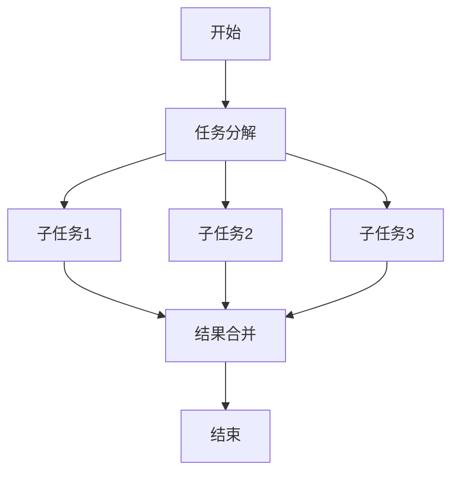

# Eureka 并行算法

## 介绍

Eureka并行算法是一种用于解决并发编程问题的算法，旨在通过并行计算提高程序的执行效率。它的核心思想是将一个大任务分解为多个小任务，并通过多线程或多进程同时执行这些小任务，从而缩短整体执行时间。Eureka并行算法特别适用于处理计算密集型任务或需要快速响应的场景。

在本教程中，我们将逐步讲解Eureka并行算法的基本原理、实现方法，并通过实际案例展示其应用场景。

---

## 什么是并行算法？

并行算法是指通过同时执行多个计算任务来提高程序性能的算法。与传统的串行算法不同，并行算法利用多核处理器或多台计算机的计算能力，将任务分解为多个子任务并行执行。

Eureka并行算法是并行算法的一种实现方式，它通过动态任务分配和负载均衡来优化并行计算的效率。

---

## Eureka 并行算法的基本原理

Eureka并行算法的核心思想包括以下几点：

1. **任务分解**：将一个大任务分解为多个独立的子任务。
2. **并行执行**：通过多线程或多进程同时执行这些子任务。
3. **结果合并**：将子任务的结果合并为最终结果。

以下是一个简单的流程图，展示了Eureka并行算法的执行过程：



---

## 实现Eureka并行算法

下面我们通过一个简单的代码示例来演示如何实现Eureka并行算法。假设我们需要计算一个数组中所有元素的平方和。

### 示例代码

```python
import concurrent.futures

def calculate_square(number):
    return number * number

def eureka_parallel_algorithm(numbers):
    results = []
    with concurrent.futures.ThreadPoolExecutor() as executor:
        futures = [executor.submit(calculate_square, num) for num in numbers]
        for future in concurrent.futures.as_completed(futures):
            results.append(future.result())
    return sum(results)

# 输入
numbers = [1, 2, 3, 4, 5]

# 输出
result = eureka_parallel_algorithm(numbers)
print("平方和:", result)
```

### 代码解释

1. **`calculate_square` 函数**：计算单个数字的平方。
2. **`eureka_parallel_algorithm` 函数**：
   - 使用 `ThreadPoolExecutor` 创建线程池。
   - 将每个数字的平方计算任务提交到线程池中。
   - 通过 `as_completed` 方法获取每个任务的结果，并将其存储在 `results` 列表中。
   - 最后返回所有结果的累加和。

### 输入与输出

- **输入**：`numbers = [1, 2, 3, 4, 5]`
- **输出**：`平方和: 55`

---

## 实际应用场景

Eureka并行算法在实际中有广泛的应用，以下是一些典型的场景：

1. **大数据处理**：在分布式计算框架（如Hadoop、Spark）中，Eureka并行算法用于处理大规模数据集。
2. **图像处理**：将图像分割为多个区域，并行处理每个区域的像素。
3. **科学计算**：在模拟和数值计算中，通过并行计算加速复杂模型的求解过程。

---

## 总结

Eureka并行算法通过任务分解、并行执行和结果合并，显著提高了程序的执行效率。它适用于计算密集型任务和大规模数据处理场景。通过本教程，您已经了解了Eureka并行算法的基本原理、实现方法以及实际应用场景。

---

## 附加资源与练习

### 资源
- [Python并发编程官方文档](https://docs.python.org/3/library/concurrent.futures.html)
- [并行算法设计与分析](https://www.example.com)（推荐书籍）

### 练习
1. 修改示例代码，使其支持多进程并行计算。
2. 尝试将Eureka并行算法应用于矩阵乘法，并比较串行和并行计算的性能差异。

:::tip
在实现并行算法时，务必注意线程安全和资源竞争问题，避免出现数据不一致的情况。
:::