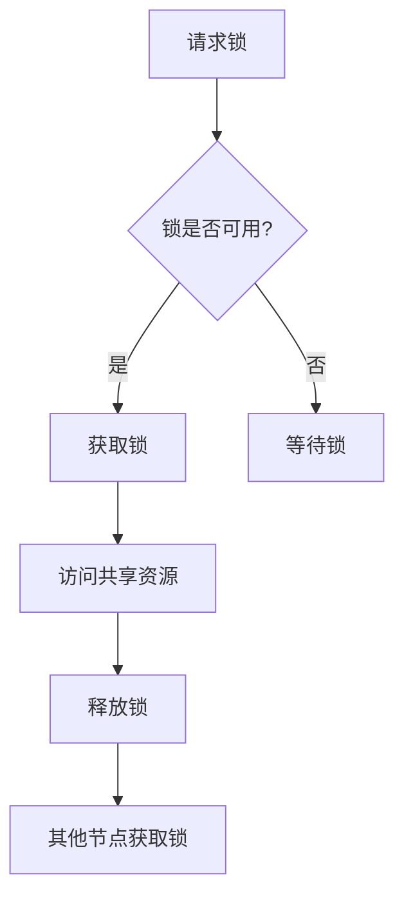

# Eureka 互斥锁

在并发编程中，互斥锁（Mutex）是一种用于保护共享资源不被多个线程同时访问的同步机制。Eureka互斥锁是Eureka框架中提供的一种实现，用于确保在分布式系统中对共享资源的独占访问。

## 什么是互斥锁？

互斥锁是一种同步原语，用于确保在任何时刻只有一个线程可以访问共享资源。当一个线程获得了互斥锁后，其他线程必须等待该线程释放锁后才能继续执行。这种机制可以有效避免竞态条件（Race Condition）和数据不一致的问题。

## Eureka 互斥锁的工作原理

Eureka互斥锁基于分布式锁的实现，确保在分布式系统中多个节点之间的互斥访问。其核心思想是通过一个中心化的锁服务（如Zookeeper或Redis）来协调多个节点之间的锁请求。

### 基本流程

1. **请求锁**：当一个节点需要访问共享资源时，它会向锁服务发送一个请求，尝试获取锁。
2. **获取锁**：如果锁当前未被其他节点持有，锁服务会将该锁分配给请求节点，并标记为已锁定。
3. **释放锁**：当节点完成对共享资源的访问后，它会释放锁，允许其他节点获取锁。
4. **等待锁**：如果锁已被其他节点持有，请求节点将进入等待状态，直到锁被释放。



## 代码示例

以下是一个使用Eureka互斥锁的简单示例，展示了如何在分布式系统中使用互斥锁来保护共享资源。

```python
from eureka.lock import Mutex

# 创建一个互斥锁实例
mutex = Mutex("shared_resource_lock")

def access_shared_resource():
    # 尝试获取锁
    if mutex.acquire():
        try:
            # 访问共享资源
            print("Accessing shared resource...")
        finally:
            # 释放锁
            mutex.release()
    else:
        print("Failed to acquire lock, waiting...")

# 模拟多个线程访问共享资源
access_shared_resource()
```

### 输出示例

```
Accessing shared resource...
```

## 实际应用场景

Eureka互斥锁在分布式系统中有广泛的应用，特别是在需要确保数据一致性和避免竞态条件的场景中。以下是一些常见的应用场景：

1. **分布式缓存更新**：在更新分布式缓存时，使用互斥锁确保只有一个节点可以更新缓存，避免数据不一致。
2. **分布式任务调度**：在分布式任务调度系统中，使用互斥锁确保同一任务不会被多个节点重复执行。
3. **分布式文件系统**：在分布式文件系统中，使用互斥锁确保对文件的独占访问，避免文件损坏。

## 总结

Eureka互斥锁是分布式系统中保护共享资源的重要工具。通过使用互斥锁，可以确保在多个节点之间对共享资源的独占访问，避免竞态条件和数据不一致的问题。理解互斥锁的工作原理及其应用场景，对于编写高效、可靠的分布式系统至关重要。

## 附加资源与练习

- **练习**：尝试在本地环境中实现一个简单的分布式锁服务，并使用Eureka互斥锁来保护共享资源。
- **资源**：阅读Eureka框架的官方文档，了解更多关于分布式锁的实现细节和最佳实践。

:::tip
在实际开发中，选择合适的锁服务（如Zookeeper或Redis）对于确保互斥锁的性能和可靠性至关重要。建议根据具体需求进行选择和优化。
:::