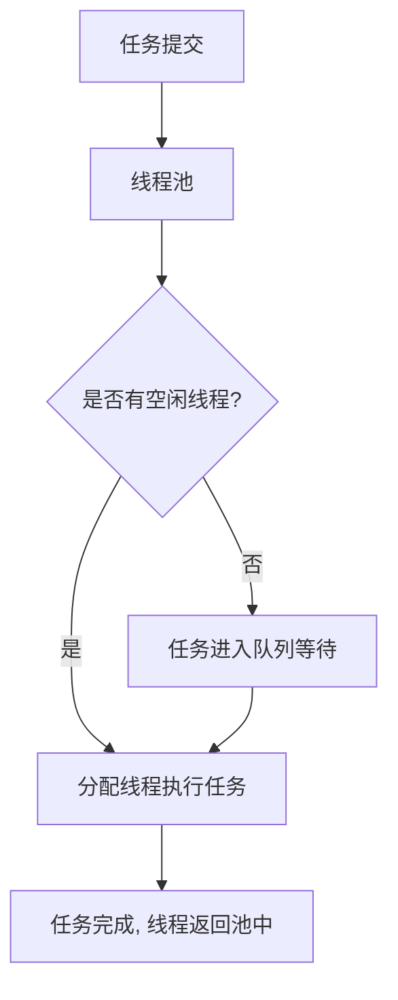

# Eureka 线程池

## 介绍

在并发编程中，线程池（Thread Pool）是一种重要的技术，用于管理和复用线程资源。Eureka线程池是Eureka框架中用于处理并发任务的核心组件之一。通过使用线程池，我们可以避免频繁创建和销毁线程的开销，从而提高程序的性能和响应速度。

## 什么是线程池？

线程池是一种预先创建并管理一组线程的机制。当有任务需要执行时，线程池会从池中分配一个空闲线程来执行任务，而不是每次都创建新的线程。任务完成后，线程会返回池中，等待下一次任务分配。

### 线程池的优点

1. **资源复用**：线程池中的线程可以被重复使用，减少了线程创建和销毁的开销。
2. **控制并发度**：通过限制线程池的大小，可以控制并发任务的数量，避免系统资源被耗尽。
3. **提高响应速度**：线程池中的线程可以立即执行任务，而不需要等待线程创建。

## Eureka 线程池的工作原理

Eureka线程池的核心思想是将任务提交给线程池，由线程池负责调度和执行这些任务。线程池内部维护了一个任务队列，当所有线程都在忙碌时，新提交的任务会被放入队列中等待执行。



## 使用Eureka线程池

下面是一个简单的代码示例，展示如何使用Eureka线程池来执行并发任务。

```java
import java.util.concurrent.ExecutorService;
import java.util.concurrent.Executors;

public class EurekaThreadPoolExample {
    public static void main(String[] args) {
        // 创建一个固定大小的线程池
        ExecutorService executor = Executors.newFixedThreadPool(5);

        // 提交10个任务给线程池
        for (int i = 0; i < 10; i++) {
            executor.submit(() -> {
                System.out.println("任务执行中，线程: " + Thread.currentThread().getName());
            });
        }

        // 关闭线程池
        executor.shutdown();
    }
}
```

### 代码解释

1. **创建线程池**：使用 `Executors.newFixedThreadPool(5)` 创建一个固定大小为5的线程池。
2. **提交任务**：通过 `executor.submit()` 方法提交任务给线程池执行。
3. **关闭线程池**：使用 `executor.shutdown()` 方法关闭线程池，停止接受新任务。

### 输出示例

```
任务执行中，线程: pool-1-thread-1
任务执行中，线程: pool-1-thread-2
任务执行中，线程: pool-1-thread-3
任务执行中，线程: pool-1-thread-4
任务执行中，线程: pool-1-thread-5
任务执行中，线程: pool-1-thread-1
任务执行中，线程: pool-1-thread-2
任务执行中，线程: pool-1-thread-3
任务执行中，线程: pool-1-thread-4
任务执行中，线程: pool-1-thread-5
```

:::note
注意：线程池的大小应根据实际需求进行调整。过大的线程池可能会导致资源浪费，而过小的线程池可能会导致任务等待时间过长。
:::

## 实际应用场景

### 场景1：Web服务器请求处理

在Web服务器中，每个客户端请求都需要一个独立的线程来处理。使用线程池可以有效地管理这些请求线程，避免因大量并发请求导致的资源耗尽问题。

### 场景2：批量数据处理

在数据处理任务中，通常需要处理大量的数据记录。使用线程池可以将这些数据记录分配给多个线程并行处理，从而提高处理速度。

## 总结

Eureka线程池是并发编程中的重要工具，它通过复用线程资源和控制并发度，显著提高了程序的性能和响应速度。通过本文的学习，你应该已经掌握了线程池的基本概念、工作原理以及如何使用Eureka线程池来处理并发任务。

## 附加资源与练习

1. **练习**：尝试修改上面的代码示例，创建一个动态大小的线程池，并观察任务执行情况。
2. **深入学习**：阅读Java官方文档中关于 `ExecutorService` 和 `ThreadPoolExecutor` 的详细说明，了解更多高级用法和配置选项。

:::tip
提示：在实际项目中，建议根据任务的特性和系统资源情况，合理配置线程池的大小和参数，以达到最佳的性能和稳定性。
:::