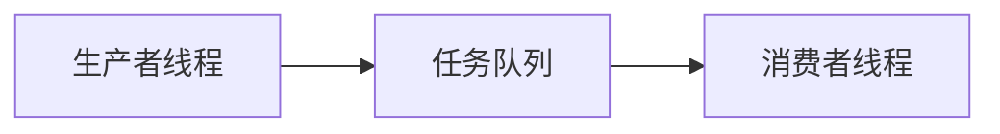

# Eureka 任务队列

在并发编程中，任务队列（Task Queue）是一种常见的机制，用于管理和调度多个任务的执行。Eureka任务队列是Eureka并发编程框架中的一个核心组件，它帮助开发者高效地处理并发任务，确保任务的有序执行和资源的合理分配。

## 什么是任务队列？

任务队列是一种数据结构，用于存储待执行的任务。在多线程或并发环境中，任务队列充当了一个缓冲区，允许生产者线程将任务放入队列，而消费者线程从队列中取出任务并执行。这种机制有效地解耦了任务的生成和执行，使得系统能够更高效地处理并发任务。

### 任务队列的基本工作原理

1. **任务生成**：生产者线程生成任务并将其放入队列。
2. 任务存储**：任务队列存储这些任务，直到消费者线程准备好处理它们。
3. **任务执行**：消费者线程从队列中取出任务并执行。



## Eureka 任务队列的实现

在Eureka框架中，任务队列通常使用线程安全的队列数据结构来实现，例如 `java.util.concurrent.BlockingQueue`。以下是一个简单的Eureka任务队列的实现示例：

```java
import java.util.concurrent.BlockingQueue;
import java.util.concurrent.LinkedBlockingQueue;

public class EurekaTaskQueue {
    private final BlockingQueue<Runnable> queue = new LinkedBlockingQueue<>();

    public void addTask(Runnable task) {
        queue.add(task);
    }

    public Runnable getTask() throws InterruptedException {
        return queue.take();
    }

    public void processTasks() {
        while (true) {
            try {
                Runnable task = getTask();
                task.run();
            } catch (InterruptedException e) {
                Thread.currentThread().interrupt();
                break;
            }
        }
    }
}
```

### 代码解释

- `addTask(Runnable task)`：将任务添加到队列中。
- `getTask()`：从队列中取出任务，如果队列为空，则阻塞直到有任务可用。
- `processTasks()`：不断从队列中取出任务并执行。

### 示例输入和输出

假设我们有一个简单的任务类 `PrintTask`，它打印一条消息：

```java
public class PrintTask implements Runnable {
    private final String message;

    public PrintTask(String message) {
        this.message = message;
    }

    @Override
    public void run() {
        System.out.println(message);
    }
}
```

我们可以使用 `EurekaTaskQueue` 来执行这些任务：

```java
public class Main {
    public static void main(String[] args) {
        EurekaTaskQueue taskQueue = new EurekaTaskQueue();

        // 添加任务
        taskQueue.addTask(new PrintTask("Task 1"));
        taskQueue.addTask(new PrintTask("Task 2"));
        taskQueue.addTask(new PrintTask("Task 3"));

        // 启动消费者线程处理任务
        new Thread(taskQueue::processTasks).start();
    }
}
```

**输出**：
```
Task 1
Task 2
Task 3
```

## 实际应用场景

任务队列在实际开发中有广泛的应用，特别是在需要处理大量并发任务的场景中。以下是一些常见的应用场景：

1. **Web服务器**：处理来自多个客户端的请求，每个请求作为一个任务放入队列，由工作线程处理。
2. **数据处理**：在数据管道中，任务队列用于存储待处理的数据块，确保数据处理的有序性和高效性。
3. **任务调度**：在定时任务调度系统中，任务队列用于存储待执行的任务，确保任务按时执行。

:::tip
在实际应用中，任务队列通常与线程池结合使用，以进一步提高系统的并发处理能力。
:::

## 总结

Eureka任务队列是并发编程中的一个重要工具，它通过解耦任务的生成和执行，帮助开发者更高效地处理并发任务。本文介绍了任务队列的基本概念、Eureka任务队列的实现方法，并通过代码示例和实际应用场景展示了其使用方法。

### 附加资源

- [Java并发编程实战](https://book.douban.com/subject/10484692/)
- [Java并发编程的艺术](https://book.douban.com/subject/26591326/)

### 练习

1. 修改 `EurekaTaskQueue` 类，使其支持任务的优先级。
2. 实现一个简单的Web服务器，使用任务队列处理客户端请求。

通过完成这些练习，你将更深入地理解任务队列的工作原理及其在并发编程中的应用。