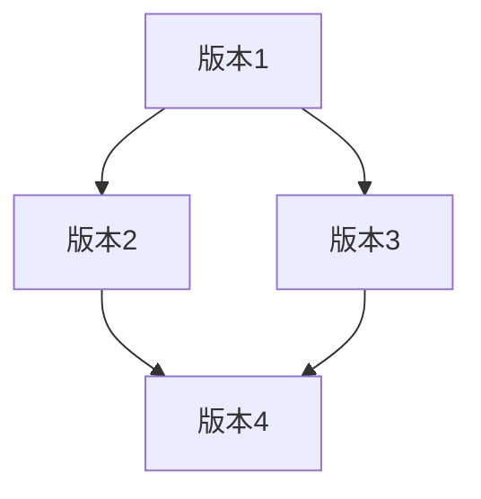

# Eureka 函数式数据结构

函数式编程是一种编程范式，强调使用纯函数和不可变数据来构建程序。在函数式编程中，数据结构的设计和使用方式与传统命令式编程有很大不同。本文将深入探讨**Eureka函数式数据结构**，帮助你理解其核心概念、实现方式以及实际应用场景。

## 什么是函数式数据结构？

函数式数据结构是指在函数式编程中使用的数据结构，它们通常是**不可变的**。这意味着一旦创建了一个数据结构，就不能直接修改它。相反，任何修改操作都会返回一个新的数据结构，而原始数据结构保持不变。

这种不可变性带来了许多好处，例如：
- **线程安全**：由于数据不可变，多个线程可以同时访问数据而无需担心竞争条件。
- **易于推理**：不可变数据使得程序的行为更容易预测和理解。
- **支持持久化**：函数式数据结构通常支持持久化，即可以高效地共享数据的历史版本。

## 常见的函数式数据结构

在Eureka函数式编程中，常见的函数式数据结构包括：

1. **不可变列表（Immutable List）**
2. **不可变集合（Immutable Set）**
3. **不可变映射（Immutable Map）**
4. **持久化数据结构（Persistent Data Structures）**

### 1. 不可变列表

不可变列表是一种常见的函数式数据结构。与传统的可变列表不同，不可变列表在添加或删除元素时不会修改原始列表，而是返回一个新的列表。

```javascript
// 示例：使用不可变列表
const list1 = [1, 2, 3];
const list2 = list1.concat(4); // 添加元素，返回新列表

console.log(list1); // 输出: [1, 2, 3]
console.log(list2); // 输出: [1, 2, 3, 4]
```

在这个例子中，`list1` 保持不变，而 `list2` 是一个新的列表，包含了额外的元素 `4`。

### 2. 不可变集合

不可变集合与不可变列表类似，但集合中的元素是唯一的。添加重复元素不会改变集合的内容。

```javascript
// 示例：使用不可变集合
const set1 = new Set([1, 2, 3]);
const set2 = new Set([...set1, 4]); // 添加元素，返回新集合

console.log(set1); // 输出: Set { 1, 2, 3 }
console.log(set2); // 输出: Set { 1, 2, 3, 4 }
```

### 3. 不可变映射

不可变映射是一种键值对的集合，其中键是唯一的。与不可变列表和集合类似，不可变映射在修改时也会返回一个新的映射。

```javascript
// 示例：使用不可变映射
const map1 = new Map([['a', 1], ['b', 2]]);
const map2 = new Map([...map1, ['c', 3]]); // 添加键值对，返回新映射

console.log(map1); // 输出: Map { 'a' => 1, 'b' => 2 }
console.log(map2); // 输出: Map { 'a' => 1, 'b' => 2, 'c' => 3 }
```

### 4. 持久化数据结构

持久化数据结构是一种特殊的函数式数据结构，它允许高效地共享数据的历史版本。这意味着你可以访问和操作数据的旧版本，而不会影响新版本。



在这个图中，`版本1` 是初始状态，`版本2` 和 `版本3` 是从 `版本1` 派生出来的不同状态，而 `版本4` 则是从 `版本2` 和 `版本3` 合并而来的。

## 实际应用场景

函数式数据结构在许多实际场景中都有应用，例如：

1. **版本控制系统**：Git 使用持久化数据结构来管理代码的不同版本。
2. **前端状态管理**：Redux 使用不可变数据结构来管理应用的状态。
3. **并发编程**：不可变数据结构在多线程环境中非常有用，因为它们天生就是线程安全的。

## 总结

函数式数据结构是函数式编程的核心组成部分，它们通过不可变性和持久化特性，提供了高效、安全和易于推理的数据管理方式。通过本文的学习，你应该对Eureka函数式数据结构有了初步的了解，并能够在实际编程中应用这些概念。

## 附加资源与练习

- **练习1**：尝试使用不可变列表实现一个简单的任务管理器，支持添加、删除和查看任务。
- **练习2**：研究Redux的状态管理机制，理解其如何使用不可变数据结构来管理应用状态。
- **资源**：阅读《Functional Programming in JavaScript》一书，深入了解函数式编程的更多概念和实践。

:::tip
函数式数据结构的学习需要时间和实践，建议多动手编写代码，逐步掌握其精髓。
:::