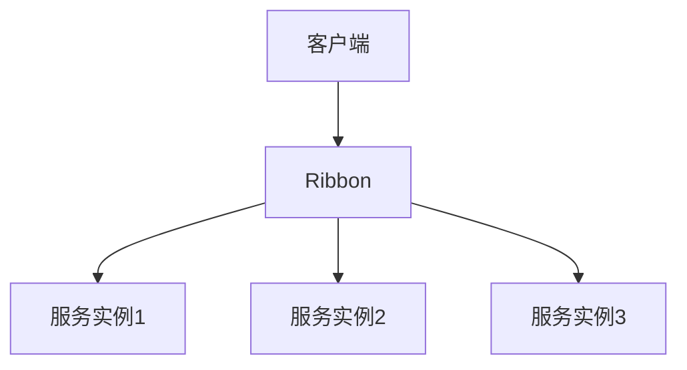

# Eureka 数据处理概述

Eureka 是 Netflix 开源的服务发现工具，广泛用于微服务架构中。它的主要功能是帮助服务实例在分布式系统中注册和发现彼此。Eureka 数据处理是指在使用 Eureka 时，如何处理服务注册、发现、心跳检测等数据。本文将详细介绍 Eureka 数据处理的基本概念、工作原理以及实际应用场景。

## 什么是 Eureka 数据处理？

Eureka 数据处理是指在微服务架构中，Eureka 服务器如何管理服务实例的注册信息、心跳检测、服务发现等数据。Eureka 服务器维护了一个服务注册表，记录了所有注册的服务实例及其状态。客户端通过 Eureka 服务器来发现其他服务实例，从而实现服务之间的通信。

## Eureka 数据处理的工作原理

Eureka 数据处理的核心是服务注册和服务发现。以下是 Eureka 数据处理的基本流程：

1. **服务注册**：当一个服务实例启动时，它会向 Eureka 服务器发送注册请求，将自己的信息（如服务名称、IP 地址、端口等）注册到 Eureka 服务器中。
2. **心跳检测**：注册成功后，服务实例会定期向 Eureka 服务器发送心跳信号，以表明自己仍然存活。如果 Eureka 服务器在一定时间内没有收到心跳信号，则会将该服务实例标记为不可用。
3. **服务发现**：客户端（或其他服务）可以通过 Eureka 服务器查询已注册的服务实例列表，从而发现并调用其他服务。

### 代码示例：服务注册

以下是一个简单的 Spring Boot 服务注册示例：

```java
@SpringBootApplication
@EnableEurekaClient
public class MyServiceApplication {
    public static void main(String[] args) {
        SpringApplication.run(MyServiceApplication.class, args);
    }
}
```

在这个示例中，`@EnableEurekaClient` 注解用于启用 Eureka 客户端功能，使得该服务在启动时自动向 Eureka 服务器注册。

### 代码示例：服务发现

以下是一个简单的服务发现示例，展示了如何通过 Eureka 客户端发现其他服务：

```java
@RestController
public class MyController {

    @Autowired
    private DiscoveryClient discoveryClient;

    @GetMapping("/services")
    public List<String> getServices() {
        return discoveryClient.getServices();
    }
}
```

在这个示例中，`DiscoveryClient` 用于从 Eureka 服务器获取所有已注册的服务列表。

## 实际应用场景

### 场景 1：微服务架构中的服务发现

在微服务架构中，服务之间的通信是必不可少的。Eureka 可以帮助服务实例自动注册和发现彼此，从而简化服务之间的调用。例如，一个订单服务需要调用用户服务来获取用户信息，订单服务可以通过 Eureka 发现用户服务的实例，并与之通信。

### 场景 2：负载均衡

Eureka 可以与 Ribbon 等负载均衡工具结合使用，实现客户端负载均衡。当有多个服务实例提供相同的服务时，Ribbon 可以根据负载均衡策略选择一个合适的实例进行调用。



在这个图中，Ribbon 作为负载均衡器，从 Eureka 获取服务实例列表，并根据策略选择一个实例进行调用。

## 总结

Eureka 数据处理是微服务架构中不可或缺的一部分。它通过服务注册、心跳检测和服务发现机制，帮助服务实例在分布式系统中自动发现彼此，从而实现高效的通信。通过本文的介绍，你应该对 Eureka 数据处理的基本概念和工作原理有了初步的了解。

## 附加资源与练习

- **练习 1**：尝试在一个 Spring Boot 项目中集成 Eureka，并实现服务注册和发现功能。
- **练习 2**：使用 Ribbon 实现客户端负载均衡，观察多个服务实例之间的调用情况。
- **资源**：阅读 [Eureka 官方文档](https://github.com/Netflix/eureka) 以深入了解 Eureka 的高级功能。

:::tip
如果你在实践过程中遇到问题，可以参考 Spring Cloud 的官方文档，或者加入相关的开发者社区寻求帮助。
:::