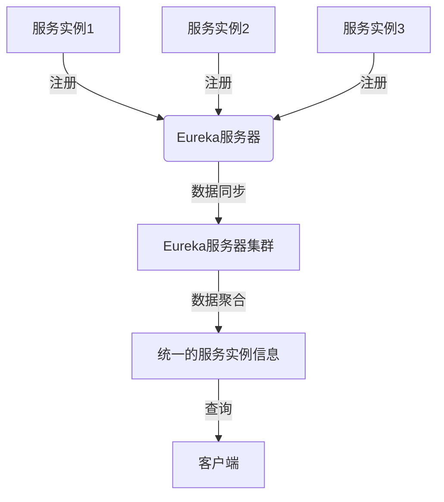

# Eureka 数据聚合

## 介绍

Eureka是Netflix开源的服务发现工具，广泛用于微服务架构中。在微服务环境中，服务实例的动态变化（如启动、停止、扩展等）是常态。Eureka通过数据聚合机制，将这些动态变化的数据汇总并提供给客户端，确保客户端能够获取最新的服务实例信息。

**数据聚合**是指将多个数据源的信息整合到一个统一的视图中。在Eureka中，数据聚合的核心目标是将所有注册的服务实例信息汇总，并提供给客户端查询。本文将详细介绍Eureka数据聚合的工作原理、实现方式以及实际应用场景。

## Eureka 数据聚合的工作原理

Eureka的数据聚合过程可以分为以下几个步骤：

1. **服务注册**：每个微服务实例启动时，会向Eureka服务器注册自己的信息（如IP地址、端口、健康状态等）。
2. **数据同步**：Eureka服务器会将注册的服务实例信息同步到其他Eureka服务器节点（如果存在集群）。
3. **数据聚合**：Eureka服务器将所有注册的服务实例信息聚合到一个统一的数据结构中，供客户端查询。
4. **客户端查询**：客户端通过Eureka服务器查询可用的服务实例信息，并根据需要发起请求。

### 数据聚合的流程



## 代码示例

以下是一个简单的Eureka客户端注册和查询的代码示例：

```java
// 服务注册
@SpringBootApplication
@EnableEurekaClient
public class MyServiceApplication {
    public static void main(String[] args) {
        SpringApplication.run(MyServiceApplication.class, args);
    }
}

// 服务查询
@RestController
public class MyController {

    @Autowired
    private DiscoveryClient discoveryClient;

    @GetMapping("/services")
    public List<String> getServices() {
        return discoveryClient.getServices();
    }

    @GetMapping("/instances/{serviceId}")
    public List<ServiceInstance> getInstances(@PathVariable String serviceId) {
        return discoveryClient.getInstances(serviceId);
    }
}
```

### 输入与输出

- **输入**：服务实例启动并注册到Eureka服务器。
- **输出**：客户端通过Eureka服务器查询到所有可用的服务实例信息。

## 实际应用场景

### 场景1：负载均衡

在微服务架构中，负载均衡是一个常见的需求。Eureka的数据聚合功能可以帮助负载均衡器获取所有可用的服务实例信息，并根据一定的策略（如轮询、随机等）将请求分发到不同的实例上。

### 场景2：服务发现

在动态的微服务环境中，服务实例的IP地址和端口可能会频繁变化。Eureka的数据聚合功能可以确保客户端始终能够获取到最新的服务实例信息，从而避免因服务实例变化而导致的请求失败。

### 场景3：故障转移

当某个服务实例发生故障时，Eureka会将其从注册表中移除。客户端通过Eureka查询服务实例信息时，可以自动避开故障实例，从而实现故障转移。

## 总结

Eureka的数据聚合功能是微服务架构中不可或缺的一部分。它通过将多个服务实例的信息汇总到一个统一的视图中，确保了客户端能够获取到最新的服务实例信息。本文介绍了Eureka数据聚合的工作原理、代码示例以及实际应用场景，希望能够帮助初学者更好地理解这一概念。

## 附加资源与练习

### 附加资源

- [Eureka官方文档](https://github.com/Netflix/eureka/wiki)
- [Spring Cloud Netflix Eureka](https://spring.io/projects/spring-cloud-netflix)

### 练习

1. 尝试在本地搭建一个Eureka服务器，并注册多个服务实例。
2. 编写一个Eureka客户端，查询并打印所有可用的服务实例信息。
3. 模拟服务实例的故障，观察Eureka如何自动移除故障实例。

:::tip
在完成练习时，建议使用Spring Boot和Spring Cloud Netflix Eureka，这样可以更轻松地实现Eureka的集成。
:::