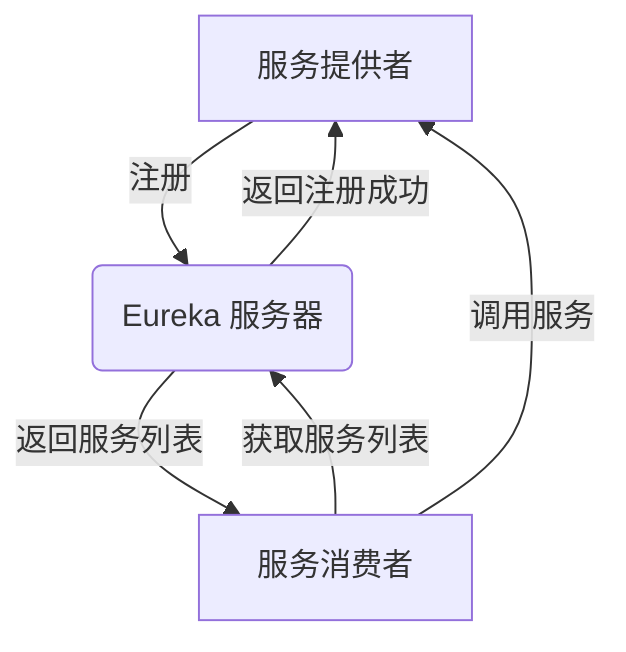

## 介绍

Eureka 是 Netflix 开源的服务发现组件，主要用于微服务架构中，帮助服务之间动态地发现和调用彼此。Eureka 的核心功能是服务注册与发现，它使得服务提供者可以注册自己的信息，而服务消费者可以通过 Eureka 服务器查找并调用这些服务。

在微服务架构中，服务数量众多且动态变化，Eureka 提供了一种高效的方式来管理这些服务的注册与发现，从而简化了服务之间的通信。

## Eureka 的核心概念

### 1. Eureka 服务器（Eureka Server）

Eureka 服务器是服务注册中心，负责管理所有服务的注册信息。服务提供者会将自己的信息注册到 Eureka 服务器，而服务消费者则从 Eureka 服务器获取服务提供者的信息。

### 2. Eureka 客户端（Eureka Client）

Eureka 客户端是服务提供者和服务消费者的统称。服务提供者通过 Eureka 客户端向 Eureka 服务器注册自己的信息，而服务消费者通过 Eureka 客户端从 Eureka 服务器获取服务提供者的信息。

### 3. 服务注册（Service Registration）

服务提供者在启动时，会将自己的信息（如服务名称、IP地址、端口号等）注册到 Eureka 服务器。Eureka 服务器会将这些信息存储在一个注册表中。

### 4. 服务发现（Service Discovery）

服务消费者在需要调用其他服务时，会从 Eureka 服务器获取服务提供者的信息。Eureka 服务器会根据服务名称返回相应的服务实例列表，服务消费者可以根据负载均衡策略选择一个实例进行调用。

## Eureka 的工作流程



1. **服务注册**：服务提供者启动时，向 Eureka 服务器注册自己的信息。
2. **服务发现**：服务消费者从 Eureka 服务器获取服务提供者的信息。
3. **服务调用**：服务消费者根据获取到的服务提供者信息，调用相应的服务。

## 实际案例

假设我们有一个简单的微服务架构，包含两个服务：`UserService` 和 `OrderService`。`UserService` 负责用户管理，`OrderService` 负责订单管理。`OrderService` 需要调用 `UserService` 来获取用户信息。

### 1. 服务注册

`UserService` 启动时，会向 Eureka 服务器注册自己的信息：

```java
@SpringBootApplication
@EnableEurekaClient
public class UserServiceApplication {
    public static void main(String[] args) {
        SpringApplication.run(UserServiceApplication.class, args);
    }
}
```

### 2. 服务发现

`OrderService` 需要调用 `UserService` 时，会从 Eureka 服务器获取 `UserService` 的实例列表：

```java
@RestController
public class OrderController {

    @Autowired
    private RestTemplate restTemplate;

    @GetMapping("/order/{userId}")
    public String getOrder(@PathVariable String userId) {
        String userServiceUrl = "http://USER-SERVICE/user/" + userId;
        String userInfo = restTemplate.getForObject(userServiceUrl, String.class);
        return "Order for user: " + userInfo;
    }
}
```

### 3. 服务调用

`OrderService` 根据获取到的 `UserService` 实例信息，调用 `UserService` 的接口获取用户信息。

## 总结

Eureka 是微服务架构中非常重要的服务发现组件，它通过服务注册与发现机制，简化了服务之间的通信。通过本文的学习，你应该已经掌握了 Eureka 的核心概念和工作流程，并能够将其应用到实际的微服务项目中。

## 附加资源与练习

- **官方文档**：阅读 [Eureka 官方文档](https://github.com/Netflix/eureka) 以深入了解其高级功能。
- **练习**：尝试在一个简单的微服务项目中集成 Eureka，并实现服务注册与发现功能。

:::tip
如果你在练习中遇到问题，可以参考本文的代码示例，或者查阅相关文档和社区资源。
:::