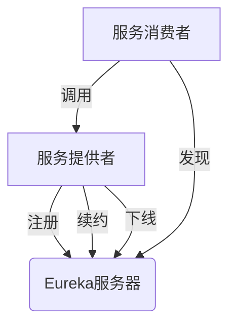

# Eureka 分布式通信

## 介绍

Eureka是Netflix开源的一个基于REST的服务发现工具，主要用于构建分布式系统中的服务注册与发现机制。在微服务架构中，服务实例的动态变化（如启动、停止、扩容等）非常频繁，Eureka通过提供一种高效的机制来管理这些服务实例，使得服务之间的通信更加可靠和灵活。

Eureka的核心思想是**服务注册与发现**。服务提供者（Service Provider）在启动时会将自身的信息注册到Eureka服务器（Eureka Server），而服务消费者（Service Consumer）则通过Eureka服务器来查找所需的服务实例。这种机制使得服务消费者无需硬编码服务提供者的地址，从而实现了服务的动态发现和负载均衡。

## Eureka 的工作原理

Eureka的工作流程可以分为以下几个步骤：

1. **服务注册**：服务提供者在启动时，会向Eureka服务器发送注册请求，包含自身的服务名称、IP地址、端口等信息。
2. **服务续约**：服务提供者会定期向Eureka服务器发送心跳，以表明自己仍然存活。如果Eureka服务器在一定时间内没有收到心跳，则会将该服务实例从注册表中移除。
3. **服务发现**：服务消费者通过Eureka服务器查询所需的服务实例列表，并根据负载均衡策略选择一个实例进行调用。
4. **服务下线**：当服务提供者正常关闭时，会向Eureka服务器发送下线请求，Eureka服务器会将该实例从注册表中移除。



## 代码示例

以下是一个简单的Eureka客户端和服务端的代码示例。

### Eureka 服务端配置

首先，我们需要配置一个Eureka服务器。以下是一个Spring Boot应用的配置文件示例：

```yaml
# application.yml
server:
  port: 8761

eureka:
  instance:
    hostname: localhost
  client:
    registerWithEureka: false
    fetchRegistry: false
    serviceUrl:
      defaultZone: http://${eureka.instance.hostname}:${server.port}/eureka/
```

### Eureka 客户端配置

接下来，我们配置一个Eureka客户端，即服务提供者：

```yaml
# application.yml
spring:
  application:
    name: my-service

eureka:
  client:
    serviceUrl:
      defaultZone: http://localhost:8761/eureka/
```

### 服务消费者调用

服务消费者可以通过Eureka客户端来发现并调用服务提供者。以下是一个简单的REST客户端示例：

```java
@RestController
public class MyController {

    @Autowired
    private RestTemplate restTemplate;

    @GetMapping("/call-service")
    public String callService() {
        String serviceUrl = "http://my-service/endpoint";
        return restTemplate.getForObject(serviceUrl, String.class);
    }
}
```

## 实际应用场景

Eureka广泛应用于微服务架构中，特别是在需要动态扩展和负载均衡的场景中。以下是一些典型的应用场景：

1. **微服务架构**：在微服务架构中，服务实例的数量和位置可能会频繁变化，Eureka可以帮助服务消费者动态发现服务实例。
2. **云原生应用**：在云原生环境中，服务的自动扩展和容错机制非常重要，Eureka可以与Kubernetes等容器编排工具结合使用，实现服务的自动注册与发现。
3. **负载均衡**：Eureka可以与Ribbon等负载均衡工具结合使用，实现客户端负载均衡，从而提高系统的可用性和性能。

## 总结

Eureka作为分布式系统中的服务发现工具，通过服务注册与发现机制，极大地简化了微服务架构中的服务通信问题。它使得服务消费者无需关心服务提供者的具体位置，从而实现了服务的动态发现和负载均衡。

通过本文的学习，你应该对Eureka的基本概念、工作原理以及实际应用场景有了初步的了解。接下来，你可以尝试在自己的项目中集成Eureka，并探索更多高级功能。

## 附加资源与练习

- **官方文档**：阅读[Eureka官方文档](https://github.com/Netflix/eureka)以了解更多细节。
- **练习**：尝试在一个Spring Boot项目中集成Eureka，并实现服务注册与发现功能。
- **扩展阅读**：了解Eureka与其他服务发现工具（如Consul、Zookeeper）的对比，分析它们的优缺点。

:::tip
提示：在实际项目中，Eureka通常与其他微服务组件（如Spring Cloud Gateway、Ribbon等）结合使用，以实现更复杂的服务治理功能。
:::