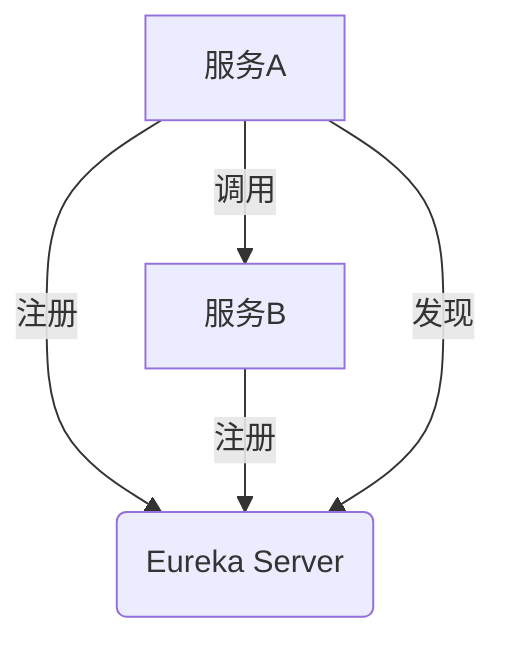
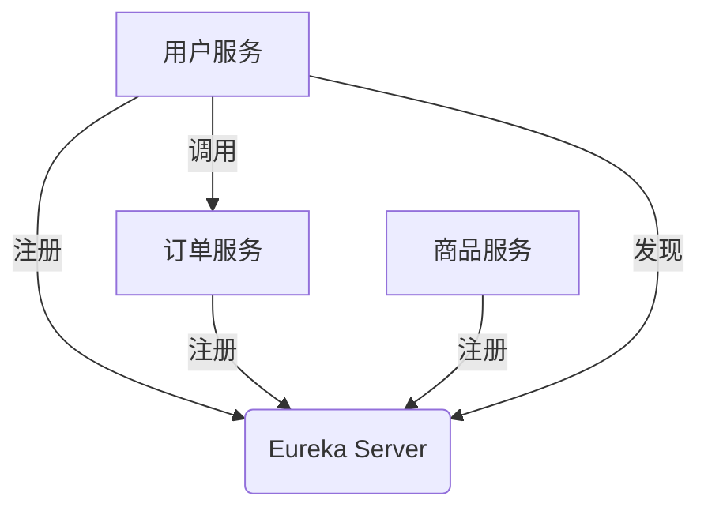

# Eureka 微服务通信

在现代微服务架构中，服务之间的通信是一个核心问题。Eureka是Netflix开源的服务发现工具，它帮助微服务在分布式系统中找到彼此并进行通信。本文将详细介绍Eureka的工作原理，并通过代码示例展示如何在实际项目中使用Eureka实现微服务通信。

## 什么是Eureka？

Eureka是一个基于REST的服务，主要用于定位运行在AWS域中的中间层服务，以实现负载均衡和故障转移。它分为两个主要组件：

1. **Eureka Server**：服务注册中心，负责管理所有注册的服务实例。
2. **Eureka Client**：服务提供者和消费者，负责向Eureka Server注册自己，并从Eureka Server获取其他服务的信息。

## Eureka 的工作原理

Eureka的工作流程可以分为以下几个步骤：

1. **服务注册**：当一个微服务启动时，它会向Eureka Server注册自己的信息，包括服务名称、IP地址、端口等。
2. **服务发现**：当一个微服务需要调用另一个微服务时，它会向Eureka Server查询目标服务的实例列表。
3. **负载均衡**：Eureka Client通常会结合Ribbon等负载均衡工具，从服务实例列表中选择一个合适的实例进行调用。



## 配置Eureka Server

首先，我们需要配置一个Eureka Server。以下是一个简单的Spring Boot应用程序的配置示例：

```java
@SpringBootApplication
@EnableEurekaServer
public class EurekaServerApplication {
    public static void main(String[] args) {
        SpringApplication.run(EurekaServerApplication.class, args);
    }
}
```

在`application.yml`中，我们需要配置Eureka Server的端口和实例信息：

```yaml
server:
  port: 8761

eureka:
  instance:
    hostname: localhost
  client:
    registerWithEureka: false
    fetchRegistry: false
    serviceUrl:
      defaultZone: http://${eureka.instance.hostname}:${server.port}/eureka/
```

## 配置Eureka Client

接下来，我们配置一个Eureka Client。以下是一个简单的Spring Boot应用程序的配置示例：

```java
@SpringBootApplication
@EnableEurekaClient
public class EurekaClientApplication {
    public static void main(String[] args) {
        SpringApplication.run(EurekaClientApplication.class, args);
    }
}
```

在`application.yml`中，我们需要配置Eureka Client的端口和Eureka Server的地址：

```yaml
server:
  port: 8080

spring:
  application:
    name: eureka-client

eureka:
  client:
    serviceUrl:
      defaultZone: http://localhost:8761/eureka/
```

## 服务注册与发现

当一个Eureka Client启动时，它会自动向Eureka Server注册自己。我们可以通过访问Eureka Server的仪表板（通常位于`http://localhost:8761`）来查看已注册的服务实例。

要调用另一个服务，我们可以使用Spring Cloud的`RestTemplate`或`FeignClient`。以下是一个使用`RestTemplate`的示例：

```java
@RestController
public class ClientController {

    @Autowired
    private RestTemplate restTemplate;

    @GetMapping("/call-service")
    public String callService() {
        String serviceUrl = "http://eureka-client/hello";
        return restTemplate.getForObject(serviceUrl, String.class);
    }
}
```

在这个示例中，`eureka-client`是目标服务的名称，Eureka会自动解析为实际的实例地址。

## 实际案例

假设我们有一个电商系统，其中包含用户服务、订单服务和商品服务。用户服务需要调用订单服务来获取用户的订单信息。通过Eureka，用户服务可以轻松地发现并调用订单服务，而无需硬编码订单服务的地址。



## 总结

Eureka是微服务架构中非常重要的服务发现工具。通过Eureka，微服务可以动态地注册和发现彼此，从而实现灵活的通信和负载均衡。本文介绍了Eureka的基本概念、配置方法以及实际应用场景，希望能帮助你更好地理解和使用Eureka。

## 附加资源与练习

- **官方文档**：阅读[Eureka官方文档](https://github.com/Netflix/eureka)以获取更多详细信息。
- **练习**：尝试在一个简单的Spring Boot项目中配置Eureka Server和多个Eureka Client，并实现服务之间的通信。
- **扩展阅读**：了解如何结合Ribbon和Feign实现更强大的负载均衡和声明式REST客户端。

:::tip
在实际项目中，Eureka通常与Spring Cloud的其他组件（如Ribbon、Feign、Hystrix等）一起使用，以构建更健壮的微服务架构。
:::