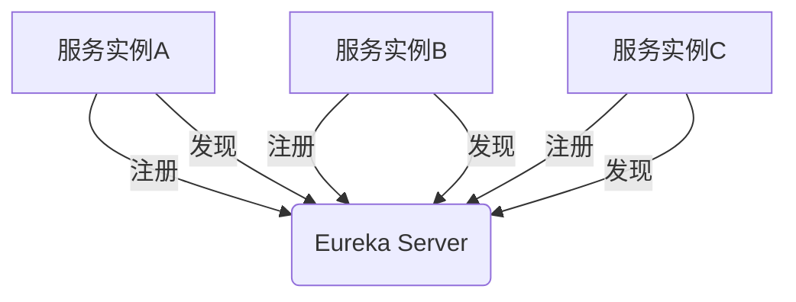

# Eureka 网络服务器

## 介绍

Eureka网络服务器是一个基于Java的开源框架，主要用于构建分布式系统中的服务发现机制。它由Netflix开发，是Spring Cloud生态系统中的重要组件之一。Eureka的核心功能是帮助微服务架构中的各个服务实例相互发现和通信。

在微服务架构中，服务实例的动态变化（如启动、停止、扩展等）非常频繁。Eureka通过维护一个服务注册表，使得服务实例可以注册自己，并发现其他服务实例的位置信息。这样，服务之间的通信就变得更加灵活和高效。

## Eureka 的工作原理

Eureka网络服务器由两个主要组件组成：

1. **Eureka Server**：负责维护服务注册表，记录所有注册的服务实例信息。
2. **Eureka Client**：嵌入在各个服务实例中，负责向Eureka Server注册自己，并定期发送心跳以保持活跃状态。

### 服务注册与发现流程

1. **服务注册**：当一个服务实例启动时，它会向Eureka Server发送注册请求，包含自己的服务名称、IP地址、端口等信息。
2. **服务发现**：其他服务实例可以通过Eureka Server查询已注册的服务实例列表，从而找到需要通信的目标服务。
3. **心跳机制**：Eureka Client会定期向Eureka Server发送心跳，以表明自己仍然存活。如果Eureka Server在一段时间内未收到心跳，则会将该服务实例从注册表中移除。



## 代码示例

### 1. 启动Eureka Server

首先，我们需要创建一个Eureka Server。以下是一个简单的Spring Boot应用程序配置：

```java
import org.springframework.boot.SpringApplication;
import org.springframework.boot.autoconfigure.SpringBootApplication;
import org.springframework.cloud.netflix.eureka.server.EnableEurekaServer;

@SpringBootApplication
@EnableEurekaServer
public class EurekaServerApplication {
    public static void main(String[] args) {
        SpringApplication.run(EurekaServerApplication.class, args);
    }
}
```

在`application.yml`中配置Eureka Server：

```yaml
server:
  port: 8761

eureka:
  instance:
    hostname: localhost
  client:
    registerWithEureka: false
    fetchRegistry: false
```

### 2. 注册Eureka Client

接下来，我们创建一个Eureka Client，并将其注册到Eureka Server中：

```java
import org.springframework.boot.SpringApplication;
import org.springframework.boot.autoconfigure.SpringBootApplication;
import org.springframework.cloud.netflix.eureka.EnableEurekaClient;

@SpringBootApplication
@EnableEurekaClient
public class EurekaClientApplication {
    public static void main(String[] args) {
        SpringApplication.run(EurekaClientApplication.class, args);
    }
}
```

在`application.yml`中配置Eureka Client：

```yaml
spring:
  application:
    name: my-service

eureka:
  client:
    serviceUrl:
      defaultZone: http://localhost:8761/eureka/
```

### 3. 服务发现

在另一个服务中，我们可以通过Eureka Client发现已注册的服务实例：

```java
import org.springframework.beans.factory.annotation.Autowired;
import org.springframework.cloud.client.discovery.DiscoveryClient;
import org.springframework.web.bind.annotation.GetMapping;
import org.springframework.web.bind.annotation.RestController;

@RestController
public class ServiceDiscoveryController {

    @Autowired
    private DiscoveryClient discoveryClient;

    @GetMapping("/services")
    public List<String> getServices() {
        return discoveryClient.getServices();
    }
}
```

## 实际应用场景

### 场景1：微服务架构中的服务通信

在一个典型的微服务架构中，多个服务实例需要相互通信。例如，订单服务需要调用库存服务来检查库存情况。通过Eureka，订单服务可以动态发现库存服务的位置，而不需要硬编码库存服务的地址。

### 场景2：负载均衡

Eureka与Ribbon（另一个Spring Cloud组件）结合使用，可以实现客户端负载均衡。当一个服务有多个实例时，Ribbon可以根据负载均衡策略选择一个合适的实例进行调用。

## 总结

Eureka网络服务器是微服务架构中不可或缺的组件，它通过服务注册与发现机制，简化了服务之间的通信。本文介绍了Eureka的基本概念、工作原理，并通过代码示例展示了如何在实际项目中使用Eureka。

## 附加资源与练习

- **官方文档**：[Spring Cloud Netflix Eureka](https://spring.io/projects/spring-cloud-netflix)
- **练习**：尝试在一个Spring Boot项目中集成Eureka Server和多个Eureka Client，并实现服务发现功能。
- **扩展阅读**：了解Eureka与Zookeeper、Consul等其他服务发现工具的对比。

:::tip
如果你在集成Eureka时遇到问题，可以查看Spring Cloud的官方文档或社区论坛，通常能找到解决方案。
:::