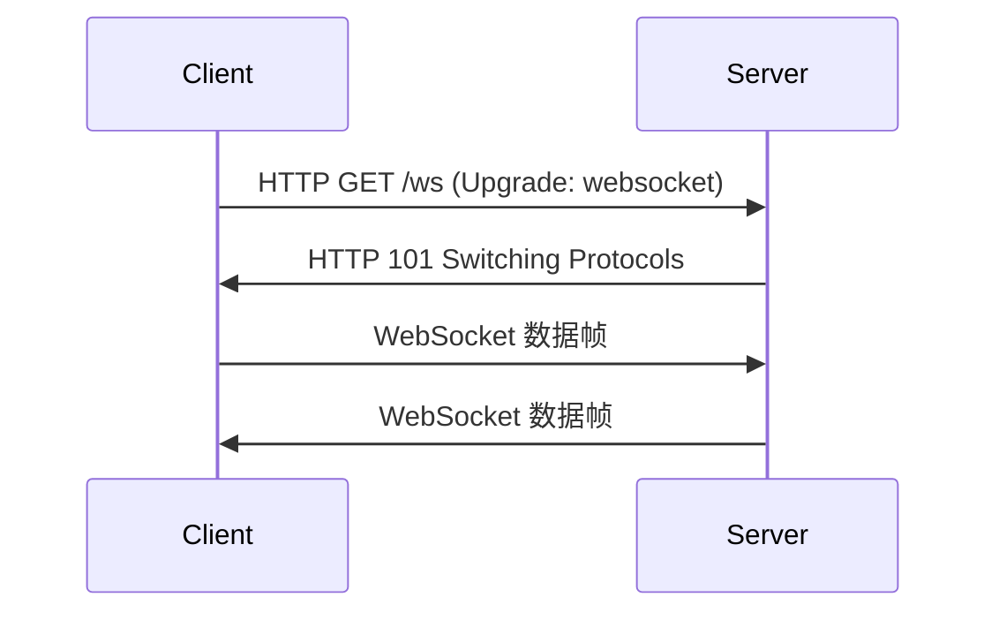

# Eureka WebSocket

WebSocket 是一种在单个 TCP 连接上进行全双工通信的协议，允许客户端和服务器之间进行实时数据传输。在 Eureka 网络编程中，WebSocket 是实现实时通信的关键技术之一。本文将带你从基础概念入手，逐步掌握如何在 Eureka 中使用 WebSocket。

## 什么是 WebSocket？

WebSocket 是一种网络通信协议，与 HTTP 不同，它允许在客户端和服务器之间建立一个持久的连接，从而实现实时数据传输。与传统的 HTTP 请求-响应模式相比，WebSocket 更适合需要频繁通信的场景，如在线聊天、实时游戏、股票行情等。

:::note
WebSocket 协议在 2011 年由 IETF 标准化为 [RFC 6455](https://tools.ietf.org/html/rfc6455)。
:::

## WebSocket 的工作原理

WebSocket 连接通常通过 HTTP 协议发起，然后升级为 WebSocket 协议。以下是 WebSocket 连接的基本流程：

1. **握手阶段**：客户端通过 HTTP 请求向服务器发起 WebSocket 连接请求。
2. **协议升级**：服务器响应并同意升级协议，连接从 HTTP 升级为 WebSocket。
3. **数据传输**：客户端和服务器可以通过 WebSocket 连接进行双向通信。



## 在 Eureka 中使用 WebSocket

Eureka 是一个强大的网络编程框架，支持 WebSocket 协议的实现。下面我们将通过一个简单的示例来展示如何在 Eureka 中使用 WebSocket。

### 示例：实现一个简单的 WebSocket 服务器

以下是一个使用 Eureka 实现 WebSocket 服务器的示例代码：

```python
from eureka import EurekaServer
from eureka.websocket import WebSocketHandler

class MyWebSocketHandler(WebSocketHandler):
    def on_open(self):
        print("WebSocket 连接已建立")

    def on_message(self, message):
        print(f"收到消息: {message}")
        self.send_message(f"你发送了: {message}")

    def on_close(self):
        print("WebSocket 连接已关闭")

server = EurekaServer()
server.add_websocket_route("/ws", MyWebSocketHandler)
server.run()
```

### 代码解释

1. **WebSocketHandler**：这是一个处理 WebSocket 连接的基类，我们需要继承它并实现 `on_open`、`on_message` 和 `on_close` 方法。
2. **on_open**：当 WebSocket 连接建立时调用。
3. **on_message**：当收到客户端发送的消息时调用。
4. **on_close**：当 WebSocket 连接关闭时调用。
5. **add_websocket_route**：将 WebSocket 处理器绑定到指定的路由。

### 客户端代码示例

以下是一个简单的 WebSocket 客户端代码，用于与上述服务器进行通信：

```javascript
const ws = new WebSocket("ws://localhost:8000/ws");

ws.onopen = () => {
    console.log("连接已建立");
    ws.send("Hello, Eureka!");
};

ws.onmessage = (event) => {
    console.log(`收到消息: ${event.data}`);
};

ws.onclose = () => {
    console.log("连接已关闭");
};
```

### 运行结果

1. 启动服务器后，客户端连接到 `ws://localhost:8000/ws`。
2. 客户端发送消息 `"Hello, Eureka!"`。
3. 服务器收到消息并回复 `"你发送了: Hello, Eureka!"`。
4. 客户端收到服务器的回复并打印到控制台。

## 实际应用场景

WebSocket 在许多实时应用中都有广泛的应用，以下是一些常见的场景：

1. **在线聊天**：WebSocket 可以实现即时消息的发送和接收，非常适合在线聊天应用。
2. **实时游戏**：多人在线游戏需要实时同步玩家状态，WebSocket 是一个理想的选择。
3. **股票行情**：股票市场数据需要实时更新，WebSocket 可以确保数据的及时传输。
4. **协作工具**：如在线文档编辑、白板等工具，需要实时同步用户的操作。

## 总结

WebSocket 是一种强大的实时通信协议，适用于需要频繁数据传输的场景。在 Eureka 网络编程中，WebSocket 的实现非常简单，只需继承 `WebSocketHandler` 并实现相应的方法即可。通过本文的学习，你应该已经掌握了 WebSocket 的基本概念及其在 Eureka 中的应用。

## 附加资源与练习

1. **官方文档**：阅读 [Eureka 官方文档](https://eureka-framework.github.io/docs/) 了解更多高级功能。
2. **练习**：尝试扩展上述示例，实现一个多人聊天室，支持多个客户端同时连接并互相发送消息。
3. **深入学习**：了解 WebSocket 协议的其他特性，如心跳机制、二进制数据传输等。

:::tip
如果你对 WebSocket 协议感兴趣，可以阅读 [RFC 6455](https://tools.ietf.org/html/rfc6455) 以深入了解其技术细节。
:::