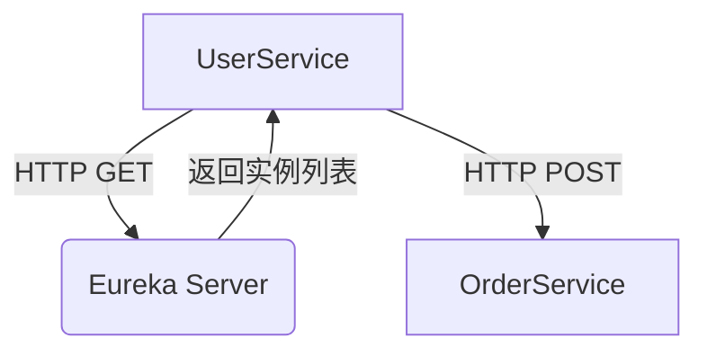

# Eureka 网络协议实现

## 介绍

Eureka是Netflix开源的服务发现框架，主要用于在微服务架构中实现服务的自动注册与发现。Eureka网络协议是Eureka客户端与服务器之间通信的核心机制，理解其实现原理对于构建高可用的微服务系统至关重要。

## Eureka 网络协议概述

Eureka网络协议基于HTTP/HTTPS，客户端通过RESTful API与Eureka服务器进行通信。主要操作包括服务注册、服务续约、服务下线和服务发现。

### 主要操作

1. **服务注册**：客户端启动时向Eureka服务器注册自己的信息。
2. **服务续约**：客户端定期向Eureka服务器发送心跳，以表明自己仍然存活。
3. **服务下线**：客户端关闭时，通知Eureka服务器自己即将下线。
4. **服务发现**：客户端从Eureka服务器获取其他服务的实例信息。

## 协议实现细节

### 服务注册

客户端通过发送HTTP POST请求到Eureka服务器的`/eureka/v2/apps/{appName}`端点进行注册。请求体包含服务的元数据，如IP地址、端口号、健康检查URL等。

```java
POST /eureka/v2/apps/MY-SERVICE HTTP/1.1
Host: eureka-server:8761
Content-Type: application/json

{
  "instance": {
    "hostName": "my-service-host",
    "app": "MY-SERVICE",
    "ipAddr": "192.168.1.100",
    "port": 8080,
    "healthCheckUrl": "http://my-service-host:8080/health"
  }
}
```

### 服务续约

客户端通过发送HTTP PUT请求到`/eureka/v2/apps/{appName}/{instanceId}`端点进行续约。

```java
PUT /eureka/v2/apps/MY-SERVICE/my-service-host:8080 HTTP/1.1
Host: eureka-server:8761
```

### 服务下线

客户端通过发送HTTP DELETE请求到`/eureka/v2/apps/{appName}/{instanceId}`端点进行下线。

```java
DELETE /eureka/v2/apps/MY-SERVICE/my-service-host:8080 HTTP/1.1
Host: eureka-server:8761
```

### 服务发现

客户端通过发送HTTP GET请求到`/eureka/v2/apps/{appName}`端点获取服务实例列表。

```java
GET /eureka/v2/apps/MY-SERVICE HTTP/1.1
Host: eureka-server:8761
```

## 实际案例

假设我们有一个微服务系统，包含两个服务：`UserService`和`OrderService`。`UserService`需要调用`OrderService`来完成用户订单的创建。

### 服务注册

`OrderService`启动时，向Eureka服务器注册自己：

```java
POST /eureka/v2/apps/ORDER-SERVICE HTTP/1.1
Host: eureka-server:8761
Content-Type: application/json

{
  "instance": {
    "hostName": "order-service-host",
    "app": "ORDER-SERVICE",
    "ipAddr": "192.168.1.101",
    "port": 8081,
    "healthCheckUrl": "http://order-service-host:8081/health"
  }
}
```

### 服务发现

`UserService`需要调用`OrderService`时，从Eureka服务器获取`OrderService`的实例列表：

```java
GET /eureka/v2/apps/ORDER-SERVICE HTTP/1.1
Host: eureka-server:8761
```

Eureka服务器返回`OrderService`的实例信息：

```json
{
  "application": {
    "name": "ORDER-SERVICE",
    "instance": [
      {
        "hostName": "order-service-host",
        "app": "ORDER-SERVICE",
        "ipAddr": "192.168.1.101",
        "port": 8081,
        "healthCheckUrl": "http://order-service-host:8081/health"
      }
    ]
  }
}
```

`UserService`根据返回的实例信息，选择合适的`OrderService`实例进行调用。

## 总结

Eureka网络协议是实现服务发现的核心机制，通过HTTP/HTTPS协议进行通信。理解其实现原理对于构建高可用的微服务系统至关重要。本文详细介绍了Eureka网络协议的主要操作及其实现细节，并通过实际案例展示了其应用场景。

## 附加资源

- [Eureka官方文档](https://github.com/Netflix/eureka/wiki)
- [微服务架构设计模式](https://microservices.io/patterns/microservices.html)
- [Spring Cloud Netflix Eureka](https://spring.io/projects/spring-cloud-netflix)

## 练习

1. 编写一个简单的Eureka客户端，实现服务的注册、续约和下线。
2. 使用Eureka客户端从Eureka服务器获取服务实例列表，并调用其中一个服务。
3. 研究Eureka服务器的高可用机制，并尝试搭建一个高可用的Eureka集群。
```



:::tip
在实际生产环境中，建议使用HTTPS来保证通信的安全性。
:::

:::caution
Eureka客户端需要定期发送心跳以保持服务的可用性，否则Eureka服务器会将该服务实例标记为不可用。
:::

:::warning
在高并发场景下，Eureka服务器的性能可能会成为瓶颈，建议使用Eureka集群来提高可用性和性能。
:::