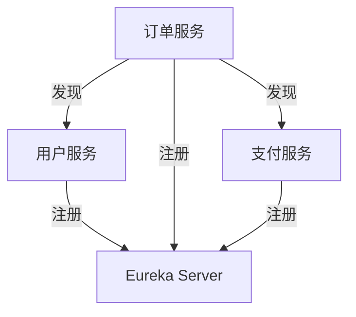

# Eureka Web开发概述

Eureka 是 Netflix 开源的服务发现工具，主要用于构建分布式系统中的服务注册与发现机制。它是微服务架构中的关键组件之一，能够帮助开发者轻松管理服务实例的动态变化。本文将带你了解 Eureka 的基本概念、核心功能以及如何在实际项目中应用它。

## 什么是 Eureka？

Eureka 是一个基于 REST 的服务，主要用于定位服务实例以实现负载均衡和故障转移。它由两个主要组件组成：

1. **Eureka Server**：服务注册中心，负责管理所有注册的服务实例。
2. **Eureka Client**：服务提供者，负责向 Eureka Server 注册自己，并从 Eureka Server 获取其他服务实例的信息。

通过 Eureka，微服务架构中的各个服务可以动态地发现彼此，而无需硬编码服务地址。

## Eureka 的核心功能

### 1. 服务注册与发现

服务实例在启动时会向 Eureka Server 注册自己，并定期发送心跳以保持注册状态。当服务实例停止时，Eureka Server 会将其从注册表中移除。其他服务可以通过 Eureka Server 查询可用的服务实例。

### 2. 负载均衡

Eureka 与 Ribbon（Netflix 的客户端负载均衡器）集成，能够自动将请求分发到多个服务实例上，从而实现负载均衡。

### 3. 故障转移

当某个服务实例不可用时，Eureka 会将其标记为不可用，并将请求路由到其他健康的实例上，从而实现故障转移。

## 如何配置 Eureka Server

以下是一个简单的 Eureka Server 配置示例：

```java
@SpringBootApplication
@EnableEurekaServer
public class EurekaServerApplication {
    public static void main(String[] args) {
        SpringApplication.run(EurekaServerApplication.class, args);
    }
}
```

在 `application.yml` 中配置 Eureka Server：

```yaml
server:
  port: 8761

eureka:
  instance:
    hostname: localhost
  client:
    registerWithEureka: false
    fetchRegistry: false
    serviceUrl:
      defaultZone: http://${eureka.instance.hostname}:${server.port}/eureka/
```

启动后，Eureka Server 将在 `http://localhost:8761` 上运行，并提供一个管理界面，显示所有注册的服务实例。

## 如何配置 Eureka Client

以下是一个简单的 Eureka Client 配置示例：

```java
@SpringBootApplication
@EnableEurekaClient
public class EurekaClientApplication {
    public static void main(String[] args) {
        SpringApplication.run(EurekaClientApplication.class, args);
    }
}
```

在 `application.yml` 中配置 Eureka Client：

```yaml
spring:
  application:
    name: my-service

eureka:
  client:
    serviceUrl:
      defaultZone: http://localhost:8761/eureka/
```

启动后，`my-service` 将向 Eureka Server 注册自己，并定期发送心跳。

## 实际应用场景

假设我们有一个微服务架构，包含以下服务：

1. **用户服务**：负责用户管理。
2. **订单服务**：负责订单管理。
3. **支付服务**：负责支付处理。

通过 Eureka，这些服务可以动态地发现彼此。例如，当订单服务需要调用用户服务时，它可以从 Eureka Server 获取用户服务的实例列表，并通过 Ribbon 实现负载均衡。



## 总结

Eureka 是微服务架构中不可或缺的组件，它简化了服务注册与发现的流程，并提供了负载均衡和故障转移的功能。通过本文，你应该已经了解了 Eureka 的基本概念、核心功能以及如何在实际项目中应用它。

## 附加资源与练习

- **官方文档**：[Eureka GitHub 仓库](https://github.com/Netflix/eureka)
- **练习**：尝试搭建一个包含多个微服务的项目，并使用 Eureka 实现服务注册与发现。
- **进阶阅读**：学习如何使用 Ribbon 实现客户端负载均衡，以及如何与 Spring Cloud Gateway 集成。

:::tip
如果你在配置或使用 Eureka 时遇到问题，可以参考官方文档或在社区中寻求帮助。
:::