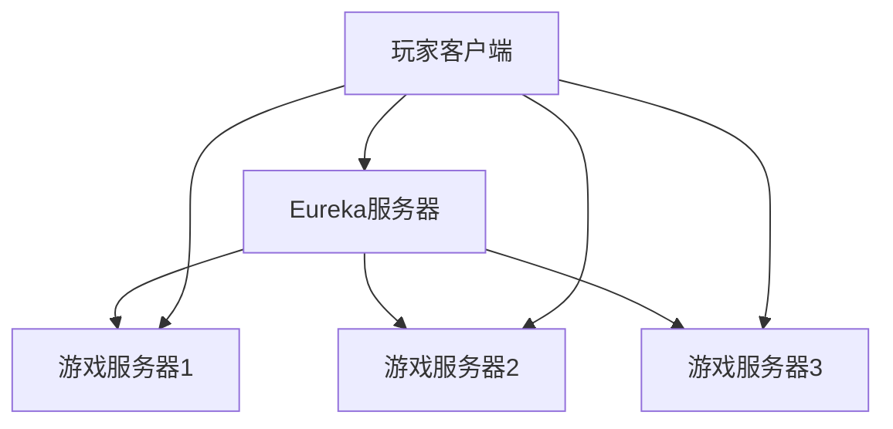

# Eureka 游戏开发

## 介绍

Eureka是Netflix开源的服务发现框架，广泛应用于微服务架构中。在游戏开发中，Eureka可以帮助开发者实现动态服务发现和负载均衡，从而提升游戏服务器的可扩展性和稳定性。本文将带你深入了解Eureka在游戏开发中的应用，并通过实际案例展示其强大功能。

## Eureka 在游戏开发中的应用场景

在大型多人在线游戏（MMO）中，玩家需要连接到不同的游戏服务器进行游戏。这些服务器可能分布在不同的地理位置，且数量可能随着玩家数量的增加而动态变化。Eureka可以帮助游戏开发者实现以下功能：

1. **动态服务发现**：玩家客户端可以自动发现可用的游戏服务器。
2. **负载均衡**：Eureka可以根据服务器的负载情况，将玩家分配到最合适的服务器。
3. **故障转移**：当某个游戏服务器出现故障时，Eureka可以自动将玩家转移到其他可用服务器。

## 实现步骤

### 1. 设置Eureka服务器

首先，我们需要设置一个Eureka服务器，用于注册和发现游戏服务器。

```java
@SpringBootApplication
@EnableEurekaServer
public class EurekaServerApplication {
    public static void main(String[] args) {
        SpringApplication.run(EurekaServerApplication.class, args);
    }
}
```

### 2. 注册游戏服务器

每个游戏服务器启动时，都需要向Eureka服务器注册自己。

```java
@SpringBootApplication
@EnableEurekaClient
public class GameServerApplication {
    public static void main(String[] args) {
        SpringApplication.run(GameServerApplication.class, args);
    }
}
```

### 3. 客户端发现服务

玩家客户端可以通过Eureka服务器发现可用的游戏服务器。

```java
@RestController
public class GameClientController {

    @Autowired
    private DiscoveryClient discoveryClient;

    @GetMapping("/servers")
    public List<String> getGameServers() {
        return discoveryClient.getInstances("game-server").stream()
                .map(instance -> instance.getUri().toString())
                .collect(Collectors.toList());
    }
}
```

### 4. 负载均衡

Eureka与Ribbon结合使用，可以实现负载均衡。

```java
@RestController
public class GameClientController {

    @Autowired
    private RestTemplate restTemplate;

    @GetMapping("/play")
    public String playGame() {
        return restTemplate.getForObject("http://game-server/play", String.class);
    }
}
```

## 实际案例

假设我们正在开发一款多人在线射击游戏。游戏中有多个服务器，每个服务器可以容纳一定数量的玩家。当玩家登录游戏时，客户端会通过Eureka发现可用的服务器，并根据负载均衡策略选择一个服务器进行连接。



## 总结

Eureka在游戏开发中扮演着重要角色，特别是在需要动态服务发现和负载均衡的场景中。通过本文的学习，你应该已经掌握了如何利用Eureka实现游戏服务器的动态发现和负载均衡。希望这些知识能够帮助你在未来的游戏开发项目中更加得心应手。

## 附加资源与练习

- **练习**：尝试在本地搭建一个Eureka服务器，并注册多个游戏服务器实例。然后编写一个客户端程序，通过Eureka发现并连接到这些服务器。
- **资源**：
  - [Eureka官方文档](https://github.com/Netflix/eureka/wiki)
  - [Spring Cloud Netflix文档](https://spring.io/projects/spring-cloud-netflix)

:::tip
在实际开发中，建议结合Spring Cloud的其他组件（如Ribbon、Hystrix等）来构建更加健壮的游戏服务器架构。
:::