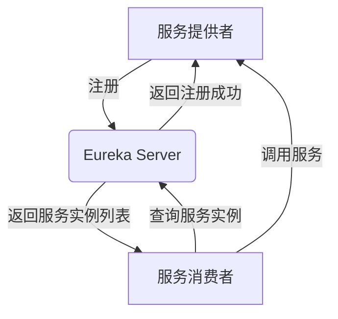

# Eureka 设计模式

## 介绍

Eureka设计模式是微服务架构中的一种服务发现模式，主要用于解决分布式系统中服务实例的动态注册与发现问题。在微服务架构中，服务实例可能会频繁地启动、停止或迁移，Eureka通过提供一个中心化的服务注册表，使得服务消费者能够动态地发现并调用服务提供者。

Eureka的核心思想是**服务注册与发现**。服务提供者在启动时向Eureka服务器注册自己的信息（如IP地址、端口号等），而服务消费者则通过查询Eureka服务器来获取可用的服务实例列表。这种机制使得服务之间的调用更加灵活和可靠。

## Eureka 的核心组件

Eureka设计模式主要由以下两个核心组件构成：

1. **Eureka Server**：服务注册中心，负责管理所有服务实例的注册信息。
2. **Eureka Client**：服务提供者和服务消费者，负责向Eureka Server注册和发现服务。

### Eureka Server

Eureka Server是服务注册中心的核心，它维护了一个服务注册表，记录了所有注册的服务实例信息。服务提供者在启动时会向Eureka Server注册自己，而服务消费者则通过Eureka Server查询可用的服务实例。

### Eureka Client

Eureka Client分为两种角色：
- **服务提供者**：在启动时向Eureka Server注册自己的信息。
- **服务消费者**：通过Eureka Server获取服务提供者的信息，并调用相应的服务。

## Eureka 的工作流程

Eureka的工作流程可以分为以下几个步骤：

1. **服务注册**：服务提供者启动时，向Eureka Server发送注册请求，将自己的信息（如IP地址、端口号、服务名称等）注册到Eureka Server。
2. **服务发现**：服务消费者通过Eureka Server查询可用的服务实例列表，并根据负载均衡策略选择一个服务实例进行调用。
3. **心跳机制**：服务提供者定期向Eureka Server发送心跳，以表明自己仍然存活。如果Eureka Server在一定时间内没有收到心跳，则认为该服务实例已下线，并将其从注册表中移除。
4. **服务调用**：服务消费者根据获取到的服务实例信息，发起实际的调用。



## 代码示例

以下是一个简单的Eureka Client注册和发现的代码示例。

### 服务提供者注册

```java
@SpringBootApplication
@EnableEurekaClient
public class ServiceProviderApplication {
    public static void main(String[] args) {
        SpringApplication.run(ServiceProviderApplication.class, args);
    }
}
```

### 服务消费者发现服务

```java
@RestController
public class ServiceConsumerController {

    @Autowired
    private DiscoveryClient discoveryClient;

    @GetMapping("/services")
    public List<String> getServices() {
        return discoveryClient.getServices();
    }

    @GetMapping("/service-instances/{serviceName}")
    public List<ServiceInstance> getServiceInstances(@PathVariable String serviceName) {
        return discoveryClient.getInstances(serviceName);
    }
}
```

### 输出示例

假设我们有两个服务提供者实例注册到Eureka Server，服务消费者调用 `/service-instances/service-provider` 接口时，可能会返回如下结果：

```json
[
    {
        "host": "192.168.1.101",
        "port": 8080,
        "serviceId": "service-provider"
    },
    {
        "host": "192.168.1.102",
        "port": 8080,
        "serviceId": "service-provider"
    }
]
```

## 实际应用场景

Eureka设计模式在微服务架构中有着广泛的应用，特别是在需要动态扩展和缩容的场景中。以下是一些典型的应用场景：

1. **动态服务发现**：在云原生环境中，服务实例可能会频繁地启动和停止，Eureka能够动态地更新服务实例列表，确保服务消费者始终能够找到可用的服务提供者。
2. **负载均衡**：Eureka与Ribbon等负载均衡工具结合使用，可以实现客户端负载均衡，提高系统的可用性和性能。
3. **故障恢复**：当某个服务实例发生故障时，Eureka能够及时将其从注册表中移除，避免服务消费者继续调用故障实例。

## 总结

Eureka设计模式是微服务架构中不可或缺的一部分，它通过服务注册与发现机制，解决了分布式系统中服务实例的动态管理问题。通过Eureka，服务消费者能够动态地发现并调用服务提供者，从而提高了系统的灵活性和可靠性。

:::tip
在实际开发中，Eureka通常与Spring Cloud等微服务框架结合使用，能够极大地简化微服务架构的开发和维护工作。
:::

## 附加资源与练习

1. **官方文档**：阅读[Spring Cloud Netflix Eureka官方文档](https://spring.io/projects/spring-cloud-netflix)以深入了解Eureka的更多高级特性。
2. **动手实践**：尝试在自己的项目中集成Eureka，并模拟服务实例的动态注册与发现过程。
3. **扩展阅读**：了解其他服务发现工具（如Consul、Zookeeper）与Eureka的异同，并思考它们在不同场景下的适用性。