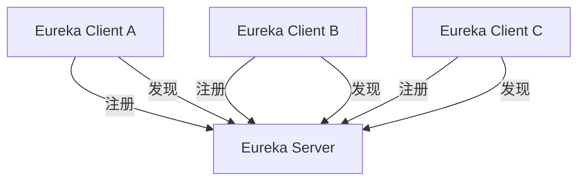

# Eureka 架构模式

Eureka是Netflix开源的一款服务发现工具，主要用于微服务架构中服务的注册与发现。它帮助开发者在分布式系统中动态管理服务的实例，从而实现高可用性和负载均衡。本文将详细介绍Eureka的架构模式，并通过实际案例帮助初学者理解其工作原理。

---

## 什么是Eureka架构模式？

Eureka架构模式是一种基于客户端-服务器模型的服务发现机制。它由两个核心组件组成：

1. **Eureka Server**：作为服务注册中心，负责管理所有注册的服务实例。
2. **Eureka Client**：作为服务提供者或消费者，负责向Eureka Server注册自身或从Eureka Server获取其他服务的信息。

通过这种模式，Eureka能够实现服务的动态发现和负载均衡，从而提升系统的可扩展性和容错能力。

---

## Eureka 的工作原理

### 1. 服务注册
当一个服务启动时，它会作为Eureka Client向Eureka Server发送注册请求，包含自身的服务名称、IP地址、端口等信息。Eureka Server将这些信息存储在其注册表中。

```java
// 示例：服务注册
eureka:
  client:
    serviceUrl:
      defaultZone: http://localhost:8761/eureka/
```

### 2. 服务发现
当一个服务需要调用另一个服务时，它会向Eureka Server查询目标服务的实例列表。Eureka Server返回可用的服务实例信息，客户端可以根据这些信息进行负载均衡。

```java
// 示例：服务发现
@Autowired
private DiscoveryClient discoveryClient;

public List<ServiceInstance> getServiceInstances(String serviceName) {
    return discoveryClient.getInstances(serviceName);
}
```

### 3. 心跳机制
Eureka Client会定期向Eureka Server发送心跳，以表明自己仍然存活。如果Eureka Server在一定时间内未收到心跳，则会将该服务实例从注册表中移除。

---

## Eureka 的架构图

以下是一个典型的Eureka架构图：



---

## 实际应用场景

### 场景：微服务架构中的服务调用
假设我们有一个电商系统，包含以下服务：
- **用户服务**（User Service）
- **订单服务**（Order Service）
- **支付服务**（Payment Service）

1. **用户服务**启动时，向Eureka Server注册自己。
2. **订单服务**需要调用**用户服务**时，向Eureka Server查询**用户服务**的实例列表。
3. Eureka Server返回**用户服务**的可用实例，**订单服务**选择一个实例进行调用。

```java
// 示例：订单服务调用用户服务
@RestController
public class OrderController {

    @Autowired
    private RestTemplate restTemplate;

    @GetMapping("/order/{userId}")
    public String getUserOrder(@PathVariable String userId) {
        String userServiceUrl = "http://user-service/user/" + userId;
        return restTemplate.getForObject(userServiceUrl, String.class);
    }
}
```

---

## 总结

Eureka架构模式通过服务注册与发现机制，为微服务架构提供了动态管理和负载均衡的能力。它的核心组件包括Eureka Server和Eureka Client，通过心跳机制确保服务实例的健康状态。在实际应用中，Eureka能够显著提升系统的可扩展性和容错能力。

---

## 附加资源与练习

### 资源
- [Netflix Eureka官方文档](https://github.com/Netflix/eureka)
- [Spring Cloud Eureka指南](https://spring.io/projects/spring-cloud-netflix)

### 练习
1. 尝试搭建一个简单的Eureka Server，并注册两个服务实例。
2. 编写一个Eureka Client，实现服务发现和调用。
3. 模拟服务实例宕机，观察Eureka Server如何移除失效实例。

:::tip
如果你在练习中遇到问题，可以参考Spring Cloud的官方示例代码，或者加入开发者社区寻求帮助。
:::