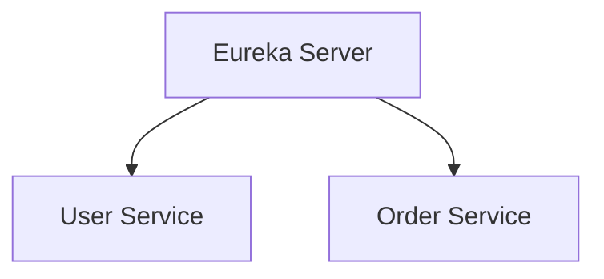

# Eureka 项目结构

在开发基于Eureka的微服务应用时，合理的项目结构是确保代码可维护性和可扩展性的关键。本文将详细介绍如何组织Eureka项目结构，并通过实际案例帮助你理解其重要性。

## 什么是Eureka项目结构？

Eureka是Netflix开源的服务发现工具，用于在微服务架构中实现服务的注册与发现。一个良好的Eureka项目结构不仅能够帮助你更好地管理代码，还能提高团队协作效率。

## 基本项目结构

一个典型的Eureka项目结构通常包含以下几个主要部分：

1. **`src/main/java`**: 存放Java源代码。
2. **`src/main/resources`**: 存放配置文件和其他资源文件。
3. **`src/test/java`**: 存放测试代码。
4. **`pom.xml`**: Maven项目的配置文件。

### 示例项目结构

```plaintext
eureka-service/
├── src/
│   ├── main/
│   │   ├── java/
│   │   │   └── com/
│   │   │       └── example/
│   │   │           ├── EurekaServerApplication.java
│   │   │           ├── config/
│   │   │           └── controller/
│   │   └── resources/
│   │       ├── application.yml
│   │       └── bootstrap.yml
│   └── test/
│       └── java/
│           └── com/
│               └── example/
│                   └── EurekaServerApplicationTests.java
└── pom.xml
```

## 详细解释

### 1. `src/main/java`

这是项目的核心部分，存放所有的Java源代码。通常，我们会按照功能模块来组织代码。

- **`EurekaServerApplication.java`**: 这是Eureka服务器的启动类，通常包含`@SpringBootApplication`和`@EnableEurekaServer`注解。

```java
package com.example;

import org.springframework.boot.SpringApplication;
import org.springframework.boot.autoconfigure.SpringBootApplication;
import org.springframework.cloud.netflix.eureka.server.EnableEurekaServer;

@SpringBootApplication
@EnableEurekaServer
public class EurekaServerApplication {
    public static void main(String[] args) {
        SpringApplication.run(EurekaServerApplication.class, args);
    }
}
```

- **`config/`**: 存放配置类，例如安全配置、Eureka配置等。
- **`controller/`**: 存放控制器类，处理HTTP请求。

### 2. `src/main/resources`

这个目录存放配置文件和其他资源文件。

- **`application.yml`**: 主配置文件，包含Eureka服务器的配置。

```yaml
server:
  port: 8761

eureka:
  instance:
    hostname: localhost
  client:
    registerWithEureka: false
    fetchRegistry: false
    serviceUrl:
      defaultZone: http://${eureka.instance.hostname}:${server.port}/eureka/
```

- **`bootstrap.yml`**: 用于在应用程序启动时加载配置，通常用于Spring Cloud Config。

### 3. `src/test/java`

这个目录存放测试代码，确保代码的质量和功能的正确性。

- **`EurekaServerApplicationTests.java`**: 这是Eureka服务器的测试类。

```java
package com.example;

import org.junit.jupiter.api.Test;
import org.springframework.boot.test.context.SpringBootTest;

@SpringBootTest
class EurekaServerApplicationTests {

    @Test
    void contextLoads() {
    }
}
```

### 4. `pom.xml`

这是Maven项目的配置文件，定义了项目的依赖和构建配置。

```xml
<project xmlns="http://maven.apache.org/POM/4.0.0"
         xmlns:xsi="http://www.w3.org/2001/XMLSchema-instance"
         xsi:schemaLocation="http://maven.apache.org/POM/4.0.0 http://maven.apache.org/xsd/maven-4.0.0.xsd">
    <modelVersion>4.0.0</modelVersion>

    <groupId>com.example</groupId>
    <artifactId>eureka-service</artifactId>
    <version>1.0.0</version>

    <parent>
        <groupId>org.springframework.boot</groupId>
        <artifactId>spring-boot-starter-parent</artifactId>
        <version>2.5.4</version>
        <relativePath/>
    </parent>

    <dependencies>
        <dependency>
            <groupId>org.springframework.cloud</groupId>
            <artifactId>spring-cloud-starter-netflix-eureka-server</artifactId>
        </dependency>
        <dependency>
            <groupId>org.springframework.boot</groupId>
            <artifactId>spring-boot-starter-test</artifactId>
            <scope>test</scope>
        </dependency>
    </dependencies>

    <build>
        <plugins>
            <plugin>
                <groupId>org.springframework.boot</groupId>
                <artifactId>spring-boot-maven-plugin</artifactId>
            </plugin>
        </plugins>
    </build>
</project>
```

## 实际案例

假设我们正在开发一个简单的微服务架构，其中包含一个Eureka服务器和两个微服务：`user-service`和`order-service`。Eureka服务器负责服务发现，`user-service`和`order-service`通过Eureka注册自己。



### 1. Eureka Server

Eureka服务器的项目结构如上所述。

### 2. User Service

`user-service`的项目结构与Eureka服务器类似，但需要注册到Eureka服务器。

```yaml
eureka:
  client:
    serviceUrl:
      defaultZone: http://localhost:8761/eureka/
```

### 3. Order Service

`order-service`的项目结构也与Eureka服务器类似，同样需要注册到Eureka服务器。

```yaml
eureka:
  client:
    serviceUrl:
      defaultZone: http://localhost:8761/eureka/
```

## 总结

一个良好的Eureka项目结构能够帮助你更好地管理代码，提高团队协作效率。通过合理的模块划分和配置文件管理，你可以确保项目的可维护性和可扩展性。

## 附加资源

- [Spring Cloud Netflix Eureka官方文档](https://spring.io/projects/spring-cloud-netflix)
- [Maven官方文档](https://maven.apache.org/guides/)

## 练习

1. 创建一个新的Eureka项目，并按照本文所述的结构组织代码。
2. 尝试将两个微服务注册到Eureka服务器，并验证服务发现功能。

:::tip
在开发过程中，始终遵循最佳实践，确保代码的可读性和可维护性。
:::