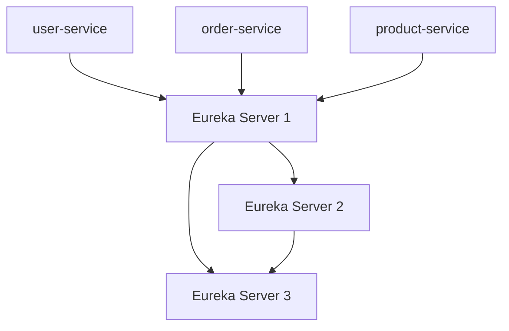

# Eureka 生产环境实践

Eureka是Netflix开源的服务发现组件，广泛应用于微服务架构中。它允许服务实例在启动时向Eureka服务器注册自己，并在需要时从Eureka服务器获取其他服务实例的信息。在生产环境中，正确配置和使用Eureka至关重要，以确保系统的高可用性和稳定性。

## 1. Eureka的基本概念

在微服务架构中，服务发现是一个关键组件。Eureka由两个主要部分组成：

- **Eureka Server**：服务注册中心，负责管理所有服务实例的注册和发现。
- **Eureka Client**：服务实例，负责向Eureka Server注册自己，并从Eureka Server获取其他服务实例的信息。

## 2. 生产环境中的Eureka配置

在生产环境中，Eureka的配置需要特别注意以下几个方面：

### 2.1 高可用性配置

为了确保Eureka Server的高可用性，通常需要部署多个Eureka Server实例，并让它们相互注册。这样，即使其中一个Eureka Server实例宕机，其他实例仍然可以提供服务。

```yaml
# application.yml for Eureka Server 1
eureka:
  client:
    service-url:
      defaultZone: http://eureka-server2:8761/eureka/,http://eureka-server3:8761/eureka/
```

```yaml
# application.yml for Eureka Server 2
eureka:
  client:
    service-url:
      defaultZone: http://eureka-server1:8761/eureka/,http://eureka-server3:8761/eureka/
```

### 2.2 自我保护模式

Eureka Server默认启用了自我保护模式，以防止在网络分区或服务实例频繁上下线时，Eureka Server误删服务实例。在生产环境中，建议保持自我保护模式开启，但需要根据实际情况调整相关参数。

```yaml
eureka:
  server:
    enable-self-preservation: true
    renewal-percent-threshold: 0.85
```

### 2.3 客户端配置

Eureka Client需要正确配置与Eureka Server的连接信息，并设置合理的健康检查间隔和心跳间隔。

```yaml
eureka:
  client:
    service-url:
      defaultZone: http://eureka-server1:8761/eureka/,http://eureka-server2:8761/eureka/
  instance:
    health-check-url-path: /actuator/health
    lease-renewal-interval-in-seconds: 30
    lease-expiration-duration-in-seconds: 90
```

## 3. 实际案例

假设我们有一个微服务架构，包含三个服务：`user-service`、`order-service`和`product-service`。每个服务都注册到Eureka Server，并通过Eureka Server发现其他服务。



在这个架构中，`user-service`需要调用`order-service`和`product-service`。通过Eureka Server，`user-service`可以动态获取`order-service`和`product-service`的实例信息，并进行服务调用。

## 4. 总结

在生产环境中，正确配置和使用Eureka是确保微服务架构高可用性和稳定性的关键。通过部署多个Eureka Server实例、启用自我保护模式以及合理配置Eureka Client，可以有效提升系统的健壮性。

## 5. 附加资源与练习

- **附加资源**：
  - [Eureka官方文档](https://github.com/Netflix/eureka/wiki)
  - [Spring Cloud Netflix Eureka文档](https://spring.io/projects/spring-cloud-netflix)

- **练习**：
  - 尝试在本地环境中部署多个Eureka Server实例，并让它们相互注册。
  - 配置一个Eureka Client，并观察其在Eureka Server中的注册和发现过程。
