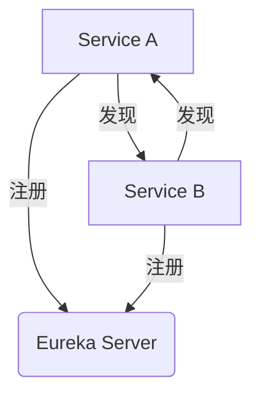

# Eureka 开发工具链

Eureka是Netflix开源的服务发现工具，广泛应用于微服务架构中。它帮助服务实例在启动时注册自己，并在需要时发现其他服务实例。为了更高效地开发和调试Eureka相关的应用，掌握Eureka开发工具链至关重要。本文将详细介绍Eureka开发工具链的核心工具及其使用方法。

---

## 什么是Eureka开发工具链？

Eureka开发工具链是指一系列用于开发、测试和调试Eureka服务发现的工具和库。这些工具可以帮助开发者快速搭建Eureka服务器、注册服务实例、监控服务状态以及调试服务发现逻辑。

---

## Eureka 开发工具链的核心组件

### 1. Eureka Server
Eureka Server是服务发现的核心组件，负责管理服务实例的注册与发现。它提供了一个RESTful API，供服务实例注册和查询。

#### 示例：启动Eureka Server
```java
@SpringBootApplication
@EnableEurekaServer
public class EurekaServerApplication {
    public static void main(String[] args) {
        SpringApplication.run(EurekaServerApplication.class, args);
    }
}
```

#### 输入：
- 配置`application.yml`：
```yaml
server:
  port: 8761
eureka:
  client:
    register-with-eureka: false
    fetch-registry: false
```

#### 输出：
- Eureka Server启动后，访问`http://localhost:8761`可以看到Eureka的管理界面。

---

### 2. Eureka Client
Eureka Client是服务实例的客户端库，用于向Eureka Server注册自己并发现其他服务实例。

#### 示例：注册服务实例
```java
@SpringBootApplication
@EnableEurekaClient
public class ServiceApplication {
    public static void main(String[] args) {
        SpringApplication.run(ServiceApplication.class, args);
    }
}
```

#### 输入：
- 配置`application.yml`：
```yaml
spring:
  application:
    name: my-service
eureka:
  client:
    service-url:
      defaultZone: http://localhost:8761/eureka/
```

#### 输出：
- 服务实例启动后，会在Eureka Server的管理界面中显示。

---

### 3. Spring Cloud Netflix
Spring Cloud Netflix是Spring Cloud生态系统的一部分，提供了与Eureka集成的工具和库。

#### 示例：使用Feign客户端调用服务
```java
@FeignClient(name = "my-service")
public interface MyServiceClient {
    @GetMapping("/endpoint")
    String callEndpoint();
}
```

#### 输入：
- 在服务消费者中注入`MyServiceClient`并调用`callEndpoint()`方法。

#### 输出：
- 返回`my-service`服务的`/endpoint`接口的响应。

---

### 4. Eureka Dashboard
Eureka Dashboard是Eureka Server提供的Web界面，用于监控服务实例的状态。

#### 示例：查看注册的服务实例
- 访问`http://localhost:8761`，可以看到所有注册的服务实例及其状态。

---

## 实际应用场景

### 场景：微服务架构中的服务发现
在一个典型的微服务架构中，多个服务实例需要相互通信。Eureka Server作为服务注册中心，管理所有服务实例的注册与发现。服务实例通过Eureka Client注册自己，并通过Eureka Server发现其他服务实例。



---

## 总结

Eureka开发工具链是构建和调试微服务架构的重要工具。通过Eureka Server、Eureka Client、Spring Cloud Netflix等组件，开发者可以轻松实现服务注册与发现。掌握这些工具的使用方法，能够显著提高开发效率和系统稳定性。

---

## 附加资源与练习

### 资源
- [Eureka官方文档](https://github.com/Netflix/eureka)
- [Spring Cloud Netflix文档](https://spring.io/projects/spring-cloud-netflix)

### 练习
1. 搭建一个Eureka Server，并注册两个服务实例。
2. 使用Feign客户端实现服务之间的通信。
3. 通过Eureka Dashboard监控服务实例的状态。

---

通过本文的学习，你应该对Eureka开发工具链有了全面的了解。接下来，尝试在实际项目中应用这些工具，进一步提升你的微服务开发能力！