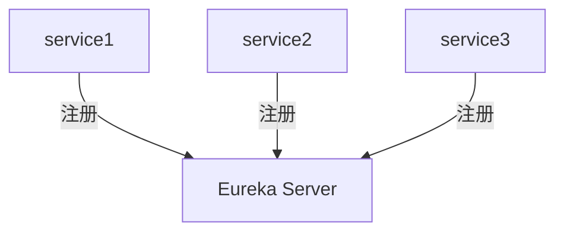

# Eureka 重构技巧

Eureka是Netflix开源的服务发现组件，广泛用于微服务架构中。它帮助服务实例注册自己，并允许其他服务发现和调用它们。然而，随着项目规模的增长，Eureka的实现可能会变得复杂和难以维护。本文将介绍一些Eureka重构技巧，帮助你优化代码结构，提升可读性和可维护性。

## 1. 为什么要重构Eureka代码？

在微服务架构中，Eureka通常用于服务注册与发现。随着服务数量的增加，Eureka的配置和代码可能会变得复杂。重构Eureka代码的目标是：

- **提高代码可读性**：使代码更易于理解和维护。
- **减少重复代码**：通过提取公共逻辑，减少代码冗余。
- **增强可扩展性**：使代码更容易适应未来的需求变化。

## 2. 重构技巧

### 2.1 提取公共配置

在Eureka的配置中，许多服务可能共享相同的配置项。将这些配置提取到公共配置文件中，可以减少重复代码。

```yaml
# application-common.yml
eureka:
  client:
    serviceUrl:
      defaultZone: http://localhost:8761/eureka/
  instance:
    preferIpAddress: true
```

然后在各个服务的配置文件中引用公共配置：

```yaml
# application-service1.yml
spring:
  profiles: service1
  application:
    name: service1

# 引用公共配置
spring:
  profiles: default
  application:
    name: default-service
```

### 2.2 使用抽象类或接口

如果多个服务有相似的Eureka注册逻辑，可以将这些逻辑提取到抽象类或接口中。

```java
public abstract class AbstractEurekaService {
    @Autowired
    private EurekaClient eurekaClient;

    public void registerService(String serviceName) {
        // 注册逻辑
    }

    public void deregisterService(String serviceName) {
        // 注销逻辑
    }
}
```

然后在具体服务中继承或实现这个抽象类：

```java
@Service
public class Service1 extends AbstractEurekaService {
    @Override
    public void registerService(String serviceName) {
        super.registerService(serviceName);
        // 服务1特有的注册逻辑
    }
}
```

### 2.3 使用注解简化配置

Spring Cloud提供了许多注解来简化Eureka的配置。例如，使用`@EnableEurekaClient`注解可以自动启用Eureka客户端。

```java
@SpringBootApplication
@EnableEurekaClient
public class Service1Application {
    public static void main(String[] args) {
        SpringApplication.run(Service1Application.class, args);
    }
}
```

### 2.4 使用配置类管理Eureka配置

将Eureka的配置集中到一个配置类中，可以更方便地管理和修改配置。

```java
@Configuration
public class EurekaConfig {

    @Bean
    public EurekaInstanceConfigBean eurekaInstanceConfig() {
        EurekaInstanceConfigBean config = new EurekaInstanceConfigBean();
        config.setAppname("service1");
        config.setInstanceId("service1-instance1");
        return config;
    }

    @Bean
    public EurekaClientConfigBean eurekaClientConfig() {
        EurekaClientConfigBean config = new EurekaClientConfigBean();
        config.setServiceUrl(Map.of("defaultZone", "http://localhost:8761/eureka/"));
        return config;
    }
}
```

## 3. 实际案例

假设我们有一个微服务架构，包含三个服务：`service1`、`service2`和`service3`。每个服务都需要注册到Eureka，并且有相似的配置和逻辑。通过上述重构技巧，我们可以将公共配置提取到`application-common.yml`中，并使用抽象类`AbstractEurekaService`来管理注册和注销逻辑。



## 4. 总结

通过提取公共配置、使用抽象类或接口、简化注解和集中管理配置，我们可以有效地重构Eureka代码，提升代码的可读性、可维护性和可扩展性。这些技巧不仅适用于Eureka，也可以应用于其他微服务组件的重构。

## 5. 附加资源与练习

- **练习**：尝试在你自己的项目中应用这些重构技巧，并观察代码的变化。
- **资源**：
  - [Spring Cloud Eureka官方文档](https://spring.io/projects/spring-cloud-netflix)
  - [微服务架构设计模式](https://microservices.io/)

:::tip
重构是一个持续的过程，建议定期回顾和优化代码，以保持代码的健康状态。
:::