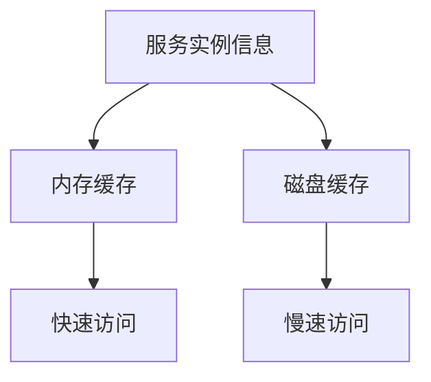

# Eureka 内存优化

Eureka是Netflix开源的服务发现工具，广泛用于微服务架构中。它帮助服务实例注册和发现其他服务实例。然而，随着服务实例数量的增加，Eureka的内存使用可能会成为一个瓶颈。本文将介绍如何优化Eureka的内存使用，以提高其性能和稳定性。

## 介绍

在微服务架构中，Eureka作为服务发现的核心组件，负责管理大量的服务实例信息。随着服务实例数量的增加，Eureka的内存使用可能会迅速增长，导致性能下降甚至内存溢出。因此，优化Eureka的内存使用是确保系统稳定性和性能的关键。

## Eureka 内存使用分析

Eureka的内存使用主要集中在以下几个方面：

1. **服务实例信息的存储**：每个服务实例的元数据（如IP地址、端口、健康状态等）都会存储在Eureka的内存中。
2. **心跳检测**：Eureka通过心跳机制检测服务实例的健康状态，这些心跳信息也会占用内存。
3. **缓存机制**：Eureka使用缓存来加速服务发现，缓存数据同样会占用内存。

## 内存优化策略

### 1. 减少服务实例的元数据

每个服务实例的元数据都会占用一定的内存空间。通过减少不必要的元数据，可以有效降低内存使用。

```java
// 示例：减少服务实例的元数据
eureka.instance.metadata-map.key1=value1
eureka.instance.metadata-map.key2=value2
```

:::tip
尽量减少服务实例的元数据，只保留必要的信息。
:::

### 2. 调整心跳间隔

Eureka通过心跳机制检测服务实例的健康状态。默认情况下，心跳间隔为30秒。适当增加心跳间隔可以减少心跳检测的频率，从而降低内存使用。

```yaml
# 示例：调整心跳间隔
eureka:
  instance:
    lease-renewal-interval-in-seconds: 60
```

:::caution
增加心跳间隔可能会影响服务发现的实时性，需根据实际需求进行调整。
:::

### 3. 优化缓存配置

Eureka使用缓存来加速服务发现。通过调整缓存的大小和过期时间，可以优化内存使用。

```yaml
# 示例：优化缓存配置
eureka:
  server:
    response-cache-update-interval-ms: 30000
    response-cache-auto-expiration-in-seconds: 180
```

:::note
合理设置缓存的大小和过期时间，可以在性能和内存使用之间取得平衡。
:::

### 4. 使用多级缓存

对于大规模的服务实例，可以考虑使用多级缓存来优化内存使用。例如，将频繁访问的服务实例信息存储在内存中，而将不常访问的信息存储在磁盘或其他存储介质中。



:::warning
多级缓存的实现较为复杂，需根据实际需求进行评估和设计。
:::

## 实际案例

假设我们有一个包含1000个服务实例的微服务系统，每个服务实例的元数据大小为1KB。默认情况下，Eureka的内存使用量为：

```
1000 instances * 1KB = 1000KB ≈ 1MB
```

通过减少元数据、调整心跳间隔和优化缓存配置，我们可以将内存使用量降低到500KB左右，显著提高了系统的性能和稳定性。

## 总结

Eureka的内存优化是确保微服务架构稳定性和性能的关键。通过减少服务实例的元数据、调整心跳间隔、优化缓存配置和使用多级缓存，我们可以有效降低Eureka的内存使用，提高系统的整体性能。

## 附加资源

- [Eureka官方文档](https://github.com/Netflix/eureka/wiki)
- [微服务架构设计与实践](https://www.example.com/microservices-design)
- [Java内存优化指南](https://www.example.com/java-memory-optimization)

## 练习

1. 尝试在你的Eureka配置中减少服务实例的元数据，并观察内存使用情况。
2. 调整Eureka的心跳间隔，测试其对服务发现实时性的影响。
3. 设计一个多级缓存方案，用于优化大规模服务实例的内存使用。
