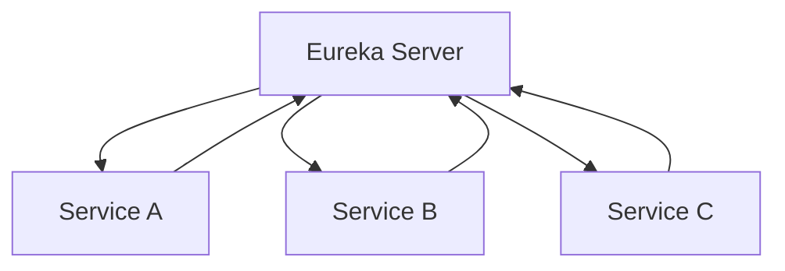
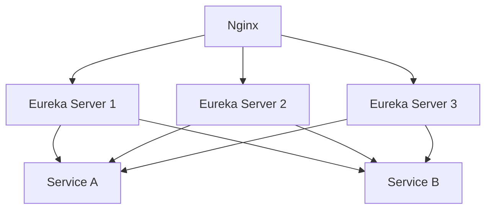

# Eureka 部署策略

Eureka是Netflix开源的服务发现组件，广泛用于微服务架构中。它允许服务实例在启动时向Eureka服务器注册自己，并定期发送心跳以保持注册状态。为了确保Eureka的高可用性和可扩展性，合理的部署策略至关重要。本文将详细介绍Eureka的部署策略，帮助初学者理解如何在实际项目中应用这些策略。

## 1. 什么是Eureka部署策略？

Eureka部署策略是指如何配置和部署Eureka服务器以及客户端，以确保服务发现机制的高可用性、可扩展性和容错性。Eureka的核心是一个分布式系统，因此其部署策略需要考虑多个因素，如集群配置、负载均衡、故障转移等。

## 2. Eureka的基本架构

在深入讨论部署策略之前，我们先回顾一下Eureka的基本架构：

- **Eureka Server**：服务注册中心，负责管理所有服务实例的注册信息。
- **Eureka Client**：服务实例，负责向Eureka Server注册自己，并从Eureka Server获取其他服务实例的信息。



## 3. Eureka部署策略的关键点

### 3.1 高可用性

为了确保Eureka Server的高可用性，通常需要部署多个Eureka Server实例，并将它们配置为一个集群。每个Eureka Server实例都会相互复制注册信息，从而实现故障转移。

#### 3.1.1 集群配置

在集群配置中，每个Eureka Server实例都需要知道其他实例的存在。可以通过以下配置实现：

```yaml
# application.yml for Eureka Server 1
eureka:
  client:
    serviceUrl:
      defaultZone: http://eureka-server2:8761/eureka/,http://eureka-server3:8761/eureka/
```

```yaml
# application.yml for Eureka Server 2
eureka:
  client:
    serviceUrl:
      defaultZone: http://eureka-server1:8761/eureka/,http://eureka-server3:8761/eureka/
```

```yaml
# application.yml for Eureka Server 3
eureka:
  client:
    serviceUrl:
      defaultZone: http://eureka-server1:8761/eureka/,http://eureka-server2:8761/eureka/
```

:::note
**注意**：每个Eureka Server实例都需要配置其他实例的地址，以确保它们可以相互通信。
:::

### 3.2 负载均衡

在Eureka集群中，客户端通常会从多个Eureka Server实例中获取服务注册信息。为了确保负载均衡，可以使用以下策略：

- **客户端负载均衡**：Eureka客户端默认会从所有可用的Eureka Server实例中随机选择一个进行请求。
- **服务器端负载均衡**：可以通过配置负载均衡器（如Nginx或AWS ELB）来分发客户端的请求。

### 3.3 容错与自我修复

Eureka具有自我修复的能力。当某个Eureka Server实例宕机时，其他实例会继续提供服务。此外，Eureka客户端会缓存服务注册信息，即使Eureka Server不可用，客户端仍然可以使用缓存的信息。

:::tip
**提示**：为了进一步提高容错性，可以配置Eureka客户端的缓存时间，确保在Eureka Server不可用时，客户端仍然可以正常工作。
:::

## 4. 实际案例

假设我们有一个包含三个Eureka Server实例的集群，以及多个微服务实例。以下是部署策略的实际应用：

1. **部署Eureka Server集群**：在三个不同的服务器上部署Eureka Server实例，并配置它们相互通信。
2. **配置微服务客户端**：每个微服务实例都配置为向所有Eureka Server实例注册自己。
3. **负载均衡**：使用Nginx作为负载均衡器，将客户端的请求分发到不同的Eureka Server实例。



## 5. 总结

Eureka的部署策略是确保微服务架构中服务发现机制高效运行的关键。通过合理的集群配置、负载均衡和容错机制，可以确保Eureka Server的高可用性和可扩展性。希望本文能帮助初学者理解并应用这些策略。

## 6. 附加资源与练习

- **附加资源**：
  - [Eureka官方文档](https://github.com/Netflix/eureka/wiki)
  - [Spring Cloud Netflix Eureka文档](https://spring.io/projects/spring-cloud-netflix)
  
- **练习**：
  - 尝试在本地环境中部署一个包含两个Eureka Server实例的集群，并配置一个微服务实例向它们注册。
  - 使用Nginx配置负载均衡，将请求分发到不同的Eureka Server实例。
