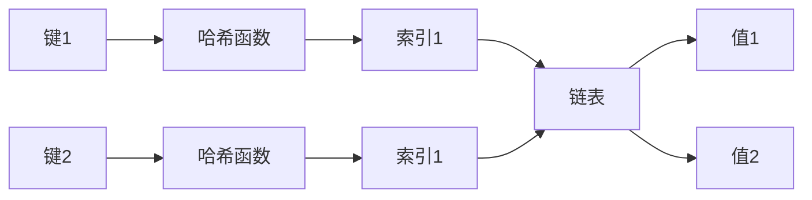

# Eureka 映射

## 介绍

Eureka映射是一种数据结构，用于将键（key）与值（value）关联起来。它类似于字典或哈希表，允许你通过键快速查找对应的值。Eureka映射的核心思想是通过高效的存储和检索机制，使得数据的访问速度大大提升。

在编程中，映射是一种非常常见的数据结构，广泛应用于缓存、数据库索引、配置管理等场景。Eureka映射的设计目标是提供一种简单、高效且易于使用的方式来管理键值对。

## 基本概念

### 键值对

Eureka映射的核心是键值对（Key-Value Pair）。每个键都是唯一的，并且与一个值相关联。你可以通过键来访问或修改对应的值。

```python
# 示例：创建一个简单的映射
eureka_map = {
    "name": "Alice",
    "age": 25,
    "city": "New York"
}

# 访问值
print(eureka_map["name"])  # 输出: Alice
```

### 哈希函数

Eureka映射通常使用哈希函数来将键转换为索引，从而快速定位存储位置。哈希函数的设计直接影响映射的性能。一个好的哈希函数应该能够均匀分布键，减少冲突。

```python
# 示例：哈希函数的基本原理
def hash_function(key):
    return sum(ord(char) for char in key) % 10

print(hash_function("name"))  # 输出: 3
```

### 冲突处理

当两个不同的键通过哈希函数得到相同的索引时，就会发生冲突。Eureka映射通常使用链地址法或开放地址法来处理冲突。



## 实现方式

### 使用数组和链表

Eureka映射可以通过数组和链表的组合来实现。数组用于存储索引，链表用于处理冲突。

```python
# 示例：简单的Eureka映射实现
class EurekaMap:
    def __init__(self, size=10):
        self.size = size
        self.table = [[] for _ in range(size)]

    def _hash(self, key):
        return sum(ord(char) for char in key) % self.size

    def insert(self, key, value):
        index = self._hash(key)
        for kvp in self.table[index]:
            if kvp[0] == key:
                kvp[1] = value
                return
        self.table[index].append([key, value])

    def get(self, key):
        index = self._hash(key)
        for kvp in self.table[index]:
            if kvp[0] == key:
                return kvp[1]
        return None

# 使用示例
eureka_map = EurekaMap()
eureka_map.insert("name", "Alice")
print(eureka_map.get("name"))  # 输出: Alice
```

### 使用内置数据结构

大多数编程语言都提供了内置的映射数据结构，如Python的`dict`、Java的`HashMap`等。这些数据结构已经经过高度优化，可以直接使用。

```python
# 示例：使用Python的dict
eureka_map = {
    "name": "Alice",
    "age": 25,
    "city": "New York"
}

print(eureka_map["name"])  # 输出: Alice
```

## 实际应用场景

### 缓存系统

Eureka映射常用于缓存系统中，用于存储频繁访问的数据，以减少数据库查询的次数。

```python
# 示例：简单的缓存系统
cache = {}

def get_data_from_db(key):
    # 模拟数据库查询
    return f"Data for {key}"

def get_data(key):
    if key in cache:
        return cache[key]
    data = get_data_from_db(key)
    cache[key] = data
    return data

print(get_data("user_123"))  # 输出: Data for user_123
```

### 配置管理

在应用程序中，Eureka映射可以用于管理配置项，如环境变量、用户设置等。

```python
# 示例：配置管理
config = {
    "debug_mode": True,
    "max_connections": 100,
    "timeout": 30
}

if config["debug_mode"]:
    print("Debug mode is enabled")
```

## 总结

Eureka映射是一种高效的数据结构，用于存储和检索键值对。它通过哈希函数和冲突处理机制，提供了快速的访问速度。Eureka映射在缓存系统、配置管理等领域有着广泛的应用。

:::tip
**练习：**
1. 尝试实现一个支持删除操作的Eureka映射。
2. 使用Eureka映射实现一个简单的电话簿程序。
:::

:::note
**附加资源：**
- [哈希表 - 维基百科](https://zh.wikipedia.org/wiki/哈希表)
- [Python字典文档](https://docs.python.org/3/tutorial/datastructures.html#dictionaries)
:::