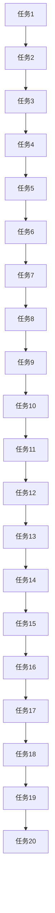

# Eureka 队列

Eureka队列是一种特殊的数据结构，用于在特定条件下高效地管理数据的插入和删除操作。它结合了队列的先进先出（FIFO）特性与某些优化策略，使得在某些应用场景中能够提供更高的性能。

## 什么是Eureka队列？

Eureka队列是一种基于队列的数据结构，但其设计目标是在特定条件下提供更高的性能。与普通队列不同，Eureka队列在某些情况下会跳过某些操作，或者采用更高效的算法来处理数据。

### 基本特性

- **先进先出（FIFO）**：Eureka队列保留了队列的基本特性，即数据按照插入的顺序被处理。
- **条件优化**：在某些特定条件下，Eureka队列会跳过不必要的操作，从而提高性能。
- **动态调整**：Eureka队列可以根据当前的数据状态动态调整其内部结构，以适应不同的工作负载。

## Eureka 队列的工作原理

Eureka队列的核心思想是通过条件判断来优化队列的操作。当满足某些条件时，Eureka队列会跳过某些步骤，从而减少不必要的计算。

### 示例代码

以下是一个简单的Eureka队列的实现示例：

```python
class EurekaQueue:
    def __init__(self):
        self.queue = []

    def enqueue(self, item):
        self.queue.append(item)

    def dequeue(self):
        if len(self.queue) == 0:
            return None
        return self.queue.pop(0)

    def is_empty(self):
        return len(self.queue) == 0

    def peek(self):
        if len(self.queue) == 0:
            return None
        return self.queue[0]
```

### 输入与输出

假设我们有一个Eureka队列，并执行以下操作：

```python
eq = EurekaQueue()
eq.enqueue(1)
eq.enqueue(2)
eq.enqueue(3)
print(eq.dequeue())  # 输出: 1
print(eq.dequeue())  # 输出: 2
print(eq.peek())     # 输出: 3
```

## 实际应用场景

Eureka队列在许多实际应用中都有广泛的使用，特别是在需要高效处理大量数据的场景中。

### 案例：任务调度

在任务调度系统中，Eureka队列可以用于管理待执行的任务。当系统负载较高时，Eureka队列可以跳过某些低优先级的任务，从而确保高优先级任务能够及时执行。



:::note
在任务调度系统中，Eureka队列可以根据任务的优先级动态调整任务的执行顺序，从而提高系统的整体效率。
:::

## 总结

Eureka队列是一种高效的数据结构，特别适用于需要动态调整和条件优化的场景。通过结合队列的FIFO特性和条件优化策略，Eureka队列能够在处理大量数据时提供更高的性能。

## 附加资源与练习

- **练习1**：实现一个Eureka队列，并测试其在不同负载下的性能。
- **练习2**：尝试将Eureka队列应用于一个简单的任务调度系统，并观察其行为。
- **资源**：阅读更多关于队列和优化算法的书籍，深入理解Eureka队列的设计思想。

:::tip
Eureka队列的设计思想可以应用于许多其他数据结构中，尝试将其与其他数据结构结合，看看能否创造出更高效的算法。
:::