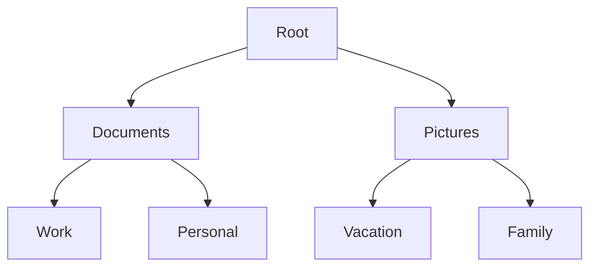
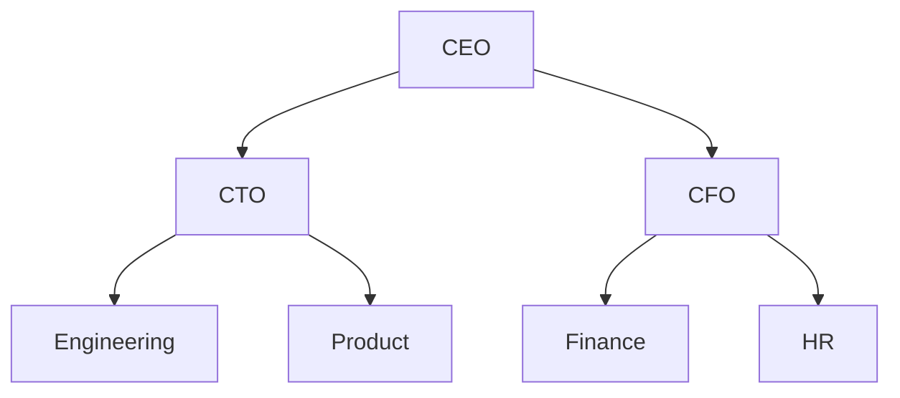

# Eureka 树结构

## 介绍

Eureka树结构是一种特殊的树形数据结构，常用于解决分层数据的管理和查询问题。它的核心思想是通过将数据组织成树的形式，使得数据的存储和检索更加高效。Eureka树结构广泛应用于文件系统、数据库索引、组织结构图等领域。

在本节中，我们将逐步介绍Eureka树结构的基本概念、实现方式以及实际应用场景。

## 什么是Eureka树结构？

Eureka树结构是一种**分层数据结构**，由节点（Node）和边（Edge）组成。每个节点可以有零个或多个子节点，但只有一个父节点（除了根节点）。根节点是树的起点，没有父节点。

Eureka树结构的核心特点包括：
- **层次性**：数据以层次化的方式组织，每个节点代表一个层级。
- **递归性**：树的结构是递归的，每个子树也是一个树。
- **高效查询**：通过树的结构，可以快速定位和检索数据。

## Eureka 树结构的基本操作

### 1. 创建树

首先，我们需要定义一个树节点的结构。以下是一个简单的Python实现：

```python
class TreeNode:
    def __init__(self, value):
        self.value = value
        self.children = []

    def add_child(self, child_node):
        self.children.append(child_node)
```

### 2. 插入节点

插入节点是树结构的基本操作之一。以下是如何在Eureka树中插入一个子节点的示例：

```python
# 创建根节点
root = TreeNode("Root")

# 创建子节点
child1 = TreeNode("Child1")
child2 = TreeNode("Child2")

# 将子节点添加到根节点
root.add_child(child1)
root.add_child(child2)
```

### 3. 遍历树

遍历树是访问树中所有节点的过程。常见的遍历方式包括**深度优先遍历（DFS）**和**广度优先遍历（BFS）**。

#### 深度优先遍历（DFS）

```python
def dfs(node):
    if node is None:
        return
    print(node.value)
    for child in node.children:
        dfs(child)

# 执行DFS遍历
dfs(root)
```

#### 广度优先遍历（BFS）

```python
from collections import deque

def bfs(root):
    queue = deque([root])
    while queue:
        node = queue.popleft()
        print(node.value)
        for child in node.children:
            queue.append(child)

# 执行BFS遍历
bfs(root)
```

### 4. 删除节点

删除节点时，需要确保树的结构仍然保持完整。以下是一个简单的删除操作示例：

```python
def remove_child(parent, child_value):
    parent.children = [child for child in parent.children if child.value != child_value]

# 删除子节点
remove_child(root, "Child1")
```

## Eureka 树结构的实际应用

### 1. 文件系统

文件系统是Eureka树结构的典型应用之一。文件系统中的目录和文件可以看作是一个树结构，其中目录是节点，文件是叶子节点。



### 2. 组织结构图

公司的组织结构图也可以使用Eureka树结构来表示。每个部门是一个节点，员工是叶子节点。



### 3. 数据库索引

在数据库中，索引通常使用树结构（如B树或B+树）来加速数据的检索。Eureka树结构的思想与这些索引结构类似。

## 总结

Eureka树结构是一种强大的数据结构，适用于需要分层管理和高效查询的场景。通过理解树的基本操作和应用场景，你可以更好地利用树结构来解决实际问题。

## 附加资源与练习

- **练习1**：尝试实现一个Eureka树结构，并编写代码插入、删除和遍历节点。
- **练习2**：思考如何在Eureka树结构中实现查找特定节点的功能。
- **附加资源**：
  - [树结构 - Wikipedia](https://zh.wikipedia.org/wiki/树_(数据结构))
  - [深度优先搜索与广度优先搜索 - GeeksforGeeks](https://www.geeksforgeeks.org/depth-first-search-or-dfs-for-a-graph/)

:::tip
如果你对树结构有更深入的兴趣，可以进一步学习二叉树、平衡树、B树等高级树结构。
:::