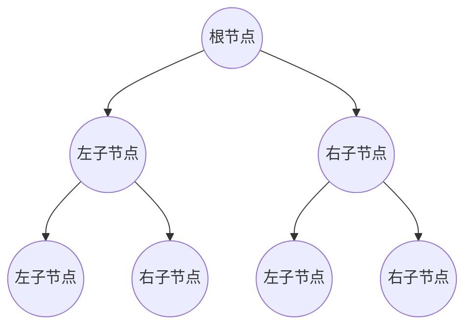

# Eureka 二叉树

二叉树是计算机科学中最基础且重要的数据结构之一。它是一种树形结构，其中每个节点最多有两个子节点，分别称为左子节点和右子节点。二叉树广泛应用于搜索、排序、数据库索引等领域。本文将带你逐步了解二叉树的基本概念、实现方式以及实际应用。

## 什么是二叉树？

二叉树是一种树形数据结构，其中每个节点最多有两个子节点。这两个子节点通常被称为**左子节点**和**右子节点**。二叉树的结构如下：



:::note
二叉树的特点：
- 每个节点最多有两个子节点。
- 左子节点和右子节点的顺序是固定的。
- 没有子节点的节点称为**叶子节点**。
:::

## 二叉树的类型

二叉树有多种类型，常见的有以下几种：

1. **满二叉树**：每个节点都有 0 或 2 个子节点。
2. **完全二叉树**：除了最后一层，其他层都是满的，且最后一层的节点从左到右排列。
3. **二叉搜索树（BST）**：左子节点的值小于父节点，右子节点的值大于父节点。
4. **平衡二叉树**：左右子树的高度差不超过 1。

## 二叉树的实现

下面是一个简单的二叉树节点的 Python 实现：

```python
class TreeNode:
    def __init__(self, value):
        self.value = value
        self.left = None
        self.right = None
```

### 示例：创建一个简单的二叉树

```python
# 创建根节点
root = TreeNode(1)

# 创建左子节点
root.left = TreeNode(2)

# 创建右子节点
root.right = TreeNode(3)

# 继续添加子节点
root.left.left = TreeNode(4)
root.left.right = TreeNode(5)
```

### 遍历二叉树

二叉树的遍历方式主要有三种：

1. **前序遍历**：根节点 -> 左子树 -> 右子树
2. **中序遍历**：左子树 -> 根节点 -> 右子树
3. **后序遍历**：左子树 -> 右子树 -> 根节点

以下是一个前序遍历的示例：

```python
def preorder_traversal(node):
    if node:
        print(node.value)
        preorder_traversal(node.left)
        preorder_traversal(node.right)

# 调用前序遍历
preorder_traversal(root)
```

**输出：**
```
1
2
4
5
3
```

## 二叉树的实际应用

二叉树在现实生活中有许多应用场景，以下是一些常见的例子：

1. **文件系统**：文件系统的目录结构可以看作是一棵二叉树，每个目录可以有多个子目录。
2. **数据库索引**：许多数据库使用二叉搜索树（BST）或其变体（如 B 树）来加速数据检索。
3. **表达式解析**：编译器使用二叉树来表示和解析数学表达式。

### 案例：二叉搜索树（BST）

二叉搜索树是一种特殊的二叉树，其中左子节点的值小于父节点，右子节点的值大于父节点。这种结构使得查找、插入和删除操作非常高效。

```python
class BST:
    def __init__(self, value):
        self.root = TreeNode(value)

    def insert(self, value):
        self._insert_recursive(self.root, value)

    def _insert_recursive(self, node, value):
        if value < node.value:
            if node.left is None:
                node.left = TreeNode(value)
            else:
                self._insert_recursive(node.left, value)
        else:
            if node.right is None:
                node.right = TreeNode(value)
            else:
                self._insert_recursive(node.right, value)

# 创建一个二叉搜索树
bst = BST(10)
bst.insert(5)
bst.insert(15)
bst.insert(3)
bst.insert(7)
```

## 总结

二叉树是一种基础但强大的数据结构，广泛应用于计算机科学的各个领域。通过本文，你已经了解了二叉树的基本概念、实现方式以及实际应用。希望你能通过练习进一步掌握二叉树的相关知识。

:::tip
**附加练习：**
1. 实现中序遍历和后序遍历。
2. 尝试实现一个二叉搜索树的查找功能。
3. 研究平衡二叉树（如 AVL 树）的实现。
:::

:::caution
**注意：**
- 在实际应用中，二叉树的性能可能会受到树的高度影响。确保树的结构尽可能平衡，以提高操作效率。
:::

**附加资源：**
- [二叉树 - Wikipedia](https://zh.wikipedia.org/wiki/%E4%BA%8C%E5%8F%89%E6%A0%91)
- [二叉搜索树 - GeeksforGeeks](https://www.geeksforgeeks.org/binary-search-tree-data-structure/)