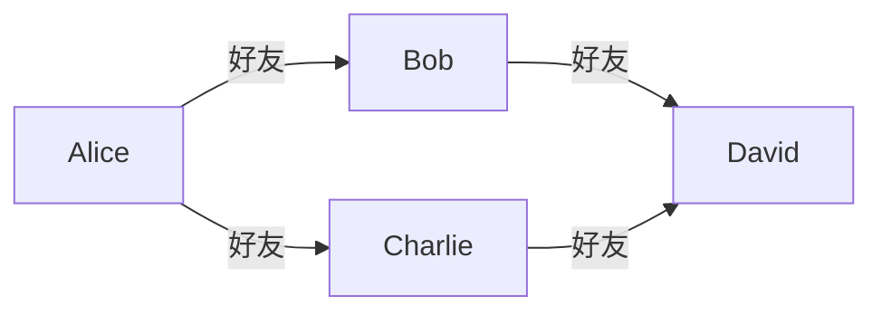
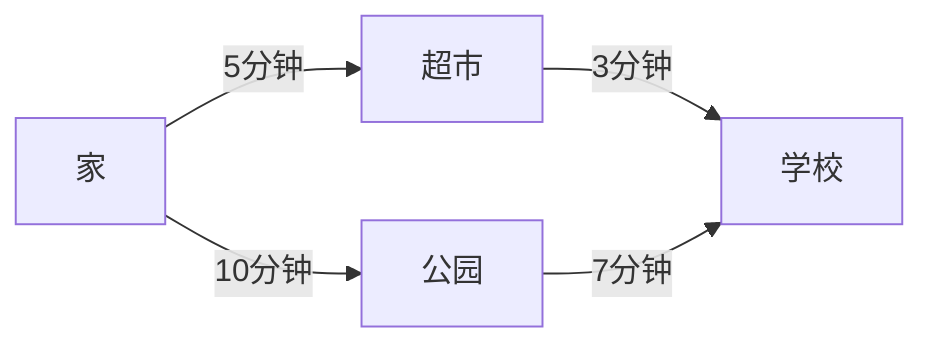

# Eureka 图结构

图结构是计算机科学中一种非常重要的数据结构，用于表示对象之间的关系。图由**节点（顶点）**和**边**组成，节点表示实体，边表示实体之间的关系。图结构广泛应用于社交网络、路径规划、推荐系统等领域。

## 什么是图结构？

图结构是一种非线性数据结构，由以下两个主要部分组成：

1. **节点（顶点）**：表示实体或对象。
2. **边**：表示节点之间的关系或连接。

图可以分为**有向图**和**无向图**：
- **有向图**：边有方向，表示从一个节点到另一个节点的单向关系。
- **无向图**：边没有方向，表示节点之间的双向关系。

:::tip
图结构非常适合表示复杂的关系网络，例如社交网络中的朋友关系、地图中的路径等。
:::

## 图的表示方式

图可以通过多种方式表示，以下是两种常见的表示方法：

### 1. 邻接矩阵

邻接矩阵是一个二维数组，其中 `matrix[i][j]` 表示节点 `i` 和节点 `j` 之间是否存在边。如果图是无向图，矩阵是对称的；如果是有向图，则不一定对称。

```python
# 无向图的邻接矩阵示例
graph = [
    [0, 1, 1, 0],  # 节点 0 连接到节点 1 和 2
    [1, 0, 0, 1],  # 节点 1 连接到节点 0 和 3
    [1, 0, 0, 1],  # 节点 2 连接到节点 0 和 3
    [0, 1, 1, 0]   # 节点 3 连接到节点 1 和 2
]
```

### 2. 邻接表

邻接表使用字典或列表来表示图，其中每个节点对应一个列表，存储与其相连的节点。

```python
# 无向图的邻接表示例
graph = {
    0: [1, 2],  # 节点 0 连接到节点 1 和 2
    1: [0, 3],  # 节点 1 连接到节点 0 和 3
    2: [0, 3],  # 节点 2 连接到节点 0 和 3
    3: [1, 2]   # 节点 3 连接到节点 1 和 2
}
```

:::note
邻接矩阵适合表示稠密图（边较多），而邻接表适合表示稀疏图（边较少）。
:::

## 图的基本操作

### 1. 添加节点和边

在邻接表中，添加节点和边的操作非常简单：

```python
# 添加节点
graph[4] = []  # 添加一个新节点 4

# 添加边
graph[0].append(4)  # 在节点 0 和 4 之间添加一条边
graph[4].append(0)  # 如果是无向图，需要双向添加
```

### 2. 遍历图

图的遍历有两种常见方式：**深度优先搜索（DFS）**和**广度优先搜索（BFS）**。

#### 深度优先搜索（DFS）

DFS 是一种递归或栈实现的遍历方法，沿着一条路径深入直到无法继续，然后回溯。

```python
def dfs(graph, start, visited=None):
    if visited is None:
        visited = set()
    visited.add(start)
    print(start)  # 处理当前节点
    for neighbor in graph[start]:
        if neighbor not in visited:
            dfs(graph, neighbor, visited)
```

#### 广度优先搜索（BFS）

BFS 使用队列实现，逐层遍历节点。

```python
from collections import deque

def bfs(graph, start):
    visited = set()
    queue = deque([start])
    while queue:
        node = queue.popleft()
        if node not in visited:
            visited.add(node)
            print(node)  # 处理当前节点
            queue.extend(graph[node] - visited)
```

## 实际应用场景

### 1. 社交网络

在社交网络中，用户是节点，好友关系是边。通过图结构，可以轻松找到用户之间的共同好友或推荐新朋友。



### 2. 路径规划

在地图应用中，地点是节点，道路是边。通过图结构，可以找到两点之间的最短路径。



## 总结

图结构是一种强大的数据结构，能够有效表示复杂的关系网络。通过邻接矩阵或邻接表，可以轻松实现图的存储和操作。深度优先搜索和广度优先搜索是遍历图的两种基本方法，适用于不同的场景。

:::caution
在处理大规模图时，注意选择合适的数据结构和算法，以避免性能问题。
:::

## 附加资源与练习

- **练习 1**：实现一个无向图，并编写代码计算每个节点的度数。
- **练习 2**：使用 BFS 找到图中两个节点之间的最短路径。
- **推荐阅读**：《算法导论》中的图算法章节，深入了解图的高级应用。

希望这篇内容能帮助你更好地理解图结构！继续加油学习吧！