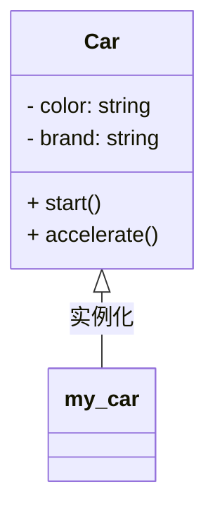

# Eureka 类与对象

面向对象编程（OOP）是一种编程范式，它将程序中的数据和操作数据的方法封装在一起，形成“对象”。类是对象的蓝图或模板，而对象是类的实例。理解类与对象是掌握面向对象编程的关键。

## 什么是类？

类（Class）是面向对象编程中的基本概念之一。它定义了一组属性和方法，用于描述具有相同特征和行为的一组对象。你可以将类看作是一个模板，而对象则是根据这个模板创建的具体实例。

### 类的定义

在大多数编程语言中，类的定义通常包括以下部分：

- **属性（Attributes）**：类的属性是描述对象特征的变量。例如，一个“汽车”类可能有“颜色”、“品牌”等属性。
- **方法（Methods）**：类的方法是定义对象行为的函数。例如，一个“汽车”类可能有“启动”、“加速”等方法。

以下是一个简单的“汽车”类的定义示例：

```python
class Car:
    def __init__(self, color, brand):
        self.color = color
        self.brand = brand

    def start(self):
        print(f"The {self.color} {self.brand} car is starting.")

    def accelerate(self):
        print(f"The {self.color} {self.brand} car is accelerating.")
```

在这个示例中，`Car` 类有两个属性：`color` 和 `brand`，以及两个方法：`start` 和 `accelerate`。

## 什么是对象？

对象（Object）是类的实例。通过类创建对象的过程称为实例化。每个对象都有其独立的属性值，但共享类中定义的方法。

### 对象的创建

使用类创建对象非常简单。以下是如何创建 `Car` 类的对象并调用其方法的示例：

```python
my_car = Car("red", "Toyota")
my_car.start()
my_car.accelerate()
```

**输出：**

```
The red Toyota car is starting.
The red Toyota car is accelerating.
```

在这个示例中，`my_car` 是 `Car` 类的一个对象。我们通过传递 `"red"` 和 `"Toyota"` 作为参数来初始化对象的属性，然后调用 `start` 和 `accelerate` 方法。

## 类与对象的关系

为了更好地理解类与对象的关系，我们可以使用以下图表：



在这个图表中，`Car` 类是一个模板，而 `my_car` 是根据这个模板创建的一个具体对象。

## 实际应用场景

类与对象的概念在现实世界中有广泛的应用。例如，在一个电商网站中，你可以定义一个 `Product` 类来表示商品，每个商品对象都有属性如 `name`、`price` 和 `description`，以及方法如 `add_to_cart` 和 `display_details`。

```python
class Product:
    def __init__(self, name, price, description):
        self.name = name
        self.price = price
        self.description = description

    def add_to_cart(self):
        print(f"{self.name} has been added to the cart.")

    def display_details(self):
        print(f"Product: {self.name}, Price: ${self.price}, Description: {self.description}")

# 创建对象
product1 = Product("Laptop", 999.99, "A high-performance laptop.")
product1.add_to_cart()
product1.display_details()
```

**输出：**

```
Laptop has been added to the cart.
Product: Laptop, Price: $999.99, Description: A high-performance laptop.
```

## 总结

类与对象是面向对象编程的核心概念。类是对象的蓝图，定义了对象的属性和方法；对象是类的实例，具有独立的属性值和共享的方法。通过理解类与对象的关系，你可以更好地设计和组织你的代码。

## 附加资源与练习

- **练习**：尝试定义一个 `Person` 类，包含属性如 `name`、`age` 和方法如 `greet`、`celebrate_birthday`。然后创建几个 `Person` 对象并调用它们的方法。
- **资源**：阅读更多关于面向对象编程的资料，了解继承、封装和多态等高级概念。

:::tip
记住，类是模板，对象是根据模板创建的具体实例。通过不断练习，你将更加熟练地使用类与对象来构建复杂的程序。
:::