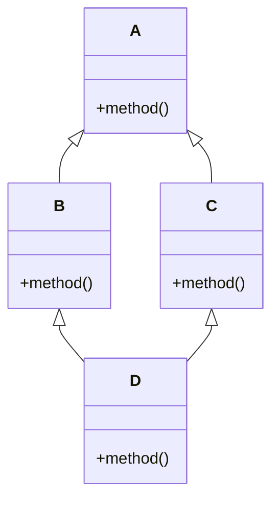

# Eureka 多重继承

在面向对象编程（OOP）中，**多重继承**是指一个类可以从多个父类继承属性和方法。这种机制允许子类同时具备多个父类的特性，从而增强代码的复用性和灵活性。Eureka语言支持多重继承，这使得开发者可以更灵活地设计复杂的类结构。

## 什么是多重继承？

多重继承是OOP中的一种特性，它允许一个类从多个父类继承属性和方法。与单继承（一个类只能有一个父类）不同，多重继承使得子类可以同时具备多个父类的特性。这种机制在某些场景下非常有用，比如当我们需要组合多个类的功能时。

### 单继承 vs 多重继承

- **单继承**：一个类只能有一个父类。
- **多重继承**：一个类可以有多个父类。

## Eureka 中的多重继承

在Eureka中，多重继承的语法非常简单。你只需要在定义类时，列出多个父类即可。下面是一个简单的例子：

```eureka
class Animal {
    void eat() {
        println("Animal is eating");
    }
}

class Flyable {
    void fly() {
        println("Flying high");
    }
}

class Bird: Animal, Flyable {
    void chirp() {
        println("Bird is chirping");
    }
}

fun main() {
    Bird bird = new Bird();
    bird.eat();   // 继承自Animal类
    bird.fly();   // 继承自Flyable类
    bird.chirp(); // Bird类自己的方法
}
```

**输出：**
```
Animal is eating
Flying high
Bird is chirping
```

在这个例子中，`Bird`类同时继承了`Animal`和`Flyable`两个类，因此它可以调用`eat()`和`fly()`方法。

## 多重继承的潜在问题

虽然多重继承非常强大，但它也带来了一些潜在的问题，其中最常见的是**菱形继承问题**（Diamond Problem）。这个问题发生在多个父类有相同的方法或属性时，子类无法确定应该继承哪一个。

### 菱形继承问题



在上面的类图中，`D`类同时继承了`B`和`C`，而`B`和`C`又都继承了`A`。如果`A`中有一个`method()`，那么`D`类在调用`method()`时，应该调用`B`的`method()`还是`C`的`method()`呢？

### Eureka 中的解决方案

Eureka通过**方法解析顺序（MRO）**来解决这个问题。MRO定义了在多重继承中，方法的调用顺序。Eureka使用C3线性化算法来确定MRO，确保方法的调用顺序是明确且一致的。

```eureka
class A {
    void method() {
        println("A's method");
    }
}

class B: A {
    override void method() {
        println("B's method");
    }
}

class C: A {
    override void method() {
        println("C's method");
    }
}

class D: B, C {
    // D类没有重写method()
}

fun main() {
    D d = new D();
    d.method(); // 输出：B's method
}
```

**输出：**
```
B's method
```

在这个例子中，`D`类继承了`B`和`C`，而`B`和`C`都重写了`A`的`method()`。根据Eureka的MRO，`D`类会优先调用`B`的`method()`。

## 实际应用场景

多重继承在实际开发中有很多应用场景，尤其是在需要组合多个类的功能时。以下是一个实际案例：

### 案例：游戏中的角色系统

假设我们正在开发一个游戏，游戏中有多种角色，每种角色都有不同的能力。我们可以使用多重继承来设计这些角色。

```eureka
class Character {
    void move() {
        println("Character is moving");
    }
}

class Warrior {
    void attack() {
        println("Warrior is attacking");
    }
}

class Mage {
    void castSpell() {
        println("Mage is casting a spell");
    }
}

class BattleMage: Character, Warrior, Mage {
    void specialAbility() {
        println("BattleMage is using a special ability");
    }
}

fun main() {
    BattleMage bm = new BattleMage();
    bm.move();         // 继承自Character
    bm.attack();       // 继承自Warrior
    bm.castSpell();    // 继承自Mage
    bm.specialAbility(); // BattleMage自己的方法
}
```

**输出：**
```
Character is moving
Warrior is attacking
Mage is casting a spell
BattleMage is using a special ability
```

在这个案例中，`BattleMage`类同时继承了`Character`、`Warrior`和`Mage`，因此它具备了移动、攻击和施法的能力。

## 总结

多重继承是Eureka中一个强大的特性，它允许一个类从多个父类继承属性和方法。虽然它带来了代码复用和灵活性的好处，但也引入了菱形继承问题。Eureka通过方法解析顺序（MRO）来解决这个问题，确保方法的调用顺序是明确且一致的。

在实际开发中，多重继承可以用于设计复杂的类结构，尤其是在需要组合多个类的功能时。通过合理使用多重继承，你可以编写出更加灵活和可复用的代码。

## 附加资源与练习

- **练习1**：尝试创建一个`FlyingCar`类，它同时继承`Car`和`Aircraft`类，并实现`drive()`和`fly()`方法。
- **练习2**：研究Eureka的MRO机制，并尝试在不同的多重继承场景下预测方法的调用顺序。

通过以上练习，你将更深入地理解Eureka中的多重继承机制，并能够在实际项目中灵活运用。