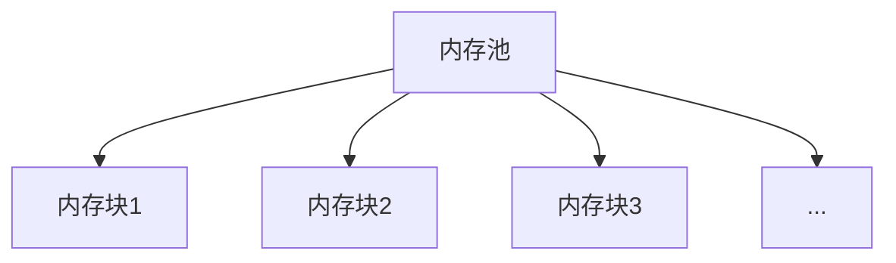

# Eureka 内存分配

## 介绍

在编程中，内存分配是一个至关重要的概念。它决定了程序如何管理和使用计算机的内存资源。Eureka内存分配是一种高效的内存管理机制，旨在优化内存使用，减少内存碎片，并提高程序的性能。本文将详细介绍Eureka内存分配的工作原理、实现方式以及实际应用场景。

## 什么是Eureka内存分配？

Eureka内存分配是一种动态内存分配策略，它通过预分配内存块并在需要时进行分配和释放，来优化内存使用。与传统的动态内存分配方法相比，Eureka内存分配具有更高的效率和更少的内存碎片。

## 工作原理

Eureka内存分配的核心思想是将内存划分为多个固定大小的块，并在程序运行时动态分配这些块。当程序需要内存时，Eureka会从预分配的内存池中分配一个块；当内存不再需要时，Eureka会将块释放回内存池。

### 内存池

内存池是Eureka内存分配的基础。它是一个预先分配的内存区域，包含多个固定大小的内存块。内存池的大小和块的大小可以根据程序的需求进行调整。



### 分配与释放

当程序需要内存时，Eureka会从内存池中分配一个空闲的内存块。如果内存池中没有足够的空闲块，Eureka会动态扩展内存池。当内存不再需要时，Eureka会将内存块释放回内存池，以便后续使用。

```cpp
#include <eureka/memory.h>

int main() {
    // 初始化内存池
    eureka_memory_pool pool;
    eureka_memory_pool_init(&pool, 1024, 64);

    // 分配内存块
    void* block1 = eureka_memory_alloc(&pool);
    void* block2 = eureka_memory_alloc(&pool);

    // 使用内存块
    // ...

    // 释放内存块
    eureka_memory_free(&pool, block1);
    eureka_memory_free(&pool, block2);

    // 销毁内存池
    eureka_memory_pool_destroy(&pool);

    return 0;
}
```

## 实际应用场景

Eureka内存分配在许多实际应用场景中都有广泛的应用，特别是在需要高效内存管理的系统中。以下是一些常见的应用场景：

### 嵌入式系统

在嵌入式系统中，内存资源通常非常有限。Eureka内存分配可以帮助嵌入式系统高效地管理内存，减少内存碎片，并提高系统的稳定性。

### 游戏开发

在游戏开发中，内存管理是一个关键问题。Eureka内存分配可以帮助游戏引擎高效地管理内存，减少内存分配和释放的开销，从而提高游戏的性能。

### 实时系统

在实时系统中，内存分配的效率和可预测性至关重要。Eureka内存分配可以提供高效且可预测的内存管理，确保实时系统的稳定运行。

## 总结

Eureka内存分配是一种高效的内存管理机制，通过预分配内存块并在需要时进行分配和释放，来优化内存使用。它在嵌入式系统、游戏开发和实时系统等场景中都有广泛的应用。通过理解Eureka内存分配的工作原理和实现方式，您可以更好地管理程序的内存资源，提高程序的性能和稳定性。

## 附加资源与练习

- **练习1**：尝试在您的项目中实现一个简单的Eureka内存分配器，并测试其性能。
- **练习2**：研究其他内存分配策略（如伙伴系统、slab分配器），并与Eureka内存分配进行比较。
- **附加资源**：
  - [Eureka内存分配官方文档](#)
  - [内存管理基础教程](#)
  - [高效内存分配策略](#)

:::tip
在实际项目中，选择合适的内存分配策略可以显著提高程序的性能和稳定性。Eureka内存分配是一个值得深入研究和应用的工具。
:::