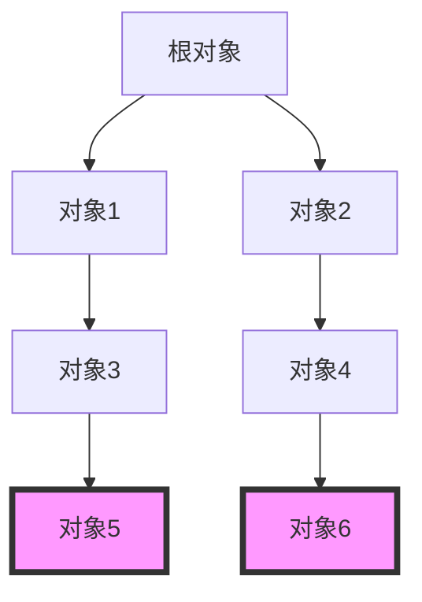

# Eureka 垃圾回收

在编程中，内存管理是一个至关重要的主题，尤其是在处理大量数据或长时间运行的程序时。Eureka垃圾回收（Garbage Collection, GC）是一种自动内存管理机制，它帮助开发者避免手动管理内存的复杂性，减少内存泄漏和悬空指针等问题。本文将详细介绍Eureka垃圾回收的工作原理、实际应用场景以及如何优化垃圾回收性能。

## 什么是垃圾回收？

垃圾回收是一种自动内存管理机制，用于识别和释放不再使用的内存。在Eureka中，垃圾回收器会定期扫描内存，找出那些不再被程序引用的对象，并释放它们占用的内存空间。这样，开发者就不需要手动释放内存，从而减少了出错的可能性。

:::note
垃圾回收的主要目标是提高内存使用效率，减少内存泄漏和程序崩溃的风险。
:::

## 垃圾回收的工作原理

Eureka的垃圾回收机制基于**标记-清除算法**（Mark-and-Sweep）。该算法分为两个主要步骤：

1. **标记阶段**：垃圾回收器从根对象（如全局变量、栈中的局部变量等）开始，遍历所有可达对象，并标记它们为“存活”。
2. **清除阶段**：垃圾回收器扫描整个内存，清除所有未被标记的对象，释放它们占用的内存。



在上图中，`对象5`和`对象6`没有被任何根对象引用，因此在清除阶段会被回收。

## 代码示例

以下是一个简单的Eureka代码示例，展示了垃圾回收的作用：

```eureka
class Node {
    var value: Int
    var next: Node?

    init(value: Int) {
        self.value = value
    }
}

func createNodes() {
    let node1 = Node(value: 1)
    let node2 = Node(value: 2)
    node1.next = node2
    // node2 不再被引用
    node1.next = nil
}

createNodes()
// 在此处，node2 将被垃圾回收器回收
```

在这个示例中，`node2`最初被`node1`引用，但在`node1.next`被设置为`nil`后，`node2`不再被任何对象引用，因此它会被垃圾回收器回收。

## 实际应用场景

垃圾回收在以下场景中尤为重要：

1. **长时间运行的服务**：如Web服务器或数据库服务，这些服务需要长时间运行并处理大量请求，垃圾回收可以防止内存泄漏导致的服务崩溃。
2. **大数据处理**：在处理大量数据时，垃圾回收可以自动释放不再使用的内存，避免内存耗尽。
3. **实时系统**：在实时系统中，垃圾回收可以确保内存资源的及时释放，避免系统延迟。

:::tip
在开发大型应用时，合理配置垃圾回收参数（如堆大小、回收频率等）可以显著提高应用性能。
:::

## 总结

Eureka垃圾回收是一种强大的内存管理工具，它通过自动识别和释放不再使用的内存，帮助开发者避免手动管理内存的复杂性。理解垃圾回收的工作原理和优化策略，对于编写高效、稳定的程序至关重要。

## 附加资源

- [Eureka官方文档 - 内存管理](https://eureka-lang.org/docs/memory-management)
- [垃圾回收算法详解](https://en.wikipedia.org/wiki/Garbage_collection_(computer_science))
- [Eureka性能优化指南](https://eureka-lang.org/docs/performance-optimization)

## 练习

1. 编写一个Eureka程序，创建一个循环引用的对象链，并观察垃圾回收器的行为。
2. 修改垃圾回收器的参数（如堆大小），观察其对程序性能的影响。
3. 尝试在Eureka中实现一个简单的垃圾回收器，理解其工作原理。

通过以上内容，你应该对Eureka垃圾回收有了全面的了解。继续探索和实践，你将能够更好地掌握内存管理的技巧。