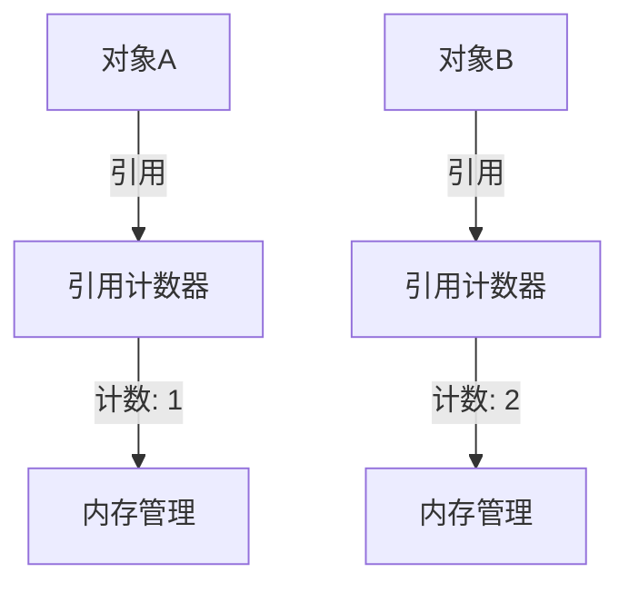

# Eureka 引用计数

在编程中，内存管理是一个非常重要的概念，尤其是在处理动态内存分配时。Eureka引用计数是一种内存管理技术，用于跟踪对象的引用数量，以便在对象不再被引用时自动释放其占用的内存。本文将详细介绍Eureka引用计数的概念、工作原理以及实际应用。

## 什么是引用计数？

引用计数是一种内存管理技术，它通过维护一个计数器来跟踪对象被引用的次数。每当一个对象被引用时，计数器加1；当引用被释放时，计数器减1。当计数器变为0时，表示该对象不再被任何引用所指向，此时可以安全地释放该对象占用的内存。

### 引用计数的工作原理

引用计数的核心思想是：**每个对象都有一个引用计数器**，用于记录当前有多少个引用指向该对象。当引用计数为0时，对象将被销毁。



在上面的图表中，对象A的引用计数为1，对象B的引用计数为2。当对象B的引用计数减少到0时，对象B将被销毁。

## 引用计数的实现

让我们通过一个简单的代码示例来理解引用计数的实现。

```python
class RefCountedObject:
    def __init__(self):
        self.ref_count = 0

    def add_ref(self):
        self.ref_count += 1

    def release_ref(self):
        self.ref_count -= 1
        if self.ref_count == 0:
            self.destroy()

    def destroy(self):
        print("对象被销毁")

# 创建对象
obj = RefCountedObject()

# 增加引用
obj.add_ref()
obj.add_ref()

# 释放引用
obj.release_ref()
obj.release_ref()
```

**输出：**
```
对象被销毁
```

在这个示例中，`RefCountedObject` 类包含一个引用计数器 `ref_count`。每次调用 `add_ref` 方法时，引用计数增加；每次调用 `release_ref` 方法时，引用计数减少。当引用计数为0时，`destroy` 方法被调用，对象被销毁。

## 引用计数的优缺点

### 优点
- **实时性**：引用计数可以立即释放不再被引用的对象，避免了内存泄漏。
- **简单性**：引用计数的实现相对简单，易于理解和调试。

### 缺点
- **循环引用**：如果两个或多个对象相互引用，它们的引用计数永远不会变为0，导致内存泄漏。
- **性能开销**：每次引用和释放都需要更新引用计数，可能会带来一定的性能开销。

## 实际应用场景

引用计数在许多编程语言和框架中都有应用。例如，Python 的垃圾回收机制就使用了引用计数来管理内存。此外，一些图形用户界面（GUI）框架也使用引用计数来管理窗口和控件的生命周期。

### 示例：Python中的引用计数

在Python中，每个对象都有一个引用计数，可以通过 `sys.getrefcount` 函数查看对象的引用计数。

```python
import sys

a = []
print(sys.getrefcount(a))  # 输出: 2

b = a
print(sys.getrefcount(a))  # 输出: 3

del b
print(sys.getrefcount(a))  # 输出: 2
```

**输出：**
```
2
3
2
```

在这个示例中，`a` 是一个空列表，初始引用计数为2（因为 `a` 和 `sys.getrefcount` 的参数都引用了它）。当 `b` 引用 `a` 时，引用计数增加到3。删除 `b` 后，引用计数减少到2。

## 总结

Eureka引用计数是一种简单而有效的内存管理技术，通过跟踪对象的引用数量来确保内存的合理使用。尽管它有一些缺点，如循环引用和性能开销，但在许多实际应用中，引用计数仍然是一个非常有用的工具。

### 附加资源
- [Python官方文档 - 垃圾回收机制](https://docs.python.org/3/library/gc.html)
- [深入理解引用计数](https://en.wikipedia.org/wiki/Reference_counting)

### 练习
1. 修改上面的 `RefCountedObject` 类，使其能够处理循环引用的情况。
2. 在Python中创建一个循环引用的对象，并使用 `gc.collect()` 强制进行垃圾回收，观察引用计数的变化。

希望本文能帮助你更好地理解Eureka引用计数的概念及其应用。继续学习，探索更多编程知识！