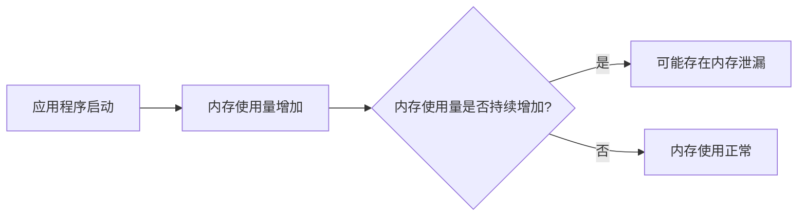

# Eureka 内存泄漏

## 介绍

在编程中，内存泄漏（Memory Leak）是指程序在运行过程中未能正确释放不再使用的内存，导致内存占用不断增加，最终可能耗尽系统资源，影响程序性能甚至导致崩溃。Eureka作为一个流行的服务发现框架，虽然本身设计良好，但在实际使用中，开发者可能会因为不当的代码编写或配置导致内存泄漏问题。

本文将详细介绍Eureka内存泄漏的概念、常见原因、检测方法以及如何避免这些问题。

## 什么是内存泄漏？

内存泄漏是指程序在运行过程中分配了内存，但在不再需要时未能正确释放。随着时间的推移，这些未释放的内存会逐渐累积，最终导致系统内存耗尽，程序运行变慢甚至崩溃。

在Eureka中，内存泄漏可能发生在以下场景：
- 未正确关闭的HTTP连接
- 未释放的缓存对象
- 未清理的监听器或回调函数

## 常见的内存泄漏原因

### 1. 未正确关闭的HTTP连接

在Eureka中，客户端与服务端之间的通信通常通过HTTP协议进行。如果HTTP连接未正确关闭，可能会导致连接资源无法释放，从而引发内存泄漏。

```java
// 错误示例：未关闭的HTTP连接
HttpURLConnection connection = (HttpURLConnection) new URL("http://example.com").openConnection();
connection.setRequestMethod("GET");
connection.connect();
// 忘记调用 connection.disconnect();
```

### 2. 未释放的缓存对象

Eureka客户端通常会缓存服务实例信息以提高性能。如果缓存对象未及时清理，可能会导致内存泄漏。

```java
// 错误示例：未清理的缓存
Map<String, InstanceInfo> cache = new HashMap<>();
cache.put("service1", instanceInfo);
// 忘记调用 cache.remove("service1");
```

### 3. 未清理的监听器或回调函数

在Eureka中，客户端可能会注册监听器或回调函数来接收服务实例的变化通知。如果这些监听器或回调函数未正确清理，可能会导致内存泄漏。

```java
// 错误示例：未清理的监听器
EurekaEventListener listener = event -> {
    // 处理事件
};
eurekaClient.registerEventListener(listener);
// 忘记调用 eurekaClient.unregisterEventListener(listener);
```

## 如何检测内存泄漏？

### 1. 使用内存分析工具

内存分析工具（如VisualVM、JProfiler、Eclipse MAT等）可以帮助开发者检测内存泄漏问题。这些工具可以生成内存快照，并分析内存中的对象引用关系，找出未释放的对象。

### 2. 监控内存使用情况

通过监控应用程序的内存使用情况，可以及时发现内存泄漏的迹象。例如，如果内存使用量持续增加而不下降，可能存在内存泄漏问题。



## 如何避免内存泄漏？

### 1. 正确关闭资源

在使用HTTP连接、数据库连接等资源时，务必确保在不再需要时正确关闭它们。

```java
// 正确示例：关闭HTTP连接
HttpURLConnection connection = (HttpURLConnection) new URL("http://example.com").openConnection();
try {
    connection.setRequestMethod("GET");
    connection.connect();
    // 处理响应
} finally {
    connection.disconnect();
}
```

### 2. 及时清理缓存

在使用缓存时，确保在不再需要时及时清理缓存对象。

```java
// 正确示例：清理缓存
Map<String, InstanceInfo> cache = new HashMap<>();
cache.put("service1", instanceInfo);
// 使用完毕后清理缓存
cache.remove("service1");
```

### 3. 清理监听器和回调函数

在注册监听器或回调函数时，确保在不再需要时及时清理它们。

```java
// 正确示例：清理监听器
EurekaEventListener listener = event -> {
    // 处理事件
};
eurekaClient.registerEventListener(listener);
// 使用完毕后清理监听器
eurekaClient.unregisterEventListener(listener);
```

## 实际案例

假设我们有一个Eureka客户端应用程序，该应用程序在启动时会注册一个监听器来接收服务实例的变化通知。如果该监听器未正确清理，可能会导致内存泄漏。

```java
public class MyEurekaClient {
    private EurekaClient eurekaClient;
    private EurekaEventListener listener;

    public void start() {
        eurekaClient = new EurekaClient();
        listener = event -> {
            // 处理事件
        };
        eurekaClient.registerEventListener(listener);
    }

    public void stop() {
        // 忘记清理监听器
        // eurekaClient.unregisterEventListener(listener);
    }
}
```

在上述代码中，`stop()`方法未清理监听器，导致监听器对象无法被垃圾回收，从而引发内存泄漏。

## 总结

内存泄漏是编程中常见的问题，尤其是在使用Eureka等框架时。通过正确关闭资源、及时清理缓存和监听器，可以有效避免内存泄漏问题。使用内存分析工具和监控内存使用情况，可以帮助开发者及时发现和解决内存泄漏问题。

## 附加资源与练习

- **练习**：尝试在自己的Eureka客户端应用程序中模拟一个内存泄漏场景，并使用内存分析工具检测和修复它。
- **资源**：
  - [VisualVM 官方文档](https://visualvm.github.io/)
  - [Eclipse MAT 官方文档](https://www.eclipse.org/mat/)
  - [JProfiler 官方文档](https://www.ej-technologies.com/products/jprofiler/overview.html)

:::tip
记住，预防内存泄漏的最佳方法是养成良好的编程习惯，确保在不再需要时正确释放资源。
:::