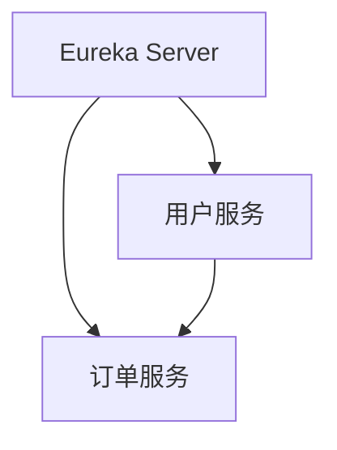

# Eureka 包创建

## 介绍

在微服务架构中，服务发现是一个关键组件，它允许服务动态地发现和调用其他服务。Eureka是Netflix开源的一个服务发现工具，广泛应用于Spring Cloud生态系统中。Eureka包是用于实现服务发现的核心模块，本文将详细介绍如何创建和管理Eureka包。

## Eureka 包的基本概念

Eureka包通常包含以下几个关键组件：

1. **Eureka Server**：服务注册中心，负责管理所有服务的注册和发现。
2. **Eureka Client**：服务提供者和消费者，负责向Eureka Server注册自己，并从Eureka Server获取其他服务的信息。

## 创建Eureka包

### 1. 创建Eureka Server

首先，我们需要创建一个Eureka Server。以下是一个简单的Spring Boot项目配置示例：

```java
@SpringBootApplication
@EnableEurekaServer
public class EurekaServerApplication {
    public static void main(String[] args) {
        SpringApplication.run(EurekaServerApplication.class, args);
    }
}
```

在这个示例中，`@EnableEurekaServer`注解用于启用Eureka Server功能。

### 2. 配置Eureka Server

接下来，我们需要在`application.yml`文件中配置Eureka Server：

```yaml
server:
  port: 8761

eureka:
  instance:
    hostname: localhost
  client:
    registerWithEureka: false
    fetchRegistry: false
    serviceUrl:
      defaultZone: http://${eureka.instance.hostname}:${server.port}/eureka/
```

在这个配置中，`server.port`指定了Eureka Server的端口，`eureka.client.registerWithEureka`和`eureka.client.fetchRegistry`设置为`false`，表示该Eureka Server不需要向其他Eureka Server注册或获取注册信息。

### 3. 创建Eureka Client

现在，我们创建一个Eureka Client，并将其注册到Eureka Server。以下是一个简单的Spring Boot项目配置示例：

```java
@SpringBootApplication
@EnableEurekaClient
public class EurekaClientApplication {
    public static void main(String[] args) {
        SpringApplication.run(EurekaClientApplication.class, args);
    }
}
```

在这个示例中，`@EnableEurekaClient`注解用于启用Eureka Client功能。

### 4. 配置Eureka Client

接下来，我们需要在`application.yml`文件中配置Eureka Client：

```yaml
server:
  port: 8080

spring:
  application:
    name: eureka-client

eureka:
  client:
    serviceUrl:
      defaultZone: http://localhost:8761/eureka/
```

在这个配置中，`spring.application.name`指定了服务的名称，`eureka.client.serviceUrl.defaultZone`指定了Eureka Server的地址。

## 实际案例

假设我们有一个微服务架构，包含以下服务：

1. **用户服务**：负责用户管理。
2. **订单服务**：负责订单管理。

我们可以使用Eureka来实现服务发现。用户服务和订单服务都会注册到Eureka Server，并通过Eureka Server发现彼此。



在这个案例中，用户服务和订单服务通过Eureka Server发现彼此，并可以直接通信。

## 总结

Eureka包是微服务架构中实现服务发现的关键组件。通过创建Eureka Server和Eureka Client，我们可以轻松地实现服务的注册和发现。本文详细介绍了如何创建和配置Eureka包，并通过实际案例展示了其应用场景。

## 附加资源

- [Spring Cloud Eureka官方文档](https://spring.io/projects/spring-cloud-netflix)
- [Netflix Eureka GitHub仓库](https://github.com/Netflix/eureka)

## 练习

1. 尝试创建一个包含多个Eureka Client的微服务架构，并观察它们如何通过Eureka Server进行通信。
2. 修改Eureka Server的配置，使其能够向其他Eureka Server注册和获取注册信息。