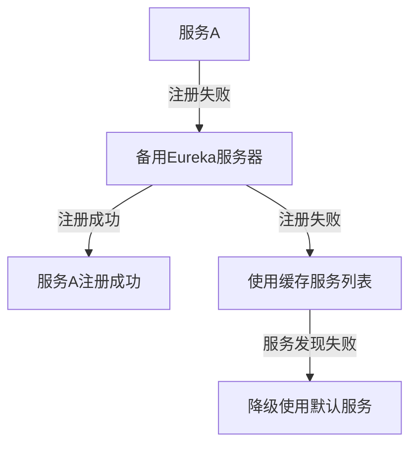

# Eureka 多异常处理

在微服务架构中，Eureka作为服务发现的核心组件，负责管理服务的注册与发现。然而，在实际应用中，可能会遇到多种异常情况，如网络波动、服务不可用、注册失败等。为了确保系统的健壮性，我们需要对这些异常进行有效的处理。本文将详细介绍如何在Eureka中处理多个异常，并通过实际案例展示其应用场景。

## 什么是Eureka多异常处理？

Eureka多异常处理是指在Eureka客户端和服务端中，针对不同的异常情况，采取相应的处理策略。这些异常可能包括服务注册失败、服务发现失败、心跳检测失败等。通过多异常处理，我们可以提高系统的容错能力，确保在异常情况下系统仍能正常运行。

## 常见的Eureka异常

在Eureka中，常见的异常包括：

1. **服务注册失败**：客户端无法将自身注册到Eureka服务器。
2. **服务发现失败**：客户端无法从Eureka服务器获取其他服务的信息。
3. **心跳检测失败**：客户端无法向Eureka服务器发送心跳信号，导致服务被标记为不可用。
4. **网络波动**：网络不稳定导致Eureka客户端与服务器之间的通信中断。

## 多异常处理的实现

### 1. 服务注册失败处理

当服务注册失败时，我们可以采取以下策略：

- **重试机制**：在注册失败后，客户端可以尝试重新注册，直到成功为止。
- **备用注册中心**：配置多个Eureka服务器，当主服务器不可用时，客户端可以尝试向备用服务器注册。

```java
@Bean
public EurekaClientConfigBean eurekaClientConfigBean() {
    EurekaClientConfigBean config = new EurekaClientConfigBean();
    config.setRegistryFetchIntervalSeconds(30);
    config.setServiceUrl(Map.of("defaultZone", "http://backup-eureka-server:8761/eureka/"));
    return config;
}
```

### 2. 服务发现失败处理

当服务发现失败时，我们可以采取以下策略：

- **缓存机制**：客户端可以缓存上一次成功获取的服务列表，在发现失败时使用缓存数据。
- **降级策略**：当无法获取服务列表时，客户端可以降级使用默认服务或返回错误信息。

```java
@Bean
public DiscoveryClient.DiscoveryClientOptionalArgs discoveryClientOptionalArgs() {
    DiscoveryClient.DiscoveryClientOptionalArgs args = new DiscoveryClient.DiscoveryClientOptionalArgs();
    args.setCacheRefreshExecutorThreadPoolSize(10);
    return args;
}
```

### 3. 心跳检测失败处理

当心跳检测失败时，我们可以采取以下策略：

- **重试机制**：客户端可以尝试重新发送心跳信号，直到成功为止。
- **自动注销**：当心跳检测失败超过一定次数时，客户端可以自动注销自身，避免影响其他服务。

```java
@Bean
public EurekaInstanceConfigBean eurekaInstanceConfigBean() {
    EurekaInstanceConfigBean config = new EurekaInstanceConfigBean();
    config.setLeaseRenewalIntervalInSeconds(30);
    config.setLeaseExpirationDurationInSeconds(90);
    return config;
}
```

### 4. 网络波动处理

当网络波动导致通信中断时，我们可以采取以下策略：

- **重试机制**：客户端可以尝试重新连接Eureka服务器，直到成功为止。
- **超时机制**：设置合理的超时时间，避免长时间等待导致系统阻塞。

```java
@Bean
public EurekaClientConfigBean eurekaClientConfigBean() {
    EurekaClientConfigBean config = new EurekaClientConfigBean();
    config.setEurekaServerConnectTimeoutSeconds(5);
    config.setEurekaServerReadTimeoutSeconds(5);
    return config;
}
```

## 实际案例

假设我们有一个微服务架构，包含多个服务A、B、C，它们都注册到Eureka服务器。当Eureka服务器出现网络波动时，服务A无法注册到Eureka服务器。此时，服务A可以尝试向备用Eureka服务器注册，并缓存上一次成功获取的服务列表。如果备用服务器也无法连接，服务A可以降级使用默认服务或返回错误信息。



## 总结

Eureka多异常处理是确保微服务架构健壮性的重要手段。通过合理的异常处理策略，我们可以有效应对服务注册失败、服务发现失败、心跳检测失败和网络波动等异常情况。在实际应用中，我们需要根据具体场景选择合适的处理策略，并结合重试机制、缓存机制、降级策略等手段，确保系统在异常情况下仍能正常运行。

## 附加资源

- [Eureka官方文档](https://github.com/Netflix/eureka/wiki)
- [Spring Cloud Eureka文档](https://spring.io/projects/spring-cloud-netflix)

## 练习

1. 尝试在你的微服务项目中实现Eureka多异常处理，并测试其在不同异常情况下的表现。
2. 研究并实现一个自定义的Eureka客户端，支持更多的异常处理策略。