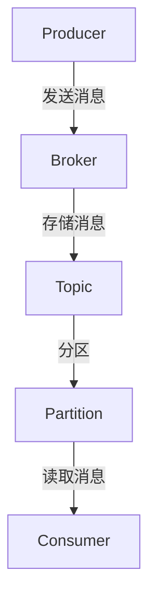

# Kafka 简介

Apache Kafka 是一个分布式流处理平台，最初由 LinkedIn 开发，并于2011年开源。它被设计用于处理实时数据流，具有高吞吐量、低延迟和高可扩展性。Kafka 广泛应用于日志收集、消息系统、流处理等场景。

## 什么是Kafka？

Kafka 是一个分布式发布-订阅消息系统，它允许应用程序以可靠的方式处理和存储数据流。Kafka 的核心设计目标是提供高吞吐量、低延迟的消息传递，同时保证数据的持久性和可靠性。

### Kafka 的核心概念

1. **Producer（生产者）**: 生产者是向 Kafka 主题（Topic）发送消息的应用程序。
2. **Consumer（消费者）**: 消费者是从 Kafka 主题读取消息的应用程序。
3. **Broker（代理）**: Kafka 集群中的每个服务器称为 Broker，负责存储和传递消息。
4. **Topic（主题）**: 主题是消息的类别或名称，生产者将消息发送到特定主题，消费者从主题中读取消息。
5. **Partition（分区）**: 每个主题可以分为多个分区，分区允许 Kafka 并行处理消息。
6. **Offset（偏移量）**: 偏移量是消息在分区中的唯一标识符，消费者通过偏移量来跟踪已读取的消息。

## Kafka 的架构

Kafka 的架构由多个组件组成，这些组件协同工作以实现高效的消息传递和处理。



### Kafka 的工作流程

1. **生产者发送消息**: 生产者将消息发送到 Kafka 集群中的某个主题。
2. **Broker 存储消息**: Broker 将消息存储在主题的分区中，并为每个消息分配一个偏移量。
3. **消费者读取消息**: 消费者从主题的分区中读取消息，并根据偏移量跟踪已读取的消息。

## 实际应用场景

Kafka 在许多实际场景中都有广泛应用，以下是一些常见的应用场景：

1. **日志收集**: Kafka 可以用于收集和存储来自多个源的日志数据，便于后续分析和处理。
2. **消息系统**: Kafka 可以作为消息中间件，用于在分布式系统中传递消息。
3. **流处理**: Kafka 可以与流处理框架（如 Apache Flink、Apache Spark Streaming）集成，用于实时数据处理。

### 示例：使用 Kafka 发送和接收消息

以下是一个简单的 Python 示例，展示如何使用 Kafka 发送和接收消息。

```python
from kafka import KafkaProducer, KafkaConsumer

# 创建生产者
producer = KafkaProducer(bootstrap_servers='localhost:9092')

# 发送消息
producer.send('my_topic', b'Hello, Kafka!')
producer.flush()

# 创建消费者
consumer = KafkaConsumer('my_topic', bootstrap_servers='localhost:9092')

# 接收消息
for message in consumer:
    print(f"Received: {message.value.decode('utf-8')}")
```

**输出**:
```
Received: Hello, Kafka!
```

## 总结

Kafka 是一个强大的分布式流处理平台，适用于处理实时数据流。通过理解 Kafka 的核心概念和架构，你可以更好地利用它来构建高效、可靠的消息系统。

:::tip
如果你对 Kafka 感兴趣，可以尝试安装 Kafka 并运行上述示例代码，亲身体验 Kafka 的强大功能。
:::

## 附加资源

- [Kafka 官方文档](https://kafka.apache.org/documentation/)
- [Kafka 入门指南](https://kafka.apache.org/quickstart)
- [Kafka 与流处理框架集成](https://kafka.apache.org/documentation/streams)

:::note
练习：尝试创建一个 Kafka 主题，并使用生产者和消费者发送和接收消息。
:::