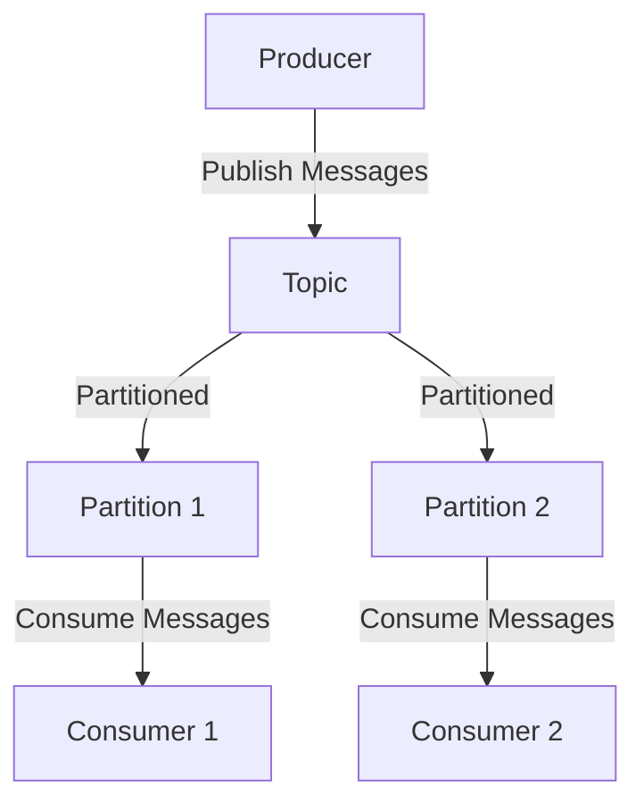

## 介绍

Apache Kafka 是一个分布式流处理平台，广泛用于构建实时数据管道和流应用。它能够高效地处理大量数据，并支持高吞吐量、低延迟的消息传递。Kafka 的架构设计使其在大规模数据处理场景中表现出色，适用于日志收集、事件流处理、实时分析等应用。

本文将逐步介绍 Kafka 的核心架构，帮助你理解其工作原理和实际应用。

## Kafka 的核心组件

Kafka 的架构主要由以下几个核心组件组成：

1. **Producer（生产者）**：负责将消息发布到 Kafka 的 Topic 中。
2. **Consumer（消费者）**：从 Kafka 的 Topic 中读取消息并进行处理。
3. **Broker（代理）**：Kafka 集群中的每个节点称为 Broker，负责存储消息并处理客户端的请求。
4. **Topic（主题）**：消息的分类，类似于数据库中的表。每个 Topic 可以分为多个 Partition（分区）。
5. **Partition（分区）**：Topic 的物理分区，每个分区是一个有序的、不可变的消息序列。
6. **Zookeeper**：用于管理 Kafka 集群的元数据，如 Broker 的状态、Topic 的配置等。

:::note
Kafka 从 2.8.0 版本开始，引入了 KRaft 模式，允许 Kafka 在不依赖 Zookeeper 的情况下运行。但在大多数生产环境中，Zookeeper 仍然是 Kafka 集群管理的重要组成部分。
:::

## Kafka 的工作原理

Kafka 的工作流程可以简化为以下几个步骤：

1. **生产者发送消息**：生产者将消息发送到指定的 Topic。
2. **消息存储**：Kafka 将消息存储在 Topic 的 Partition 中，每个 Partition 是一个有序的日志文件。
3. **消费者读取消息**：消费者从 Partition 中读取消息，并按照顺序处理。



:::tip
Kafka 的 Partition 机制允许消息并行处理，从而提高系统的吞吐量。每个 Partition 只能被一个 Consumer 组中的一个 Consumer 消费，但一个 Consumer 可以消费多个 Partition。
:::

## Kafka 的实际应用场景

Kafka 在许多实际场景中都有广泛应用，以下是几个典型的例子：

1. **日志收集**：Kafka 可以作为集中式的日志收集系统，将来自不同服务的日志数据统一存储和处理。
2. **事件流处理**：在微服务架构中，Kafka 可以用于处理服务之间的事件流，实现解耦和异步通信。
3. **实时分析**：Kafka 可以与流处理框架（如 Apache Flink、Apache Spark Streaming）结合，用于实时数据分析和处理。

:::caution
在使用 Kafka 时，需要注意消息的顺序性和一致性。虽然 Kafka 保证了单个 Partition 内的消息顺序，但在多个 Partition 之间，消息的顺序是无法保证的。
:::

## 代码示例

以下是一个简单的 Kafka 生产者和消费者的代码示例：

```python
# 生产者示例
from kafka import KafkaProducer

producer = KafkaProducer(bootstrap_servers='localhost:9092')
producer.send('my_topic', b'Hello, Kafka!')
producer.flush()

# 消费者示例
from kafka import KafkaConsumer

consumer = KafkaConsumer('my_topic', bootstrap_servers='localhost:9092')
for message in consumer:
    print(f"Received: {message.value.decode('utf-8')}")
```

:::note
在实际生产环境中，建议配置 Kafka 的 ACK 机制和重试策略，以确保消息的可靠传递。
:::

## 总结

Kafka 是一个强大的分布式流处理平台，其架构设计使其能够高效处理大量数据。通过理解 Kafka 的核心组件和工作原理，你可以更好地利用 Kafka 构建实时数据管道和流应用。

## 附加资源

- [Kafka 官方文档](https://kafka.apache.org/documentation/)
- [Kafka 入门指南](https://kafka.apache.org/quickstart)
- [Kafka 与流处理框架集成](https://www.confluent.io/blog/apache-kafka-for-stream-processing/)

## 练习

1. 尝试在本地的 Kafka 集群中创建一个 Topic，并使用生产者和消费者进行消息的发送和接收。
2. 研究 Kafka 的 Partition 机制，并尝试配置多个 Partition 以提高消息处理的并行度。
3. 探索 Kafka 的 ACK 机制，并配置不同的 ACK 级别以观察消息传递的可靠性。