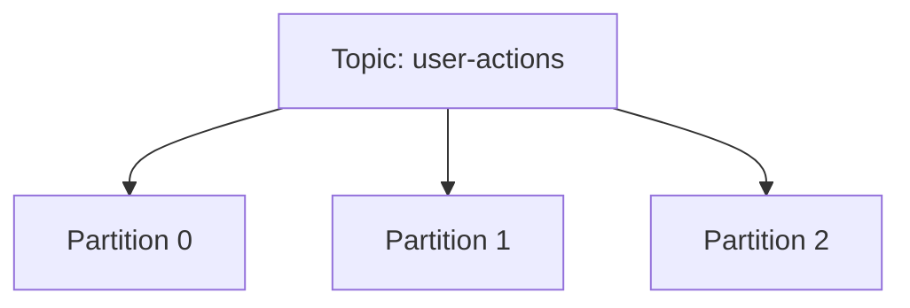
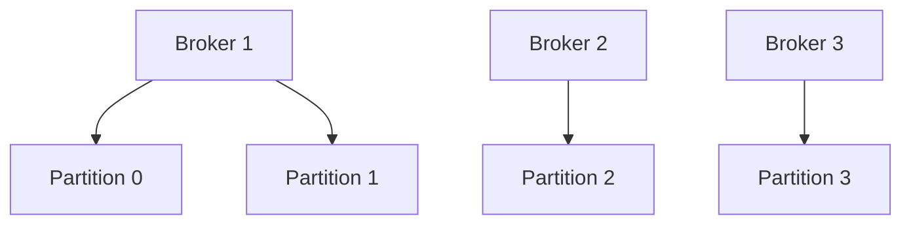

# Kafka 核心概念

Apache Kafka 是一个分布式流处理平台，广泛用于构建实时数据管道和流应用。它能够高效地处理大量数据，并支持高吞吐量、低延迟的消息传递。为了更好地理解 Kafka，我们需要掌握其核心概念。

## 1. 主题（Topic）

**主题**是 Kafka 中数据存储的逻辑分类。你可以将主题理解为一个消息队列的名称，生产者将消息发送到特定的主题，消费者从主题中读取消息。

:::note
主题是 Kafka 中最基本的数据组织单位，所有消息都通过主题进行分类和存储。
:::

### 示例
假设我们有一个名为 `user-actions` 的主题，生产者将用户的操作记录发送到这个主题，消费者则从该主题中读取并处理这些记录。

```java
// 生产者发送消息到主题
producer.send(new ProducerRecord<>("user-actions", "user1", "clicked_button"));
```

## 2. 分区（Partition）

**分区**是主题的物理存储单元。每个主题可以被分成多个分区，分区允许 Kafka 在多个服务器上分布数据，从而实现高吞吐量和并行处理。

:::tip
分区是 Kafka 实现水平扩展和高吞吐量的关键机制。
:::

### 示例
假设 `user-actions` 主题有 3 个分区，Kafka 会将消息均匀地分布到这些分区中。



## 3. 生产者（Producer）

**生产者**是向 Kafka 主题发送消息的客户端应用程序。生产者负责将消息发布到指定的主题和分区。

:::caution
生产者可以选择将消息发送到特定的分区，或者让 Kafka 根据分区策略自动分配分区。
:::

### 示例
以下是一个简单的生产者代码示例，它将消息发送到 `user-actions` 主题。

```java
Properties props = new Properties();
props.put("bootstrap.servers", "localhost:9092");
props.put("key.serializer", "org.apache.kafka.common.serialization.StringSerializer");
props.put("value.serializer", "org.apache.kafka.common.serialization.StringSerializer");

Producer<String, String> producer = new KafkaProducer<>(props);
producer.send(new ProducerRecord<>("user-actions", "user1", "clicked_button"));
producer.close();
```

## 4. 消费者（Consumer）

**消费者**是从 Kafka 主题读取消息的客户端应用程序。消费者可以订阅一个或多个主题，并从分区中拉取消息。

:::warning
消费者组（Consumer Group）允许多个消费者协同工作，共同处理一个主题的消息。
:::

### 示例
以下是一个简单的消费者代码示例，它从 `user-actions` 主题中读取消息。

```java
Properties props = new Properties();
props.put("bootstrap.servers", "localhost:9092");
props.put("group.id", "test");
props.put("enable.auto.commit", "true");
props.put("auto.commit.interval.ms", "1000");
props.put("key.deserializer", "org.apache.kafka.common.serialization.StringDeserializer");
props.put("value.deserializer", "org.apache.kafka.common.serialization.StringDeserializer");

KafkaConsumer<String, String> consumer = new KafkaConsumer<>(props);
consumer.subscribe(Arrays.asList("user-actions"));

while (true) {
    ConsumerRecords<String, String> records = consumer.poll(Duration.ofMillis(100));
    for (ConsumerRecord<String, String> record : records) {
        System.out.printf("offset = %d, key = %s, value = %s%n", record.offset(), record.key(), record.value());
    }
}
```

## 5. 代理（Broker）

**代理**是 Kafka 集群中的单个服务器节点。每个代理负责存储主题的分区数据，并处理来自生产者和消费者的请求。

:::note
Kafka 集群通常由多个代理组成，以实现高可用性和容错性。
:::

### 示例
假设我们有一个由 3 个代理组成的 Kafka 集群，每个代理存储部分主题的分区数据。



## 实际应用场景

Kafka 的核心概念在实际应用中有广泛的应用场景。例如，在电商平台中，Kafka 可以用于实时处理用户行为数据。生产者将用户的点击、购买等行为发送到 `user-actions` 主题，消费者则从该主题中读取数据，进行实时分析和处理。

## 总结

Kafka 的核心概念包括主题、分区、生产者、消费者和代理。理解这些概念是掌握 Kafka 的基础。通过主题和分区，Kafka 实现了高效的数据存储和并行处理；生产者和消费者则负责数据的发布和订阅；代理则构成了 Kafka 集群的基础。

## 附加资源

- [Kafka 官方文档](https://kafka.apache.org/documentation/)
- [Kafka 入门教程](https://www.tutorialspoint.com/apache_kafka/index.htm)
- [Kafka 实战](https://www.oreilly.com/library/view/kafka-the-definitive/9781492043072/)

## 练习

1. 创建一个 Kafka 主题，并使用生产者和消费者进行消息的发送和接收。
2. 尝试将主题分成多个分区，并观察消息的分布情况。
3. 配置一个由多个代理组成的 Kafka 集群，并测试其高可用性。

通过以上练习，你将更深入地理解 Kafka 的核心概念及其应用。