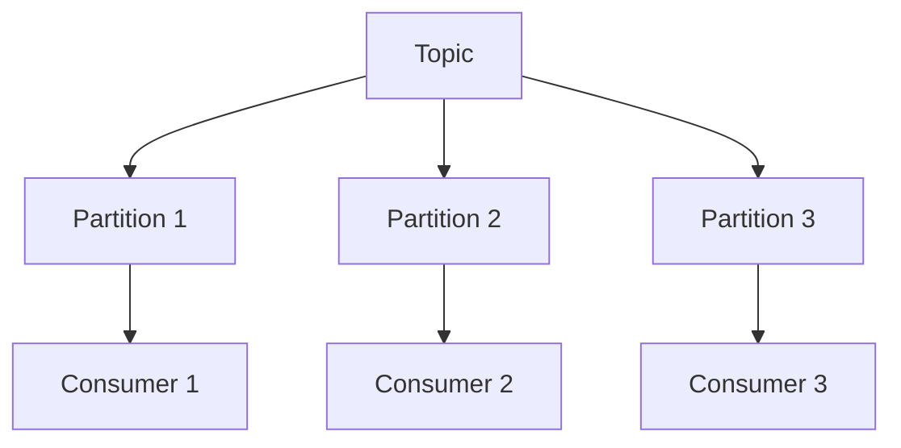

# Kafka 消费者

Kafka消费者是Apache Kafka中的一个核心组件，用于从Kafka主题（Topic）中读取数据。消费者通过订阅一个或多个主题，从Kafka集群中拉取消息，并进行处理。理解Kafka消费者的工作原理对于构建高效的数据处理系统至关重要。

## 什么是Kafka消费者？

Kafka消费者是一个客户端应用程序，它从Kafka主题中读取数据。消费者可以订阅一个或多个主题，并从这些主题的分区（Partition）中拉取消息。Kafka消费者组（Consumer Group）允许多个消费者协同工作，以并行处理来自多个分区的消息。

### 消费者组

消费者组是一组消费者的集合，它们共同消费一个或多个主题的消息。Kafka通过消费者组来实现负载均衡和容错。每个分区只能被消费者组中的一个消费者消费，这样可以确保消息的顺序性和高效处理。



## Kafka 消费者的工作原理

Kafka消费者通过轮询（Polling）机制从Kafka集群中拉取消息。消费者会定期向Kafka集群发送请求，获取新的消息。消费者还可以通过提交偏移量（Offset）来记录已经处理的消息位置，以便在发生故障时能够从上次处理的位置继续消费。

### 偏移量（Offset）

偏移量是Kafka中用于标识消息在分区中位置的唯一标识符。消费者通过提交偏移量来记录已经处理的消息位置。Kafka提供了自动提交和手动提交两种偏移量管理方式。

:::note
**注意**：自动提交偏移量可能会导致消息重复消费或丢失，因此在生产环境中建议使用手动提交偏移量。
:::

## 代码示例

以下是一个使用Java编写的简单Kafka消费者示例：

```java
import org.apache.kafka.clients.consumer.ConsumerConfig;
import org.apache.kafka.clients.consumer.KafkaConsumer;
import org.apache.kafka.clients.consumer.ConsumerRecords;
import org.apache.kafka.clients.consumer.ConsumerRecord;
import org.apache.kafka.common.serialization.StringDeserializer;

import java.time.Duration;
import java.util.Collections;
import java.util.Properties;

public class SimpleConsumer {
    public static void main(String[] args) {
        Properties props = new Properties();
        props.put(ConsumerConfig.BOOTSTRAP_SERVERS_CONFIG, "localhost:9092");
        props.put(ConsumerConfig.GROUP_ID_CONFIG, "test-group");
        props.put(ConsumerConfig.KEY_DESERIALIZER_CLASS_CONFIG, StringDeserializer.class.getName());
        props.put(ConsumerConfig.VALUE_DESERIALIZER_CLASS_CONFIG, StringDeserializer.class.getName());

        KafkaConsumer<String, String> consumer = new KafkaConsumer<>(props);
        consumer.subscribe(Collections.singletonList("my-topic"));

        while (true) {
            ConsumerRecords<String, String> records = consumer.poll(Duration.ofMillis(100));
            for (ConsumerRecord<String, String> record : records) {
                System.out.printf("offset = %d, key = %s, value = %s%n", record.offset(), record.key(), record.value());
            }
        }
    }
}
```

### 输入与输出

假设Kafka主题 `my-topic` 中有以下消息：

```
key: "user1", value: "Hello, Kafka!"
key: "user2", value: "Welcome to Kafka!"
```

运行上述代码后，控制台输出将如下所示：

```
offset = 0, key = user1, value = Hello, Kafka!
offset = 1, key = user2, value = Welcome to Kafka!
```

## 实际应用场景

Kafka消费者在许多实际应用场景中都有广泛的应用，例如：

1. **实时数据处理**：消费者可以实时处理来自Kafka主题的数据，并将其存储到数据库或数据仓库中。
2. **日志聚合**：消费者可以从多个服务中收集日志数据，并将其集中存储或分析。
3. **事件驱动架构**：消费者可以监听事件流，并根据事件触发相应的业务逻辑。

## 总结

Kafka消费者是Kafka生态系统中不可或缺的一部分，它允许应用程序从Kafka主题中读取数据并进行处理。通过理解消费者组、偏移量以及轮询机制，您可以构建高效、可靠的数据处理系统。

## 附加资源与练习

- **官方文档**：阅读[Kafka官方文档](https://kafka.apache.org/documentation/)以获取更多关于消费者的详细信息。
- **练习**：尝试修改上述代码示例，实现手动提交偏移量，并观察其行为。

:::tip
**提示**：在实际生产环境中，建议使用Kafka的高级客户端库（如Spring Kafka）来简化消费者的开发和管理。
:::