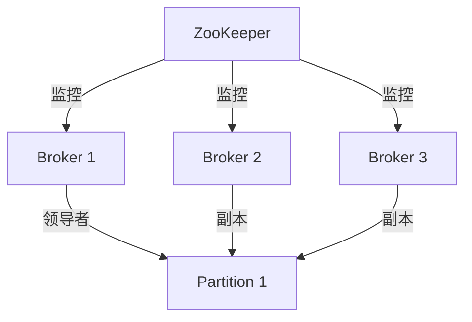

## 介绍

Apache Kafka 是一个分布式流处理平台，广泛用于构建实时数据管道和流应用。Kafka 的设计依赖于分布式系统的核心组件，而 **ZooKeeper** 是 Kafka 架构中不可或缺的一部分。ZooKeeper 是一个分布式协调服务，用于管理 Kafka 集群的元数据、领导者选举和配置管理。

本文将详细介绍 Kafka 如何与 ZooKeeper 集成，以及 ZooKeeper 在 Kafka 中的具体作用。

---

## ZooKeeper 在 Kafka 中的作用

ZooKeeper 在 Kafka 中扮演了以下关键角色：

1. **集群管理**：ZooKeeper 维护 Kafka 集群的元数据，包括 Broker 列表、Topic 分区和副本信息。
2. **领导者选举**：ZooKeeper 负责选举分区（Partition）的领导者（Leader），确保数据的高可用性和一致性。
3. **配置管理**：Kafka 使用 ZooKeeper 存储和同步集群的配置信息。
4. **状态监控**：ZooKeeper 监控 Kafka Broker 的状态，并在 Broker 故障时触发重新选举。

:::note
从 Kafka 2.8.0 版本开始，Kafka 引入了 **Kafka Raft Metadata (KRaft)** 模式，允许 Kafka 在不依赖 ZooKeeper 的情况下运行。然而，ZooKeeper 仍然是 Kafka 生态系统中广泛使用的组件。
:::

---

## Kafka 与 ZooKeeper 的集成

Kafka 通过 ZooKeeper 的 API 与其进行交互。以下是 Kafka 与 ZooKeeper 集成的核心流程：

1. **Broker 注册**：当 Kafka Broker 启动时，它会向 ZooKeeper 注册自己的信息，包括 Broker ID 和网络地址。
2. **Topic 和分区管理**：Kafka 使用 ZooKeeper 存储 Topic 和分区的元数据，例如分区副本的位置。
3. **领导者选举**：ZooKeeper 监控分区领导者的状态，并在领导者失效时触发重新选举。
4. **消费者组管理**：Kafka 使用 ZooKeeper 存储消费者组的偏移量（Offset）信息。

---

## 代码示例：Kafka 与 ZooKeeper 的交互

以下是一个简单的 Kafka 配置示例，展示如何指定 ZooKeeper 的连接信息：

```properties
# Kafka Broker 配置文件 (server.properties)
broker.id=1
zookeeper.connect=localhost:2181
```

:::tip
`zookeeper.connect` 参数指定了 ZooKeeper 的连接地址。多个 ZooKeeper 节点可以用逗号分隔，例如 `zookeeper.connect=zk1:2181,zk2:2181,zk3:2181`。
:::

---

## 实际应用场景

### 场景 1：Kafka 集群的高可用性

在一个 Kafka 集群中，多个 Broker 协同工作以提供高可用性。ZooKeeper 负责监控 Broker 的状态。如果某个 Broker 宕机，ZooKeeper 会触发领导者选举，确保分区的高可用性。



### 场景 2：消费者组管理

Kafka 使用 ZooKeeper 存储消费者组的偏移量信息。当消费者重新加入组时，ZooKeeper 会帮助其恢复之前的消费进度。

---

## 总结

ZooKeeper 是 Kafka 架构中的核心组件，负责集群管理、领导者选举和配置管理。尽管 Kafka 正在向不依赖 ZooKeeper 的方向发展，但 ZooKeeper 仍然是 Kafka 生态系统中不可或缺的一部分。

:::caution
在生产环境中，确保 ZooKeeper 集群的高可用性和稳定性至关重要。ZooKeeper 的故障可能导致 Kafka 集群不可用。
:::

---

## 附加资源

1. [Apache Kafka 官方文档](https://kafka.apache.org/documentation/)
2. [ZooKeeper 官方文档](https://zookeeper.apache.org/doc/current/)
3. 练习：尝试配置一个本地 Kafka 集群，并观察 ZooKeeper 的日志以理解其工作原理。