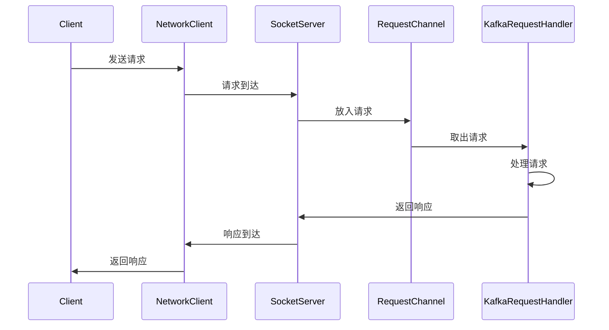

# Kafka 网络层实现

Kafka是一个分布式流处理平台，其高性能和可扩展性很大程度上依赖于其网络层的实现。Kafka的网络层负责处理客户端与服务器之间的通信，确保消息的高效传输和低延迟。本文将深入探讨Kafka网络层的核心组件及其实现细节。

## 介绍

Kafka的网络层基于Java的NIO（非阻塞I/O）库实现，采用了异步、非阻塞的通信模型。这种设计使得Kafka能够高效地处理大量的并发连接和请求。Kafka的网络层主要包括以下几个核心组件：

1. **SocketServer**：负责监听客户端连接，并处理传入的请求。
2. **RequestChannel**：用于在SocketServer和Kafka的请求处理器之间传递请求和响应。
3. **KafkaRequestHandler**：负责处理具体的请求逻辑。
4. **NetworkClient**：客户端用于与Kafka服务器通信的组件。

## SocketServer

`SocketServer`是Kafka网络层的核心组件之一，它负责监听客户端连接并处理传入的请求。`SocketServer`使用Java的NIO库来实现非阻塞的I/O操作，从而能够高效地处理大量的并发连接。

```java
public class SocketServer {
    private final Selector selector;
    private final ServerSocketChannel serverSocketChannel;

    public SocketServer(int port) throws IOException {
        this.selector = Selector.open();
        this.serverSocketChannel = ServerSocketChannel.open();
        this.serverSocketChannel.bind(new InetSocketAddress(port));
        this.serverSocketChannel.configureBlocking(false);
        this.serverSocketChannel.register(selector, SelectionKey.OP_ACCEPT);
    }

    public void run() {
        while (true) {
            try {
                selector.select();
                Set<SelectionKey> selectedKeys = selector.selectedKeys();
                for (SelectionKey key : selectedKeys) {
                    if (key.isAcceptable()) {
                        acceptConnection(key);
                    } else if (key.isReadable()) {
                        readRequest(key);
                    }
                }
                selectedKeys.clear();
            } catch (IOException e) {
                e.printStackTrace();
            }
        }
    }

    private void acceptConnection(SelectionKey key) throws IOException {
        ServerSocketChannel serverChannel = (ServerSocketChannel) key.channel();
        SocketChannel clientChannel = serverChannel.accept();
        clientChannel.configureBlocking(false);
        clientChannel.register(selector, SelectionKey.OP_READ);
    }

    private void readRequest(SelectionKey key) throws IOException {
        SocketChannel clientChannel = (SocketChannel) key.channel();
        ByteBuffer buffer = ByteBuffer.allocate(1024);
        clientChannel.read(buffer);
        buffer.flip();
        // 处理请求逻辑
    }
}
```

:::note
`SocketServer`通过`Selector`来监听多个通道的事件，从而实现非阻塞的I/O操作。这种方式可以显著提高系统的并发处理能力。
:::

## RequestChannel

`RequestChannel`是Kafka网络层中用于在`SocketServer`和`KafkaRequestHandler`之间传递请求和响应的组件。它本质上是一个生产者-消费者模型，`SocketServer`将接收到的请求放入`RequestChannel`，而`KafkaRequestHandler`从`RequestChannel`中取出请求进行处理。

```java
public class RequestChannel {
    private final BlockingQueue<Request> requestQueue = new LinkedBlockingQueue<>();

    public void sendRequest(Request request) {
        requestQueue.add(request);
    }

    public Request receiveRequest() throws InterruptedException {
        return requestQueue.take();
    }
}
```

:::tip
`RequestChannel`使用`BlockingQueue`来实现线程安全的请求传递，确保在高并发场景下请求能够被正确处理。
:::

## Kafka RequestHandler

`KafkaRequestHandler`是Kafka网络层中负责处理具体请求逻辑的组件。它从`RequestChannel`中取出请求，并根据请求的类型调用相应的处理逻辑。

```java
public class KafkaRequestHandler implements Runnable {
    private final RequestChannel requestChannel;

    public KafkaRequestHandler(RequestChannel requestChannel) {
        this.requestChannel = requestChannel;
    }

    @Override
    public void run() {
        while (true) {
            try {
                Request request = requestChannel.receiveRequest();
                processRequest(request);
            } catch (InterruptedException e) {
                Thread.currentThread().interrupt();
                break;
            }
        }
    }

    private void processRequest(Request request) {
        // 根据请求类型调用相应的处理逻辑
    }
}
```

:::caution
`KafkaRequestHandler`通常运行在多个线程中，以并行处理多个请求，从而提高系统的吞吐量。
:::

## NetworkClient

`NetworkClient`是Kafka客户端用于与Kafka服务器通信的组件。它负责将客户端的请求发送到服务器，并接收服务器的响应。

```java
public class NetworkClient {
    private final Selector selector;
    private final Map<String, Node> nodes;

    public NetworkClient() throws IOException {
        this.selector = Selector.open();
        this.nodes = new HashMap<>();
    }

    public void sendRequest(Request request, Node node) throws IOException {
        SocketChannel channel = SocketChannel.open();
        channel.configureBlocking(false);
        channel.connect(new InetSocketAddress(node.host(), node.port()));
        channel.register(selector, SelectionKey.OP_CONNECT);

        // 发送请求
        ByteBuffer buffer = ByteBuffer.wrap(request.toBytes());
        channel.write(buffer);
    }

    public void poll() throws IOException {
        selector.select();
        Set<SelectionKey> selectedKeys = selector.selectedKeys();
        for (SelectionKey key : selectedKeys) {
            if (key.isConnectable()) {
                finishConnection(key);
            } else if (key.isReadable()) {
                readResponse(key);
            }
        }
        selectedKeys.clear();
    }

    private void finishConnection(SelectionKey key) throws IOException {
        SocketChannel channel = (SocketChannel) key.channel();
        if (channel.finishConnect()) {
            key.interestOps(SelectionKey.OP_READ);
        }
    }

    private void readResponse(SelectionKey key) throws IOException {
        SocketChannel channel = (SocketChannel) key.channel();
        ByteBuffer buffer = ByteBuffer.allocate(1024);
        channel.read(buffer);
        buffer.flip();
        // 处理响应逻辑
    }
}
```

:::warning
`NetworkClient`同样使用非阻塞的I/O操作来与Kafka服务器通信，确保在高并发场景下能够高效地处理请求和响应。
:::

## 实际案例

假设我们有一个Kafka集群，其中包含三个Broker节点。客户端需要向Kafka集群发送消息，并从集群中消费消息。以下是客户端与Kafka集群通信的简化流程：

1. 客户端通过`NetworkClient`向Kafka集群发送消息。
2. `SocketServer`接收到客户端的请求，并将其放入`RequestChannel`。
3. `KafkaRequestHandler`从`RequestChannel`中取出请求，并处理消息的存储逻辑。
4. 处理完成后，`KafkaRequestHandler`将响应返回给客户端。



## 总结

Kafka的网络层是其高性能和可扩展性的关键所在。通过使用非阻塞的I/O操作和生产者-消费者模型，Kafka能够高效地处理大量的并发请求。本文详细介绍了Kafka网络层的核心组件及其实现细节，并通过实际案例展示了Kafka网络层的工作流程。

## 附加资源

- [Kafka官方文档](https://kafka.apache.org/documentation/)
- [Java NIO编程指南](https://docs.oracle.com/javase/8/docs/api/java/nio/package-summary.html)
- [Kafka源码解析](https://github.com/apache/kafka)

## 练习

1. 尝试实现一个简单的`SocketServer`，并处理客户端的请求。
2. 修改`KafkaRequestHandler`，使其能够处理不同类型的请求。
3. 使用`NetworkClient`向Kafka集群发送消息，并接收响应。

通过以上练习，你将更深入地理解Kafka网络层的实现原理。