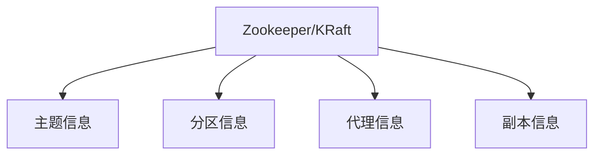

# Kafka 元数据管理

Kafka是一个分布式流处理平台，广泛用于构建实时数据管道和流应用。元数据管理是Kafka的核心组件之一，它负责存储和管理Kafka集群的元数据信息。本文将详细介绍Kafka元数据管理的概念、工作原理及其在实际应用中的重要性。

## 什么是Kafka元数据管理？

元数据管理是指Kafka集群中用于存储和管理元数据的机制。元数据包括主题（Topic）、分区（Partition）、副本（Replica）、代理（Broker）等信息。这些信息对于Kafka的正常运行至关重要，因为它们决定了数据如何存储、如何路由以及如何复制。

## Kafka 元数据管理的工作原理

Kafka的元数据管理主要通过Zookeeper或Kafka内部的KRaft协议来实现。以下是元数据管理的基本工作原理：

1. **主题和分区信息**：Kafka集群中的每个主题都被划分为多个分区，每个分区可以有多个副本。这些信息存储在元数据中。
2. **代理信息**：Kafka集群中的每个代理（Broker）都会向Zookeeper或KRaft注册自己，并报告其状态和负载信息。
3. **副本信息**：每个分区的副本信息也存储在元数据中，包括主副本（Leader）和从副本（Follower）的位置。



## 实际应用场景

### 场景1：主题创建与分区分配

当你在Kafka中创建一个新主题时，Kafka会根据配置自动分配分区和副本。例如，创建一个名为`my-topic`的主题，分区数为3，副本数为2：

```bash
kafka-topics.sh --create --topic my-topic --partitions 3 --replication-factor 2 --bootstrap-server localhost:9092
```

Kafka会将这个主题的元数据存储在Zookeeper或KRaft中，包括每个分区的副本位置。

### 场景2：代理故障恢复

当一个代理（Broker）发生故障时，Kafka会根据元数据中的副本信息，自动将故障代理上的分区副本重新分配到其他健康的代理上。这个过程是自动的，无需人工干预。

## 总结

Kafka元数据管理是Kafka集群正常运行的关键组件。它负责存储和管理主题、分区、副本和代理等信息，确保数据的高可用性和一致性。通过理解元数据管理的工作原理，你可以更好地设计和优化Kafka集群。

## 附加资源与练习

- **资源**：
  - [Kafka官方文档](https://kafka.apache.org/documentation/)
  - [Kafka元数据管理深入解析](https://example.com/kafka-metadata-management)

- **练习**：
  1. 创建一个Kafka主题，并查看其元数据信息。
  2. 模拟一个代理故障，观察Kafka如何重新分配分区副本。

:::tip
建议初学者在本地搭建一个Kafka集群，通过实际操作来加深对元数据管理的理解。
:::