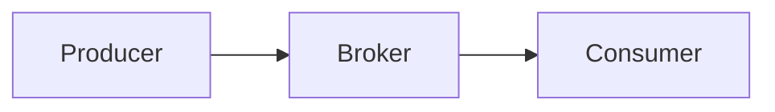
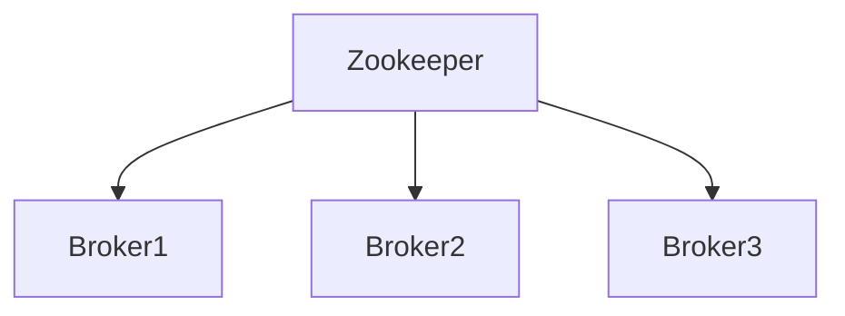

# Kafka 集群角色

Kafka是一个分布式流处理平台，广泛用于构建实时数据管道和流应用。为了理解Kafka的工作原理，首先需要了解Kafka集群中的各个角色及其职责。本文将详细介绍Kafka集群中的核心角色：**Broker**、**Producer**、**Consumer**和**Zookeeper**，并解释它们如何协同工作。

## 1. 什么是Kafka集群？

Kafka集群是由多个Kafka节点（Broker）组成的分布式系统。每个Broker负责存储和处理数据流。Kafka集群通过分布式架构实现了高可用性、可扩展性和容错性。

## 2. Kafka集群中的核心角色

### 2.1 Broker

**Broker**是Kafka集群中的核心组件，负责存储和管理数据。每个Broker都是一个独立的Kafka服务器，可以处理来自Producer的数据写入请求，并将数据分发给Consumer。

:::note
Broker是Kafka集群的基础，负责数据的存储和传输。
:::

#### Broker的主要职责：
- **存储数据**：Broker将数据存储在称为**Topic**的逻辑分区中。
- **处理请求**：Broker处理来自Producer和Consumer的请求。
- **数据复制**：Broker通过复制机制确保数据的可靠性和高可用性。



### 2.2 Producer

**Producer**是Kafka集群中的数据生产者，负责将数据发布到Kafka的Topic中。Producer可以是任何应用程序或服务，只要它能够向Kafka集群发送消息。

:::tip
Producer通常用于将日志数据、事件数据或其他流数据发送到Kafka集群。
:::

#### Producer的主要职责：
- **发布消息**：Producer将消息发布到指定的Topic。
- **消息分区**：Producer可以选择将消息发送到特定的分区（Partition），或者让Kafka自动分配分区。

```java
// 示例：Kafka Producer代码
Properties props = new Properties();
props.put("bootstrap.servers", "localhost:9092");
props.put("key.serializer", "org.apache.kafka.common.serialization.StringSerializer");
props.put("value.serializer", "org.apache.kafka.common.serialization.StringSerializer");

Producer<String, String> producer = new KafkaProducer<>(props);
producer.send(new ProducerRecord<>("my-topic", "key", "value"));
producer.close();
```

### 2.3 Consumer

**Consumer**是Kafka集群中的数据消费者，负责从Kafka的Topic中读取数据。Consumer可以是任何应用程序或服务，只要它能够从Kafka集群中订阅并消费消息。

:::caution
Consumer通常用于实时处理数据流，例如日志分析、事件处理等。
:::

#### Consumer的主要职责：
- **订阅Topic**：Consumer订阅一个或多个Topic，并从中读取数据。
- **消费消息**：Consumer从Topic的分区中读取消息，并进行处理。

```java
// 示例：Kafka Consumer代码
Properties props = new Properties();
props.put("bootstrap.servers", "localhost:9092");
props.put("group.id", "test");
props.put("enable.auto.commit", "true");
props.put("key.deserializer", "org.apache.kafka.common.serialization.StringDeserializer");
props.put("value.deserializer", "org.apache.kafka.common.serialization.StringDeserializer");

Consumer<String, String> consumer = new KafkaConsumer<>(props);
consumer.subscribe(Arrays.asList("my-topic"));
while (true) {
    ConsumerRecords<String, String> records = consumer.poll(Duration.ofMillis(100));
    for (ConsumerRecord<String, String> record : records) {
        System.out.printf("offset = %d, key = %s, value = %s%n", record.offset(), record.key(), record.value());
    }
}
```

### 2.4 Zookeeper

**Zookeeper**是Kafka集群的协调服务，负责管理集群的元数据和状态信息。虽然Kafka 2.8.0版本开始支持无Zookeeper模式（Kafka Raft Metadata mode，简称KRaft），但在大多数生产环境中，Zookeeper仍然是Kafka集群的重要组成部分。

:::warning
Zookeeper在Kafka集群中扮演着关键角色，负责Broker的选举、Topic的配置管理等。
:::

#### Zookeeper的主要职责：
- **Broker管理**：Zookeeper负责Broker的注册和发现。
- **Leader选举**：Zookeeper帮助Kafka集群进行Leader选举，确保每个分区都有一个Leader Broker。
- **配置管理**：Zookeeper存储Kafka集群的配置信息，如Topic和分区的元数据。



## 3. 实际应用场景

### 3.1 日志收集与分析

在大规模分布式系统中，Kafka常用于日志收集与分析。Producer将日志数据发送到Kafka集群，Consumer从Kafka集群中读取日志数据并进行实时分析。

### 3.2 事件驱动架构

Kafka广泛应用于事件驱动架构中。Producer将事件发布到Kafka集群，Consumer订阅这些事件并触发相应的业务逻辑。

### 3.3 数据管道

Kafka可以作为数据管道，将数据从一个系统传输到另一个系统。例如，将数据库的变更记录实时传输到数据仓库或搜索引擎中。

## 4. 总结

Kafka集群中的各个角色（Broker、Producer、Consumer和Zookeeper）协同工作，共同构建了一个高效、可靠的分布式流处理平台。理解这些角色的职责和相互关系，是掌握Kafka的基础。

## 5. 附加资源与练习

- **练习**：尝试在本地搭建一个Kafka集群，并使用Producer和Consumer进行简单的消息发送和接收。
- **资源**：阅读Kafka官方文档，深入了解Kafka的配置和高级功能。

通过本文的学习，你应该对Kafka集群中的核心角色有了全面的了解。接下来，你可以进一步探索Kafka的高级功能，如分区、副本、消费者组等。