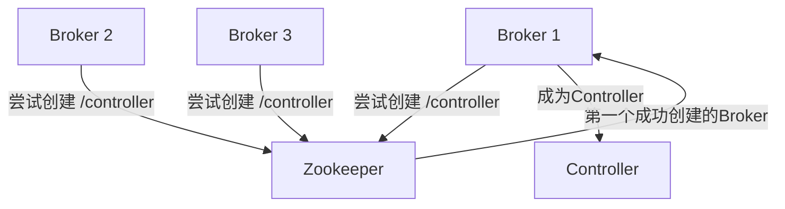
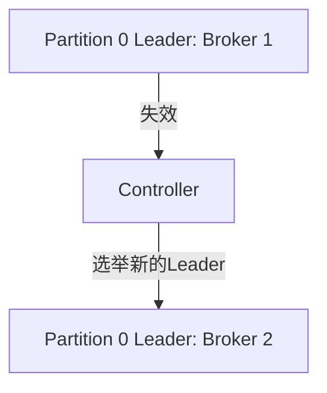
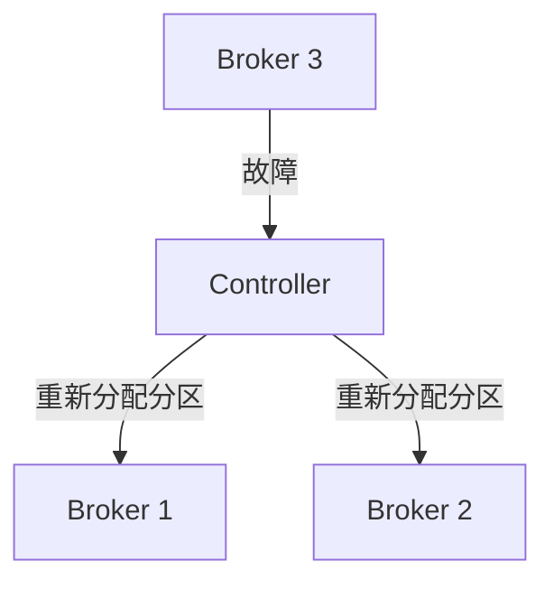

# Kafka Controller机制

Kafka是一个分布式流处理平台，广泛应用于实时数据管道和流处理场景。在Kafka集群中，**Controller**是一个核心组件，负责管理集群的元数据和协调分区（Partition）的分配与故障恢复。本文将详细介绍Kafka Controller的机制，帮助初学者理解其工作原理和实际应用。

## 什么是Kafka Controller？

Kafka Controller是Kafka集群中的一个特殊角色，负责管理集群的元数据和协调分区的分配与故障恢复。每个Kafka集群中只有一个Broker会被选举为Controller，其他Broker则作为普通节点运行。Controller的主要职责包括：

1. **分区管理**：负责创建、删除分区，以及分区的重新分配。
2. **Leader选举**：当某个分区的Leader副本失效时，Controller会负责选举新的Leader。
3. **故障恢复**：当Broker发生故障时，Controller会重新分配受影响的分区。
4. **元数据同步**：Controller会将集群的元数据同步给其他Broker。

## Kafka Controller的选举机制

Kafka Controller的选举是基于Zookeeper的临时节点（Ephemeral Node）实现的。当集群启动时，所有Broker都会尝试在Zookeeper上创建一个临时节点 `/controller`。第一个成功创建该节点的Broker将成为Controller，其他Broker则会成为普通节点。



:::note
Zookeeper是Kafka早期版本中用于集群管理的依赖组件，但在Kafka 2.8.0及更高版本中，Kafka引入了Kafka Raft Metadata（KRaft）模式，允许Kafka在不依赖Zookeeper的情况下运行。
:::

## Controller的工作流程

### 1. 分区管理

当创建一个新的Topic时，Controller会根据配置的分区数和副本因子（Replication Factor）来决定如何分配分区和副本。例如，假设我们有一个3个Broker的集群，创建一个Topic `my-topic`，分区数为3，副本因子为2。

```bash
kafka-topics.sh --create --topic my-topic --partitions 3 --replication-factor 2 --bootstrap-server localhost:9092
```

Controller会为每个分区分配Leader副本和Follower副本。例如：

- Partition 0: Leader在Broker 1，Follower在Broker 2
- Partition 1: Leader在Broker 2，Follower在Broker 3
- Partition 2: Leader在Broker 3，Follower在Broker 1

### 2. Leader选举

当某个分区的Leader副本失效时，Controller会从该分区的ISR（In-Sync Replicas）列表中选择一个新的Leader。ISR列表是当前与Leader保持同步的副本集合。

例如，假设Partition 0的Leader（Broker 1）失效，Controller会从ISR列表中选择Broker 2作为新的Leader。



### 3. 故障恢复

当某个Broker发生故障时，Controller会重新分配该Broker上的所有分区。例如，假设Broker 3发生故障，Controller会将Broker 3上的所有分区重新分配到其他Broker上。



## 实际应用场景

### 场景1：Broker故障恢复

假设在一个3个Broker的Kafka集群中，Broker 2突然宕机。此时，Controller会检测到Broker 2的失效，并重新分配Broker 2上的所有分区。例如，Broker 2上的Partition 1的Leader副本失效，Controller会从ISR列表中选择Broker 3作为新的Leader。

### 场景2：新增Broker

当向集群中添加一个新的Broker时，Controller会重新平衡分区，将部分分区迁移到新的Broker上，以提高集群的负载均衡和容错能力。

## 总结

Kafka Controller是Kafka集群中的核心组件，负责管理分区的分配、Leader选举和故障恢复。通过Controller，Kafka能够实现高可用性和数据一致性。理解Controller的机制对于掌握Kafka的工作原理至关重要。

## 附加资源与练习

- **练习1**：在一个本地Kafka集群中，手动停止一个Broker，观察Controller如何重新分配分区。
- **练习2**：使用Kafka命令行工具创建一个新的Topic，并观察Controller如何分配分区和副本。

:::tip
深入学习Kafka Controller的源码可以帮助你更深入地理解其内部实现。Kafka的源码可以在[GitHub](https://github.com/apache/kafka)上找到。
:::