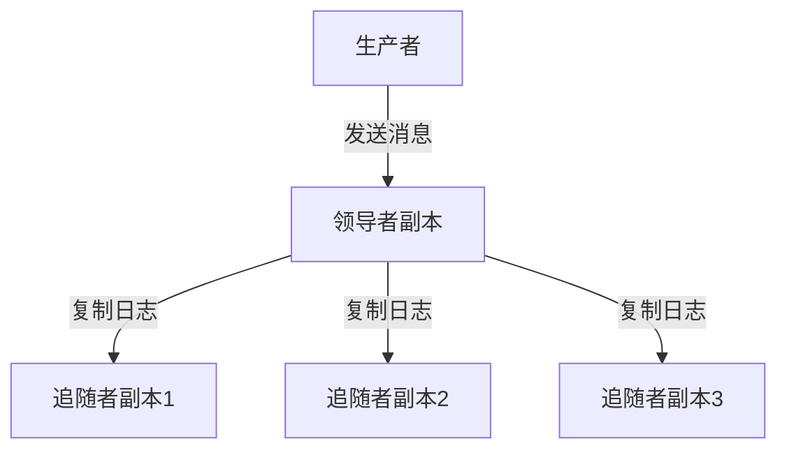

# Kafka 副本机制

Kafka是一个分布式流处理平台，广泛用于构建实时数据管道和流应用程序。为了确保数据的高可用性和容错性，Kafka引入了**副本机制**。本文将详细介绍Kafka副本机制的工作原理、实现方式以及实际应用场景。

## 什么是Kafka副本机制？

Kafka副本机制是指在Kafka集群中，每个分区（Partition）的数据会被复制到多个副本（Replica）中。这些副本分布在不同的Broker上，以确保即使某个Broker发生故障，数据仍然可用。副本机制是Kafka实现高可用性和容错性的核心。

### 副本的类型

在Kafka中，副本分为两种类型：

1. **领导者副本（Leader Replica）**：每个分区都有一个领导者副本，负责处理所有的读写请求。
2. **追随者副本（Follower Replica）**：每个分区可以有多个追随者副本，它们从领导者副本同步数据，并在领导者副本发生故障时接管其工作。

:::note
追随者副本不会直接处理客户端的读写请求，它们的主要作用是备份数据并在必要时接管领导者副本的角色。
:::

## Kafka 副本机制的工作原理

### 数据同步

Kafka的副本机制通过**日志复制**来实现数据同步。领导者副本将数据写入本地日志，并将这些日志复制到所有追随者副本。追随者副本会定期从领导者副本拉取数据，并写入自己的日志中。

### 副本的选举

当领导者副本发生故障时，Kafka会从追随者副本中选举一个新的领导者副本。这个过程由Kafka的控制器（Controller）负责。控制器会监控所有Broker的状态，并在检测到领导者副本失效时触发选举。

:::caution
选举过程中，Kafka会优先选择与旧领导者副本数据最接近的追随者副本作为新的领导者，以确保数据的一致性。
:::

### ISR（In-Sync Replicas）

Kafka引入了**ISR（In-Sync Replicas）**的概念，即与领导者副本保持同步的副本集合。只有ISR中的副本才有资格参与领导者选举。如果一个追随者副本落后于领导者副本太多，它将被移出ISR，直到它重新追上领导者副本的进度。

:::tip
ISR机制确保了Kafka在选举新领导者时，能够选择数据最完整的副本，从而避免数据丢失。
:::

## 实际应用场景

### 高可用性

在一个分布式系统中，硬件故障是不可避免的。Kafka的副本机制确保了即使某个Broker发生故障，数据仍然可以从其他副本中读取，从而保证了系统的高可用性。

### 数据一致性

Kafka的副本机制通过ISR和日志复制机制，确保了数据在多个副本之间的一致性。即使某个副本暂时不可用，系统仍然能够从其他副本中读取一致的数据。

### 负载均衡

Kafka的副本机制还可以用于负载均衡。通过将领导者副本分布在不同的Broker上，Kafka可以有效地分散读写请求，避免单个Broker成为性能瓶颈。

## 总结

Kafka的副本机制是其实现高可用性、容错性和数据一致性的核心。通过领导者副本和追随者副本的协同工作，Kafka能够在分布式环境中高效地处理数据流。理解副本机制的工作原理，对于设计和维护Kafka集群至关重要。

## 附加资源

- [Kafka官方文档](https://kafka.apache.org/documentation/)
- [Kafka副本机制深入解析](https://www.confluent.io/blog/hands-free-kafka-replication-a-lesson-in-operational-simplicity/)
- [Kafka实战：构建高可用性数据管道](https://www.oreilly.com/library/view/kafka-the-definitive/9781492043072/)

## 练习

1. 在一个Kafka集群中，创建一个包含3个副本的分区，并模拟领导者副本故障，观察追随者副本如何接管。
2. 使用Kafka的命令行工具，查看一个分区的ISR集合，并尝试手动将一个追随者副本移出ISR，观察系统的行为。