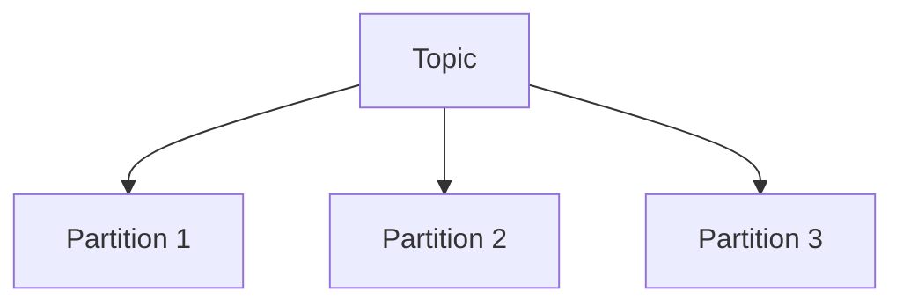
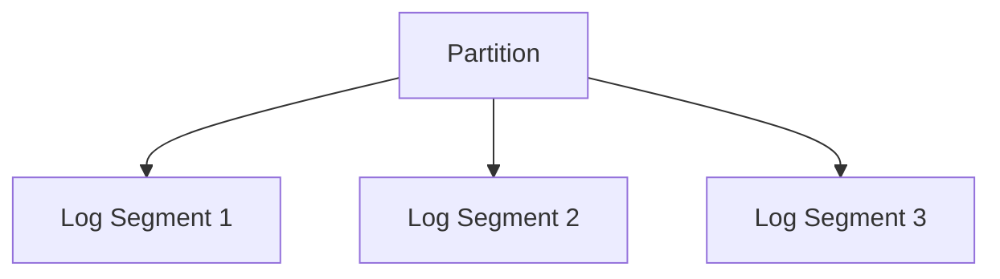
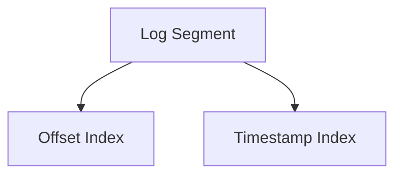

# Kafka 存储机制

Kafka是一个分布式流处理平台，广泛用于构建实时数据管道和流应用。其高效的存储机制是其核心优势之一。本文将详细介绍Kafka的存储机制，帮助你理解其内部工作原理。

## 介绍

Kafka的存储机制是其高性能和高可靠性的关键。Kafka将数据存储在磁盘上，并通过一系列优化技术确保数据的快速写入和读取。Kafka的存储机制主要包括分区、日志段、索引文件等概念。

## 分区（Partition）

Kafka中的每个主题（Topic）可以被分成多个分区（Partition）。分区是Kafka的基本存储单元，每个分区是一个有序的、不可变的记录序列。分区允许Kafka在多个服务器上分布数据，从而实现水平扩展。



## 日志段（Log Segment）

每个分区实际上是由多个日志段（Log Segment）组成的。日志段是Kafka存储数据的基本单位，每个日志段对应一个文件。当一个日志段达到一定大小或时间限制时，Kafka会创建一个新的日志段。

:::note
日志段的大小和时间限制可以通过Kafka的配置参数进行设置。
:::



## 索引文件（Index File）

为了快速定位消息，Kafka为每个日志段维护了两个索引文件：偏移量索引文件（Offset Index）和时间戳索引文件（Timestamp Index）。这些索引文件允许Kafka在读取数据时快速定位到特定的消息。

:::tip
索引文件是Kafka高效读取数据的关键，它们通过二分查找算法快速定位消息。
:::



## 实际案例

假设我们有一个名为`user_activity`的Kafka主题，该主题被分成3个分区。每个分区由多个日志段组成，每个日志段对应一个文件。当生产者向`user_activity`主题发送消息时，Kafka会根据分区策略将消息写入相应的分区和日志段。

```plaintext
user_activity-0/
  ├── 00000000000000000000.log
  ├── 00000000000000000000.index
  ├── 00000000000000000000.timeindex
  ├── 00000000000000012345.log
  ├── 00000000000000012345.index
  ├── 00000000000000012345.timeindex
user_activity-1/
  ├── 00000000000000000000.log
  ├── 00000000000000000000.index
  ├── 00000000000000000000.timeindex
user_activity-2/
  ├── 00000000000000000000.log
  ├── 00000000000000000000.index
  ├── 00000000000000000000.timeindex
