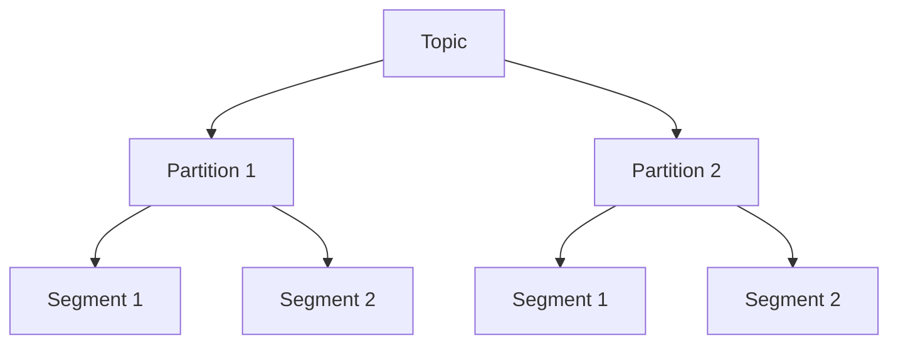
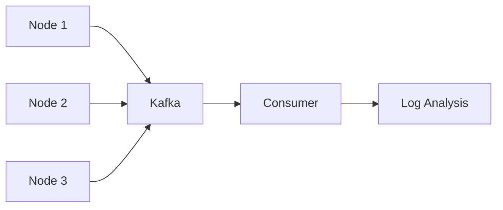
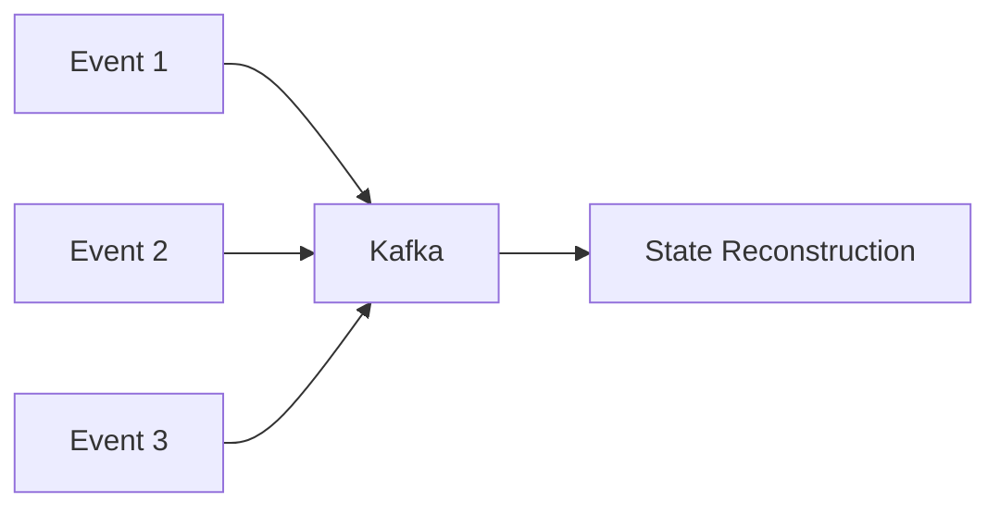

# Kafka 日志管理

Kafka是一个分布式流处理平台，广泛用于构建实时数据管道和流应用。日志管理是Kafka的核心组件之一，负责存储、组织和检索消息。本文将详细介绍Kafka日志管理的工作原理、实际应用场景以及如何通过代码示例来理解这一概念。

## 什么是Kafka日志管理？

Kafka日志管理是指Kafka如何存储和管理消息日志。Kafka将所有消息以日志的形式存储在磁盘上，每个主题（Topic）被分成多个分区（Partition），每个分区对应一个日志文件。日志文件按顺序追加写入，确保消息的顺序性和持久性。

### 日志结构

Kafka的日志文件由多个段（Segment）组成，每个段包含一定数量的消息。当段达到一定大小时，Kafka会创建一个新的段文件。这种分段存储的方式有助于高效管理和清理旧数据。



:::note
每个分区（Partition）是一个有序的、不可变的日志序列，消息按顺序追加到日志的末尾。
:::

## Kafka 日志管理的工作原理

### 日志追加

当生产者（Producer）发送消息到Kafka时，消息会被追加到对应分区的日志文件中。Kafka保证消息的顺序性，即先发送的消息会先被写入日志。

```java
// 生产者发送消息示例
ProducerRecord<String, String> record = new ProducerRecord<>("my_topic", "key", "value");
producer.send(record);
```

### 日志读取

消费者（Consumer）从Kafka读取消息时，会从指定分区的日志文件中按顺序读取消息。Kafka通过偏移量（Offset）来标识每条消息的位置。

```java
// 消费者读取消息示例
ConsumerRecords<String, String> records = consumer.poll(Duration.ofMillis(100));
for (ConsumerRecord<String, String> record : records) {
    System.out.printf("offset = %d, key = %s, value = %s%n", record.offset(), record.key(), record.value());
}
```

### 日志清理

Kafka提供了两种日志清理策略：基于时间的清理和基于大小的清理。通过配置日志保留策略，可以自动删除旧数据，释放磁盘空间。

```properties
# 配置日志保留时间为7天
log.retention.hours=168

# 配置日志保留大小为1GB
log.retention.bytes=1073741824
```

:::tip
合理配置日志保留策略可以有效管理磁盘空间，避免数据无限增长。
:::

## 实际应用场景

### 实时日志收集

Kafka常用于实时日志收集系统。例如，一个分布式系统可以将所有节点的日志发送到Kafka，然后由消费者统一处理和分析。



### 事件溯源

在事件溯源（Event Sourcing）架构中，Kafka可以用于存储所有状态变化的事件日志。通过重放日志，可以重建系统的状态。



## 总结

Kafka日志管理是Kafka的核心功能之一，负责消息的存储、组织和检索。通过分段存储、顺序追加和灵活的清理策略，Kafka能够高效地管理大量数据。理解Kafka日志管理的工作原理对于构建可靠的实时数据管道至关重要。

## 附加资源

- [Kafka官方文档](https://kafka.apache.org/documentation/)
- [Kafka日志管理深入解析](https://www.confluent.io/blog/)

## 练习

1. 创建一个Kafka主题，并配置日志保留时间为1天。
2. 编写一个生产者程序，向Kafka发送100条消息。
3. 编写一个消费者程序，从Kafka读取并打印这些消息。

通过以上练习，你将更深入地理解Kafka日志管理的工作原理。