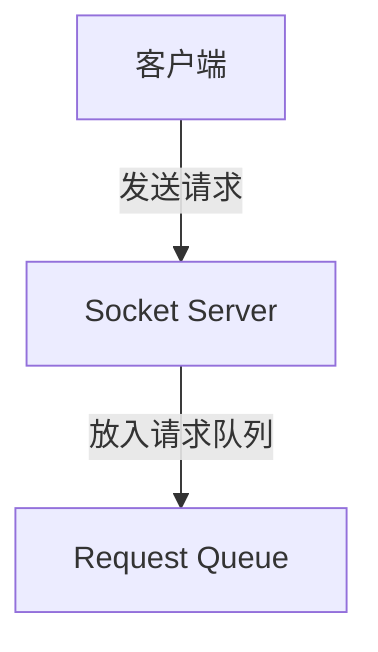
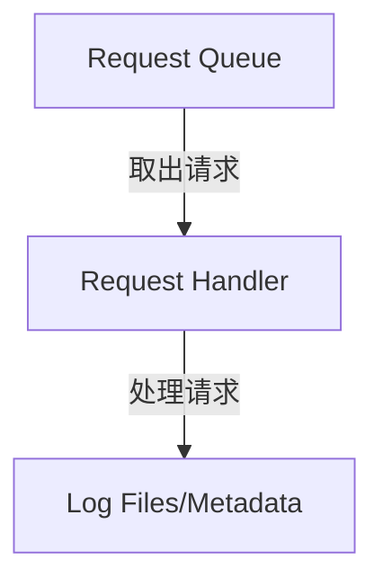
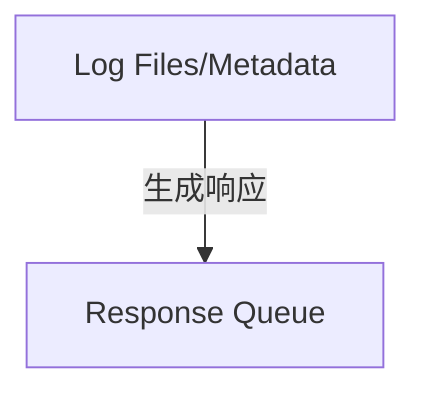
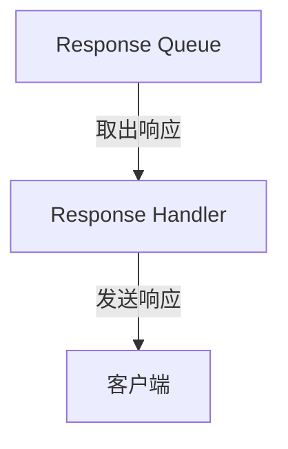

# Kafka 请求处理流程

Kafka是一个分布式流处理平台，广泛用于构建实时数据管道和流应用程序。为了确保高效的消息传递，Kafka设计了一套复杂的请求处理流程。本文将详细介绍Kafka如何处理客户端请求，并逐步解析其核心组件和工作原理。

## 什么是Kafka请求处理流程？

Kafka的请求处理流程是指Kafka服务器（Broker）接收、处理和响应客户端请求的过程。客户端可以是生产者（Producer）、消费者（Consumer）或其他Kafka组件。Kafka通过多线程和异步处理机制来高效地处理这些请求，确保高吞吐量和低延迟。

## Kafka 请求处理流程的核心组件

Kafka的请求处理流程涉及以下几个核心组件：

1. **Socket Server**：负责接收客户端的网络请求。
2. **Request Queue**：存储待处理的请求。
3. **Request Handler**：从请求队列中取出请求并进行处理。
4. **Response Queue**：存储处理完成的响应。
5. **Response Handler**：将响应发送回客户端。

## Kafka 请求处理流程的详细步骤

### 1. 接收请求

当客户端（如生产者或消费者）向Kafka Broker发送请求时，请求首先会被Socket Server接收。Socket Server负责监听网络端口，并将接收到的请求放入请求队列中。

### 2. 处理请求

Request Handler线程会从请求队列中取出请求，并根据请求类型（如生产请求、消费请求等）进行相应的处理。处理过程可能涉及读取或写入日志文件、更新元数据等操作。

### 3. 生成响应

请求处理完成后，Request Handler会将生成的响应放入响应队列中。响应可能包括确认消息、数据块或其他信息。

### 4. 发送响应

Response Handler线程会从响应队列中取出响应，并通过Socket Server将其发送回客户端。

## 实际案例

假设我们有一个生产者向Kafka Broker发送一条消息。以下是该过程的简化示例：

1. **生产者发送消息**：生产者将消息发送到Kafka Broker的指定主题（Topic）。
2. **Broker接收请求**：Socket Server接收生产者的请求，并将其放入请求队列。
3. **Broker处理请求**：Request Handler从请求队列中取出请求，将消息写入日志文件，并更新元数据。
4. **Broker生成响应**：Request Handler生成确认消息，并将其放入响应队列。
5. **Broker发送响应**：Response Handler从响应队列中取出确认消息，并通过Socket Server将其发送回生产者。

:::note
在实际应用中，Kafka的请求处理流程可能会涉及更复杂的操作，如分区管理、副本同步等。但基本流程与上述步骤类似。
:::

## 总结

Kafka的请求处理流程是其高效消息传递的核心机制之一。通过多线程和异步处理，Kafka能够同时处理大量客户端请求，确保高吞吐量和低延迟。理解这一流程对于深入掌握Kafka的工作原理至关重要。

## 附加资源

- [Kafka官方文档](https://kafka.apache.org/documentation/)
- 《Kafka权威指南》——Neha Narkhede, Gwen Shapira, Todd Palino

## 练习

1. 尝试在本地搭建一个Kafka集群，并使用生产者发送消息，观察请求处理流程。
2. 修改Kafka的配置参数（如线程数、队列大小等），观察其对请求处理性能的影响。

通过以上内容，你应该对Kafka的请求处理流程有了全面的了解。继续深入学习Kafka的其他核心组件，将有助于你更好地掌握这一强大的流处理平台。