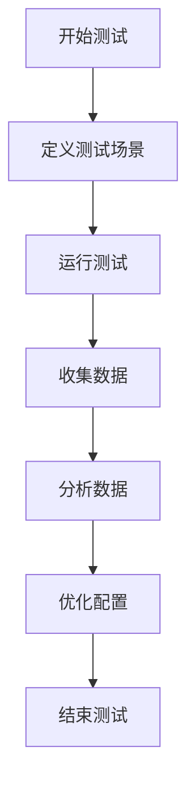

# Kafka 扩展性测试

Kafka是一个分布式流处理平台，广泛应用于实时数据管道和大规模数据处理场景。随着数据量的增长和业务需求的增加，Kafka集群的扩展性变得至关重要。扩展性测试是评估Kafka集群在高负载和复杂场景下性能表现的关键步骤。本文将详细介绍Kafka扩展性测试的概念、方法和实际应用。

## 什么是Kafka扩展性测试？

Kafka扩展性测试是指通过模拟不同规模的负载和集群配置，评估Kafka集群在增加资源（如节点、分区、副本等）时的性能表现。扩展性测试的目标是确保Kafka集群能够在不显著降低性能的情况下，处理更多的数据和更高的并发请求。

### 为什么需要扩展性测试？

- **验证集群性能**：确保Kafka集群在高负载下仍能保持稳定的性能。
- **优化资源配置**：通过测试发现集群的瓶颈，优化资源配置。
- **规划未来扩展**：为未来的业务增长提供数据支持，确保集群能够平滑扩展。

## Kafka 扩展性测试的关键指标

在进行扩展性测试时，需要关注以下几个关键指标：

1. **吞吐量（Throughput）**：单位时间内Kafka集群能够处理的消息数量。
2. **延迟（Latency）**：消息从生产者发送到消费者接收的时间。
3. **资源利用率（Resource Utilization）**：CPU、内存、磁盘和网络的使用情况。
4. **分区和副本的性能**：分区和副本的增加对集群性能的影响。

## 扩展性测试的步骤

### 1. 准备测试环境

首先，需要搭建一个Kafka集群，并配置好生产者和消费者。可以使用Docker或Kubernetes快速部署一个测试集群。

```bash
# 使用Docker启动一个Kafka集群
docker-compose up -d
```

### 2. 定义测试场景

根据业务需求，定义不同的测试场景。例如：

- **场景1**：增加分区数量，观察吞吐量和延迟的变化。
- **场景2**：增加副本数量，观察数据一致性和延迟的变化。
- **场景3**：增加节点数量，观察集群的扩展性和资源利用率。

### 3. 运行测试

使用Kafka自带的性能测试工具`kafka-producer-perf-test`和`kafka-consumer-perf-test`进行测试。

```bash
# 生产者性能测试
kafka-producer-perf-test --topic test-topic --num-records 1000000 --record-size 100 --throughput 10000 --producer-props bootstrap.servers=localhost:9092

# 消费者性能测试
kafka-consumer-perf-test --topic test-topic --messages 1000000 --broker-list localhost:9092
```

### 4. 收集和分析数据

在测试过程中，收集吞吐量、延迟和资源利用率等数据，并使用工具（如Grafana）进行可视化分析。



### 5. 优化配置

根据测试结果，调整Kafka集群的配置参数，如分区数量、副本因子、内存分配等，以优化性能。

## 实际案例

假设我们有一个电商平台，需要处理每天数百万的订单数据。随着业务增长，订单量预计将增加10倍。为了确保Kafka集群能够应对未来的数据增长，我们进行了扩展性测试。

### 测试场景

- **初始配置**：3个Kafka节点，10个分区，副本因子为2。
- **扩展配置**：6个Kafka节点，20个分区，副本因子为3。

### 测试结果

- **吞吐量**：从初始的10,000条/秒增加到20,000条/秒。
- **延迟**：从50ms增加到70ms，但仍处于可接受范围。
- **资源利用率**：CPU和内存使用率保持在70%以下，磁盘I/O略有增加。

### 结论

通过扩展性测试，我们确认Kafka集群在增加节点和分区后，能够处理更高的数据量，并且性能表现良好。这为未来的业务增长提供了保障。

## 总结

Kafka扩展性测试是确保集群在高负载下仍能保持稳定性能的关键步骤。通过定义测试场景、运行测试、收集数据和优化配置，可以有效评估和提升Kafka集群的扩展性。希望本文能帮助你理解Kafka扩展性测试的基本概念和方法，并为你的Kafka集群优化提供指导。

## 附加资源

- [Kafka官方文档](https://kafka.apache.org/documentation/)
- [Kafka性能调优指南](https://www.confluent.io/blog/optimizing-apache-kafka-deployment/)
- [Kafka性能测试工具](https://github.com/apache/kafka/tree/trunk/tools/src/main/java/kafka/tools)

:::tip
建议在实际生产环境中进行扩展性测试之前，先在测试环境中充分验证配置和性能表现。
:::